# TBD

## Museum Park

Last night after work, I went to an art museum park that had giant sculptures throughout the property and several trails. I had very limited time there. It's definitely a place I'd like to visit again. The park was beautiful and was quite large. It was in a very nice part of Raleigh. The park was free and several people were enjoying it.

With limited time, I just sort of meandered through a few of the trails. I saw most of the sculptures, though. And I even came across some deer...hehehe Overall, it was a very pleasant experience.

Since I love art, I'm glad I saw all of the wonderful creations last night. With limited time, I didn't take the opportunity to read all of the signs for what I saw. I'll eventually go back and take the time to take it all in. I'd also like to visit the actual museum sometime.

Here is a small photo dump from last night:

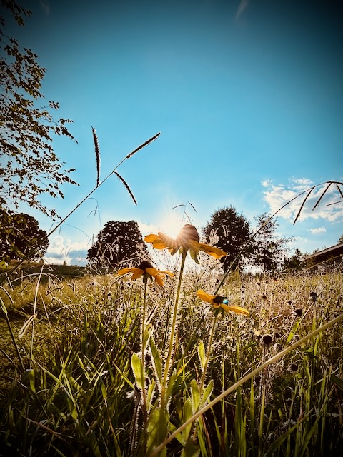

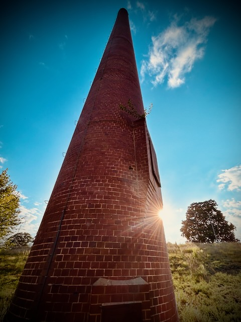

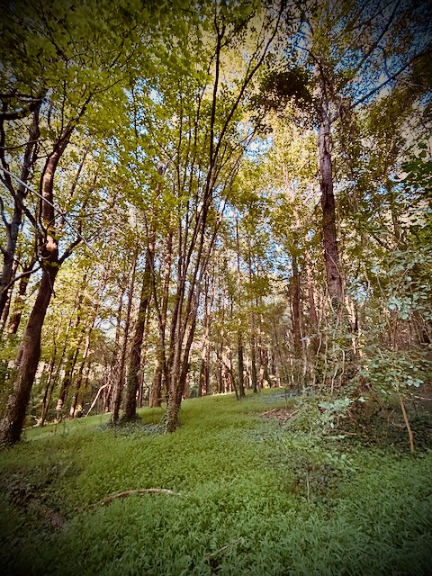

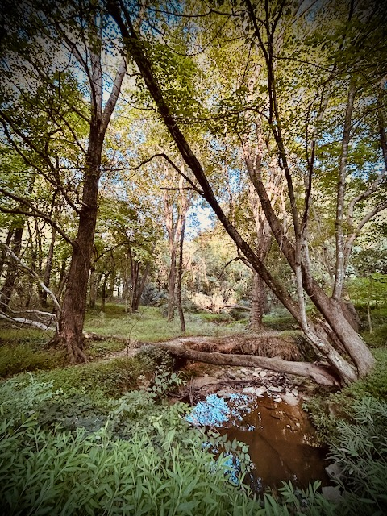

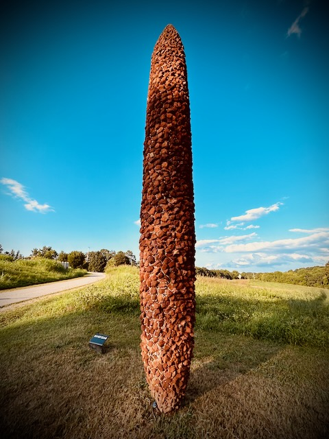

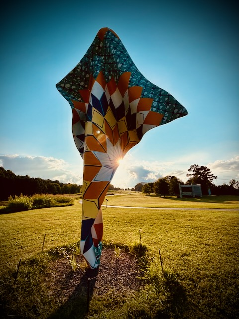

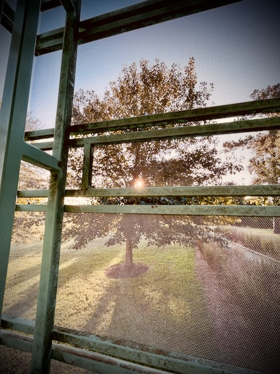

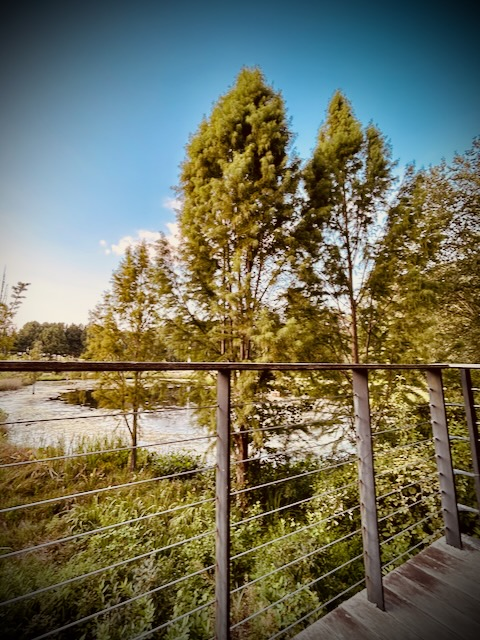

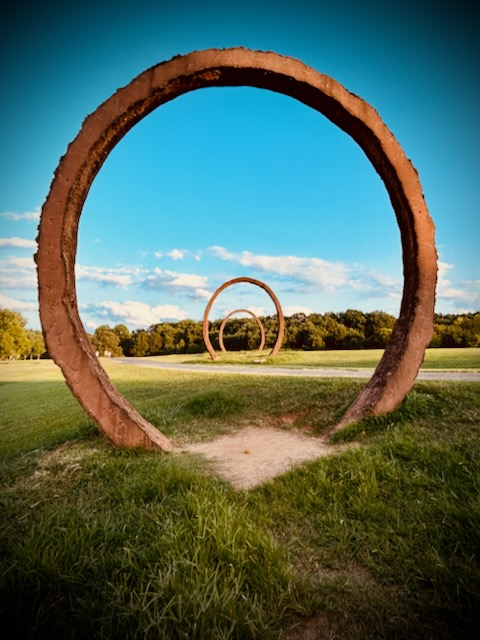

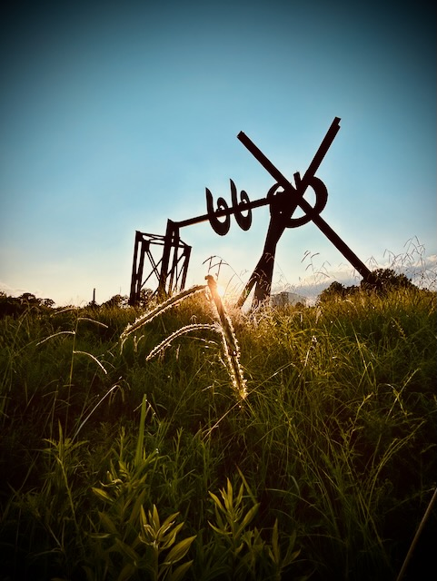

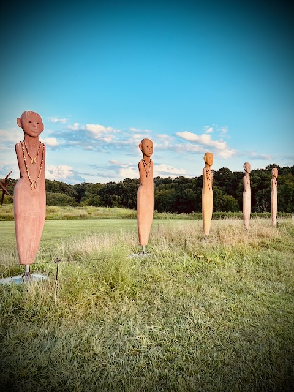

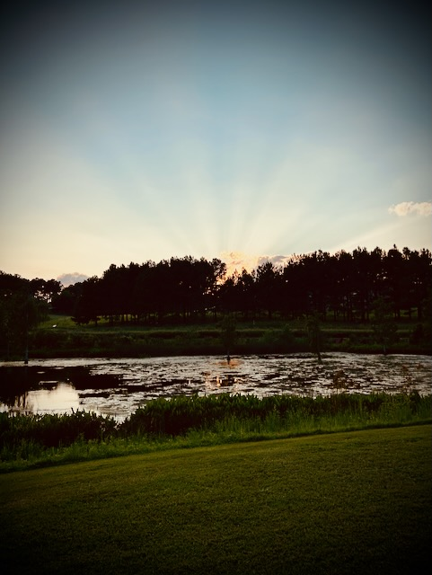

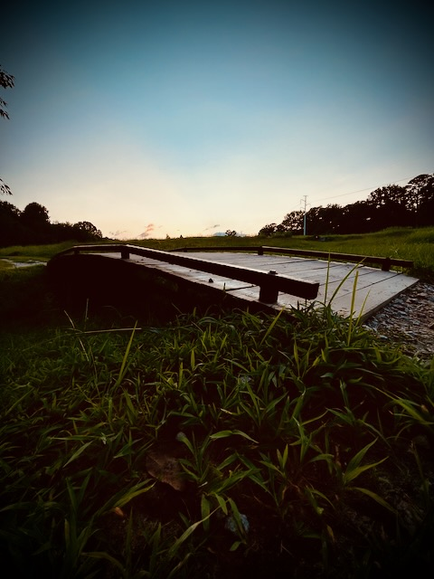

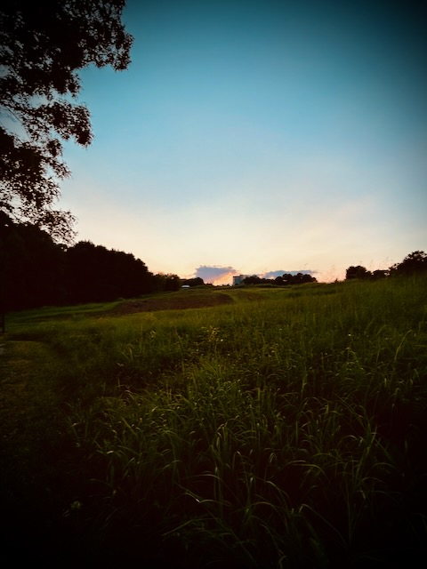

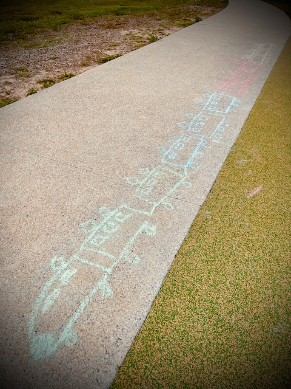