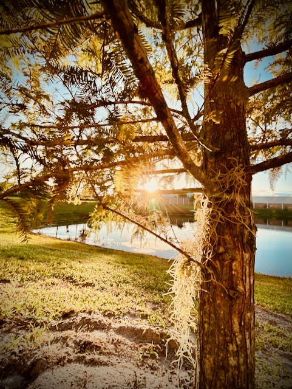

# TBD

I'll start off by addressing the *elephant in the room*. I haven't yet finished journaling about my time in North Carolina...LOL I experienced several wonderful moments and I took photos and videos along the way. I'm unlikely to post the videos on this journal because I'm not quite sure how that works really. I'll be posting the photos...hehehe However, today, I wanted to do a general journal entry.

I failed to be consistent with my journaling on this trip simply because I filled up my time quite a bit more than the trip I did in California. There isn't any particular reason why I did things a little different this time. Each journey is unique. The main goals were the same. The execution was appropriate for the locations I traveled to.

That said, one of the things I wanted to write about today is how I'm going to be pausing my search for a new home. The main goal of both trips was to get a feel for those areas. I feel God allowed this to teach me a few things. But all of my attempts to plan such a trip in September have been met with closing doors...hehehe I also received some new insights to places I previously took off the table. So, for now, I'm going to consider September a stay at home month. Maybe October too. That's okay. I wasn't disappointed when none of the plans were working out...LOL Although, I did frown a while when I realized I wasn't going to get to see Cherie next month :-(

I have been reminiscing about my early life in my hometown of Mooresville, Indiana. To this day, I consider it a quiet, small town feel. It has grown. But its essence remains small towny...hehehe There are still a lot of places one can live there and rarely need to drive. And the downtown streets have been *cleaned up* a bit. It was never a dirty place. It's just that buildings have a fresh coat of paint and sidewalks have been repaired over the years. Several of those downtown buildings have retained their late 1800s/early 1900s facades. And things like the old bars have been replaced with things like coffee shops. Picture Main Street USA without a castle at the end...hehehe That's Mooresville <3

Cherie asked me yesterday if I miss living there. My immediate answer was yes. I don't miss that brief 2010-2013 time I lived in a horrible apartment. But I do miss the first 23 years (1978-2001) of my life in Mooresville. In those early years, I lived in 2 houses with my parents. I've since lived in a total of 11 other apartments, houses, and duplexes in 3 different states. It's no wonder I feel a bit lost...LOL I haven't ever given any place a chance to grow roots...hehehe

As I became an independent adult, I could walk throughout Mooresville to do just about everything I needed. I did have a vehicle. But I rarely needed it. I would walk to work, the grocery, the movies, and restaurants. Everything was within a mile. It was very safe to walk too. And the large park where I would rollerblade was less than a mile away. Since the point of going to the park was to be outside and do a little exercise, there was no point in driving there...LOL Why did I ever leave!?! Long story, for another time perhaps...hehehe

I'm still relatively certain I'll be moving next year or the year after that. But I think my next trip will be the one in November for Disneyland. And I may go back to California in March for a Dodgers game and Disneyland birthday trip. I'm likely to make a visit to Indiana in late November or early December for Christmas. I don't want to travel close to Christmas again this year. I did so the last 2 seasons and didn't like doing travel that last week of the year. The weather is so unpredictable and airlines charge inappropriate amounts for flights that week. I drove the last 2 Christmases due to flight costs...hehehe

I'm going to spend the next few months deciding how I would like to setup and furnish my current home. Right now, it doesn't *feel* like *me*. Once I get that *me* feeling worked out, I'm sure it will be much homier...hehehe I may not make any changes at first. I can at the very least think about it and make some decisions. I'll start small and work my way through this. I've actually already given it a lot of thought. But now I'm going to actually make decisions and a plan...hehehe

Something that has stood out in my recent travels to California and North Carolina is how I've slept so much better away from *home* than when I sleep in my own bed...hehehe That is so weird to me. Most people sleep best at home. In the past, I was typical in this area. However, these last few years have been quite the opposite...LOL I was fine when I first moved here. I think part of my problem is the bed. At about this time in 2022, I accepted a bed from my sister. It was her guest bed that she no longer needed. At the time, I used a Japanese floor futon mattress. I think I'd like to go back to that...hehehe I'll need a new one. The one I previously had did not survive dormancy these last few years...I checked...LOL

I'd also like to get rid of my couch. It was given to me by my sister and her, then, husband. It never felt like *me*. But I thought I needed something for my living room for when I had visitors...LOL And my stools are definitely not *me*. Although I picked out my shelving for the entertainment center, I don't like all the things I put on the shelves. I mostly populated the shelves just to have something there. But all of this feels as if I'm living in someone else's home...LOL I laugh...but it actually makes me kinda sad, really.

Which brings me back to my travels...hehehe I think God *allowed* my trips for a few purposes. The obvious purpose was to enable me to visit a few of my closest friends. I talk with both Cherie and Tye daily now. Cherie and I do an amazing daily devotional and have video calls every weekend. Tye and I do random FaceTime calls a few times a month. Being able to have shared experiences in person with the both of them was such a lovely Blessing. I'm incredibly grateful for those shared memories and I'll always cherish them. I look forward to more experiences!

Another purpose I feel God allowed my travels to accomplish was to remind me I'm okay living in what feels like *someone else's home*. As Cherie eloquently put it yesterday, *anywhere [I] live here on earth is temporary anyway. Heaven is my home.* God's Kingdom is the destination. I've felt that way intellectually for quite sometime. But my heart was losing focus these past few months.

I wonder if my church experience has something to do with how I feel about where I live? By the way, the whole church thing is something I have peace about. I'm not seeking a new church home right now. I'm getting what I need from virtually attending other churches and I remain in my daily devotional, daily study, and daily prayers. But having come off of about a year's worth of spiritual turmoil with my church *home*, that may have had an impact on my residential *home* as well. They are seemingly unrelated. Yet, perhaps the two were intermingled unintentionally?

A third purpose for my travels was to overcome my travel anxiety. Having faced some past trauma, that was blocking my ability to travel freely to new places, has really made a difference in my life. So being able to test out how I have healed was the reassurance I needed to keep moving forward. A bonus to this was facing the trauma that caused my anxieties about crowds. After being in small crowds in LA, I reflected on that anxiety throughout July. I have since been in larger crowds without any issues. Truly looking trauma in the face and telling it to *GO* has been a freeing experience.

I have been doing this since January 2023. The results speak for themselves mostly. But the source bears repeating. God is the source of my strength. His Power is made perfect in my weakness. Where I am weak, He is strong. This isn't just cliché. It is very real in my life. The growth I am experiencing right now can only come from letting God's Light shine in my heart.

> I’m not just healing to overcome the trauma. Although that is perfectly fine to do. More so, I’m healing to accept and embrace the blessings of my life <3

That was today's *Vitamin G*. I originally wrote it a few weeks ago. It is something that has been on my mind and in my heart for quite sometime now. Today just felt like a good day to post it.

I took the above photo this morning to accompany the *Vitamin G*. It was inspired by many of the *warm hug* photos I've been taking privately of late. Photography is one of the many ways I have learned to communicate my heart. A lot of the private photography I've worked on this year has helped me grow. And now I feel it is time to begin sharing it with the rest of my little world.

I'm using the word *trauma* as a surface level term. I haven't really delved deep publicly about what I dealt with in my past. I didn't truly begin facing it until January 2023. And only recently have I started to talk about it with others. Perhaps someday I'll actually talk about it in the hope that others will be inspired to heal. Helping others heal is actually the point of *Vitamin G* in the first place.

I get very little engagement on my posts. I'm not one to do this as a *content creator*. But I do hope it produces healthy conversation. Being genuine on social media doesn't often inspire conversation...hehehe I don't do hashtags or tag people in my posts. I don't repost famous quotes from larger accounts in hopes that it will attract more people. I'm just being me. I'm glad I'm being me. Although I always hope a conversation is struck up, I'm not going to lose who I am just for the sake of attention. So, if I'm not always inspiring, I'm okay with that.

Honestly, I have found that something greater has been occurring. Some of my social media *friends* have become true friends offline. So, in a way, the healthy conversations are actually happening; just offline. In today's *The Chosen* devotional (Book 4, Day 3), it talks about how *words count*. It opened my eyes to that fact that, even though there is very little social media engagement with my posts, I truly have no idea how my words are impacting people. And I'm definitely okay with that.

In some cases, my words have opened doors to my finding true friendships. In other cases, I can imagine people may be knocking on doors in their offline lives that they may not have ever thought to knock on themselves. I recall one case when I later found out that my posts inspired them to seek help for their depression to avoid suicide.

I suppose the point I'm really making is that social media *engagement* isn't the true measurement by which I should focus my attention. My attention will remain on God first by loving Him with all my heart, mind, soul, and strength. The second, I will love others as if they were myself. I can plant and water as much as I can. God is the One who makes it all grow. I will tend the garden God has Blessed me with. The flowers are ready to grow <3