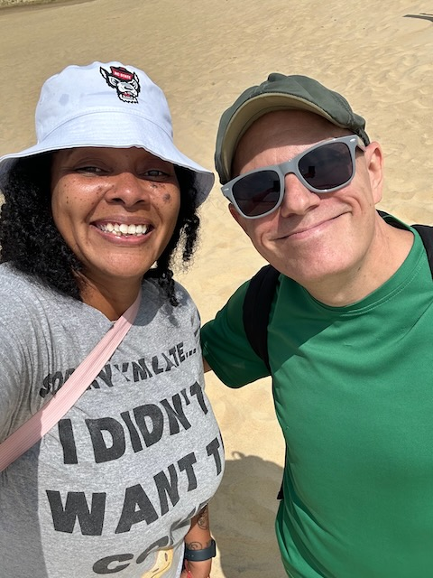
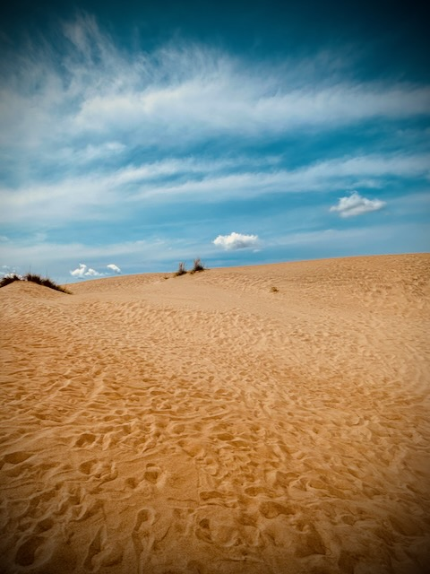
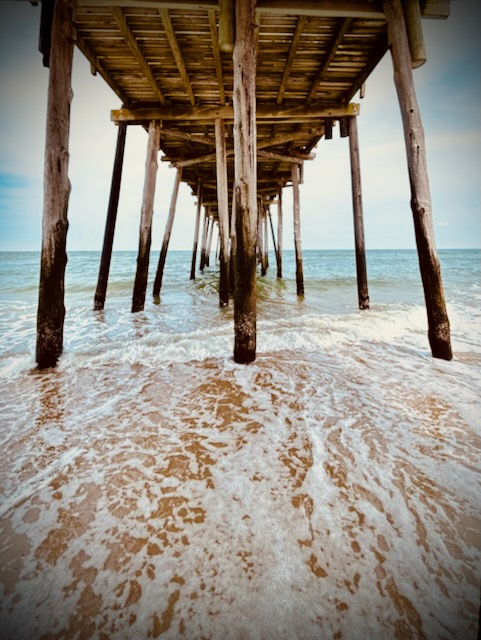
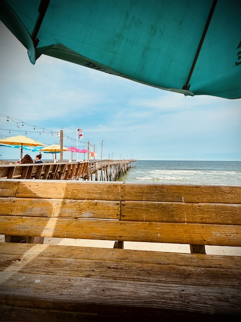
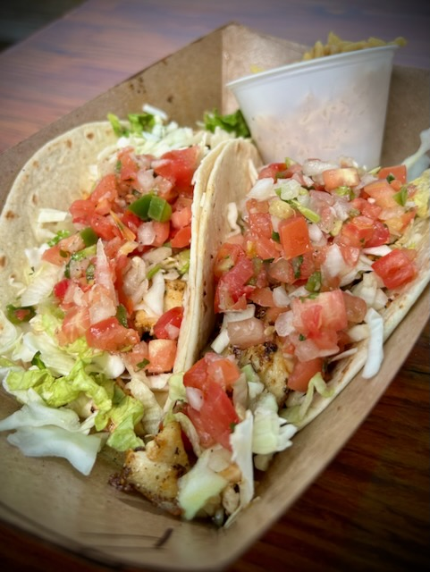
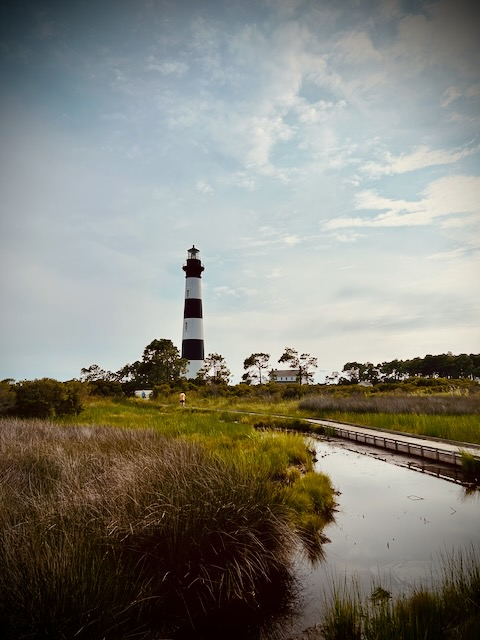
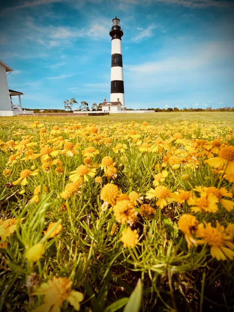

# TBD

## Tyrese

I spent Thursday and Friday of my North Carolina trip with Tyrese. Below is my favorite photo from my time in NC...hehehe It was great to spend time with her and we now have some fond memories to share. If nothing else, those two days with here made the whole trip worth it. So it was a bonus that the rest of the trip went well too...hehehe I'm already looking forward to future visits and she plans to come down to Disney World sometime as well.

## Jockey's Ridge State Park

## More to Come

That's it for today. This was all that we did Thursday. I'll write about Friday another day. Here is a photo dump of the highlights from that day.

