# TBD

I almost went with another general journal entry yesterday. I seem to have a lot to say lately...hehehe Well, I decided I should wrap up my NC trip and finally journal about my day last Friday...LOL I have a lot on my mind. But I also had a really great day that day. So, it wants me to talk about it...hehehe I started to write last night and kinda gave up and pushed it off until today as I was very distracted last night. I'm finishing this entry in the morning after my devotional journaling. My mind is far less distracted at this time of day...hehehe

## The Flying Biscuit

One of my favorite things about travel is checking out local eateries. On this particular day, I knew we would be out hiking for a large portion of the day. So I asked Tye if we could go to breakfast. She offered a list of places that included McDonald's...hehehe One of the options was a place called The Flying Biscuit Cafe. The name was enough for me to choose it...LOL Tye was grateful I didn't choose McDonald's...hehehe

The Flying Biscuit is this little *mom and pop* restaurant in this sweet little area in Raleigh. When we first arrived, I noticed they had outdoor seating. I immediately requested to be outside...hehehe All they serve there is breakfast/brunch food. It was almost perfect. The only thing lacking was...a flying biscuit...LOL j/k They do serve a biscuit with apple butter with your meal. However, it arrives on a plate and not through the air...hehehe Sadly disappointing...LOL Again, j/k...hehehe The apple butter was freshly made and the biscuit was homemade as well.

I went with a protein bowl of grits that included two sunny side eggs and lots of shrimp. I had them include white cheddar cheese, peppers, mushrooms, and seasoned potatoes. When I was growing up, I hated grits. As I grew older, I learned I had just never had decent grits...hehehe Being in what would be considered a southern state, I trusted Tye and The Flying Biscuit. The grits did not disappoint at all. They were perfect!

The overall atmosphere and the quality of the food was amazing. It was a great way to start off the day. The protein and calories were just what I needed for a day of hiking through mountain like terrain.

## Raven Rock

## Bowstring

## Conclusion

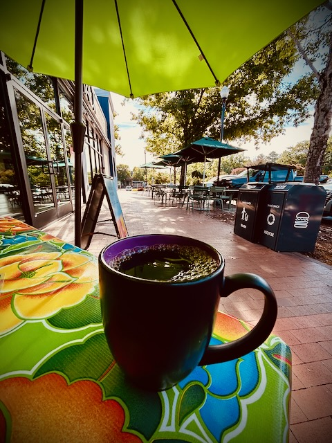

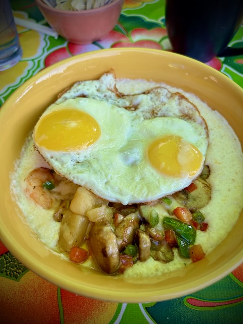

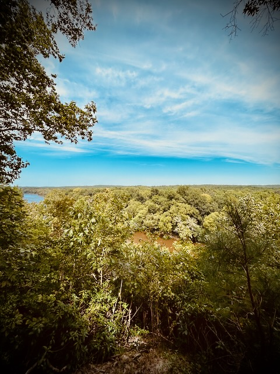

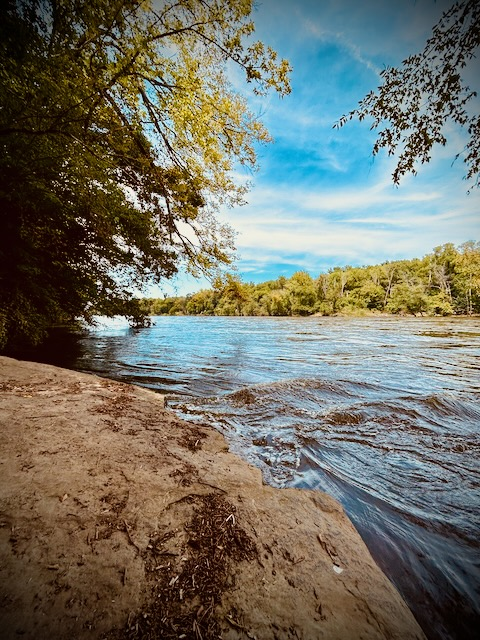

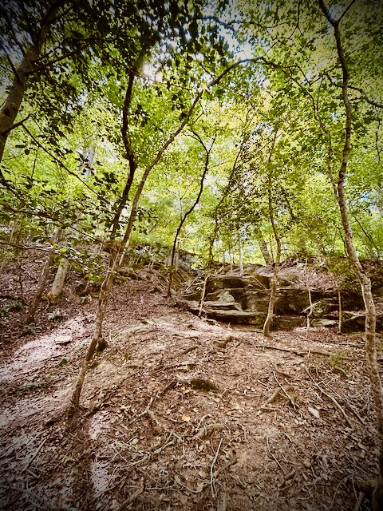

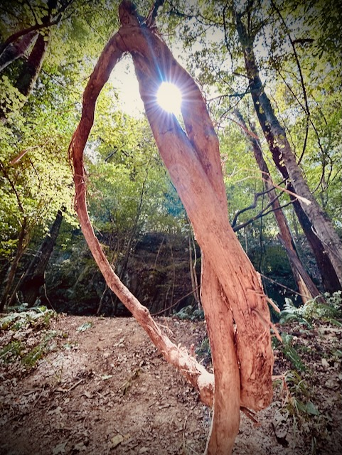

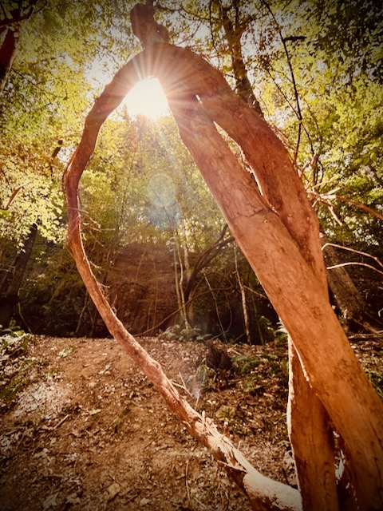

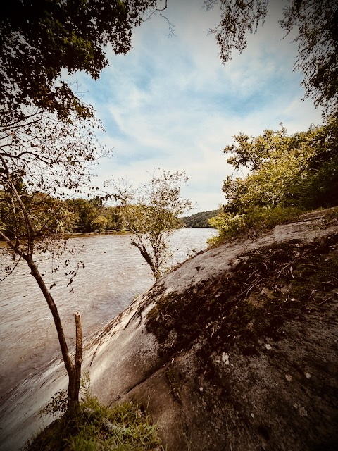

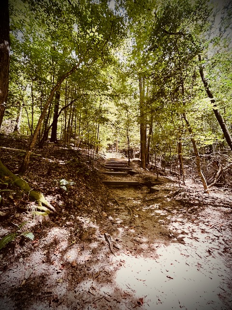

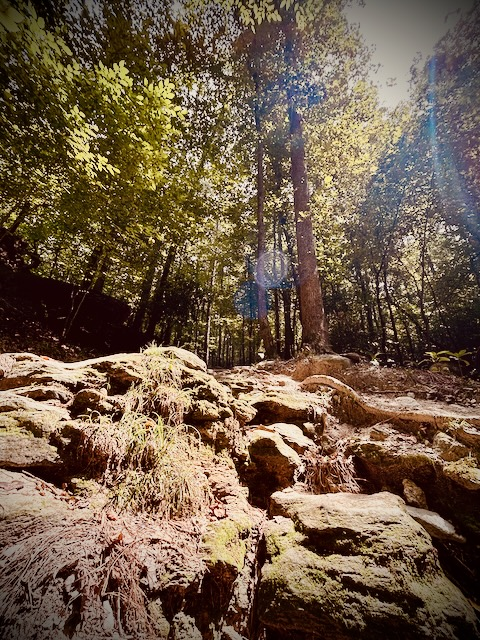

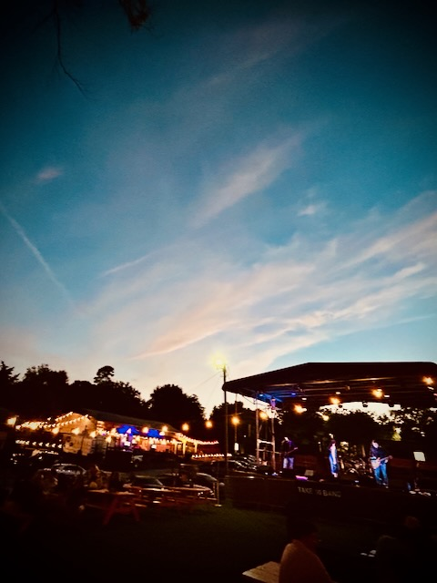