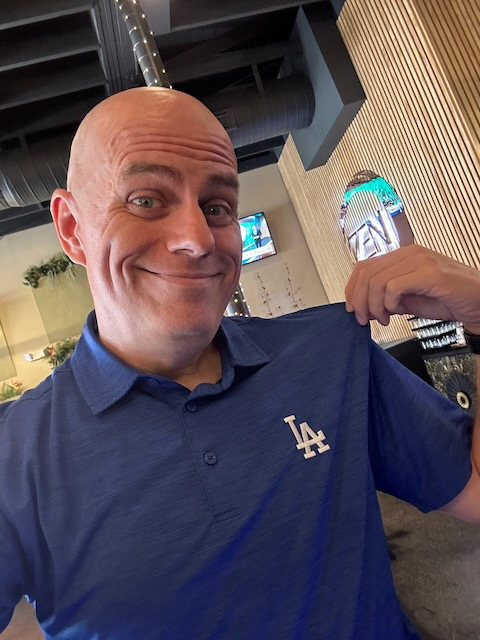
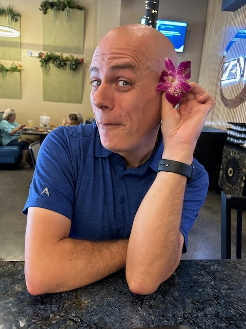

# Creative Focus and Zen Chow Mein

Well, September isn't going quite like I had expected earlier this year. Although it is different than expected, it isn't any better or worse than I envisioned. Part of that is my new (to me) philosophy of expecting nothing while appreciating everything. I may have ideas and thoughts about what I'd like to do in any given time frame or season. But I look at it with hope without disappointment. Hope for the best while not being disappointed if reality falls a little short of the hope...hehehe

I traveled in June, July, and August. The year I moved to Florida, I traveled 13 times. Basically one trip every month. That extra trip was due to a hurricane...hehehe Last year, I traveled just twice. After getting past the initial uncertainty about my job's transition, I decided I wanted to travel more this year. I started to feel like going back to the once per month cadence. Unlike 2022, I wanted to travel to other places besides back to my home in Indiana...hehehe In June, my trip was in Indiana. But July was California and August was North Carolina.

Yes, I'm saying nothing new. I've been talking about that a lot. Well, I really wanted to travel again in September. My original plans were for California again. When those plans weren't working out, I set my sights on Texas. But then I received a summons for jury duty the week I wanted to travel...LOL It became clear that I should remain at home this month. I'm completely fine with that. I was a bit sad I wouldn't be seeing friends I wanted to travel to see. But I also know that whatever God had in store for the month, it was going to be better in some way.

If the Lord wills it, I think I'd still like to do some sort of travel this month. Instead of a place I would need to fly to, perhaps I could find somewhere within driving distance? Louisiana, Alabama, or somewhere else here in Florida would be nice. But as I dream of going somewhere, I also recognize what the problem is...hehehe

So, what's my problem? I haven't been able to focus while at home. I do my day job and all basic tasks each week. But when I go to sit and focus on a personal project, I get very distracted...LOL When I travel, I tend to find some focus. This seems weird to me. I have no idea if anyone else experiences this or not. I was talking with someone the other day about it and they mentioned they experience something similar.

This leads me back to thinking perhaps I should just stay at home for a while. Rather than escaping home to find focus, maybe I should figure out how to be focused while at home...hehehe Yes, that sounds like a good idea. I'm actively thinking this through. Can you tell by this journal entry?!? LOL

One thought I've had on this subject is to simply be present in my community without traveling. I could go to a park, bar, or coffee shop. I did that last Saturday and Monday so I could write. The problem with that is that I tend to spend money when I go to a bar or coffee shop. I always feel guilty taking up a seat while I work. So I get food and drinks to justify my presence...hehehe

Honestly, though, I don't think they really care. At places with a bar, I'm only taking up one seat as opposed to entire table. That's actually why I love bars. I always feel guilty taking up a table that could otherwise be used by a couple or group. I don't always drink when I'm at a bar anyway. I've learned the delight of a glass of water, no ice, with a lemon and lime...hehehe It's refreshing and has no alcohol. Although it does feel weird to be the only one sitting at the bar not drinking...LOL Guess what, I don't care...LOL

But back to enjoying my local community while being able to focus on my *work*. Yeah, instead of traveling, I could do more local exploration and sit with my MacBook to focus. And I don't actually need to spend a lot of money to do so. I could get a meal. But I really don't think the bartender cares that I take up a single seat for hours while only having a meal or snack. I don't need to feel guilty about it. When I do sit for hours working on my projects, I see a good turnaround of folks coming and going. These places aren't hurting when I take up that one seat...hehehe I need to stop feeling guilty about it.

On the other hand, I could also learn to just focus while at home. I need to stop overthinking this...LOL

Speaking of plans that didn't work out for September, this past Tuesday would have been the first Dodgers game I would have gone to. Cherie and I talked about going to that game months ago. It didn't work out for this season. And that is absolutely okay. I wasn't able to watch the game on TV, either. But I did follow along through the MLB and Apple apps. It looked like a fantastic game. It was also a blessing to be text with Cherie a few times during the game. We've been able to do that a lot this season. After the game, we both mentioned we were imagining us being there. I apologized for spilling my Cracker Jacks on it...LOL

Today, I watched the condensed game on the MLB app. Wow! That was an amazing game. It made my heart so happy to watch the highlight reel. Once again, I was imagining Cherie and I in the grandstands...hehehe It was like I could wave at the screen and we'd be waving back...LOL When we do get to go to a game together, I'll see if we can actually do that. We may not end up on TV. But it will be fun pretending and then waving back at ourselves when we watch the replay...hehehe That was something my mom got me doing when we knew someone would be at an event that was being televised...hehehe

Today, I wore my teekit to celebrate the imaginary memory of going to the game Tuesday...hehehe

I would have also gone to Disneyland this week. Something I find funny is that a few of my friends are there this week...LOL Mack and Meg went to Disneyland. I've actually avoided seeing their social media posts this week...hehehe I'll be going in November and didn't want any spoilers. Mack and Meg are recently dating. I've known them both for a little over a year now. I'm very happy for them. But I'm glad I didn't go this week. I wouldn't have wanted to take away from their experience since they are just starting off as a couple...hehehe Two very lovely people enjoying a new experience while also enjoying a new relationship <3 Had I gone, I'm sure they would have wanted to meet up. They are kind like that...hehehe

Back in July, I tried a [new (to me) soap from Zum](../07/29_new-soap-connected-journeys-and-wrong-choices) that has cleared up all...and I do mean *all*...of my skin irritation issues. Well, a few weeks ago, I was shopping for new laundry soap. I figured as part of my health journey, I would begin to also question my choice in laundry detergent. The *detergent* part was key to that question. While at Sprouts, I decided to look at what they offered. I found that Zum makes laundry soap! The *soap* is the key part there...hehehe

I tried it for the first time for my most recent batch of laundry for clothes and towels. Wow! Everything came out so fluffy and the scent (lavender) is so much better. The main cleaning agent is baking soda and the scents are from essential oils. I'm really impressed with it and hope it continues to help improve my skin health. I've not dealt with skin cancer concerns like my dad and grandma (his mother) do. But I still deal with dry skin and rashes. These small changes have made huge impacts. And I love that. I can't wait to clean my bedsheets this weekend...hehehe

As I continue to experiment with my schedule, something I'm wanting to do is dedicate at least an hour a day to being creative. I don't mean like writing in my journal. I'm thinking about starting some writing prompts, following a list of photography ideas, or even doing some sort of artwork. A while ago, I wanted to try scheduling specific days to do each of those things. I have yet to get around to adding that to my routine...LOL

I've continued being creative randomly regardless of where I am or what I'm doing. But I'd really like to try and focus more on that part of who I am. I've actively done this with my time with God. My prayer, devotional, and Bible time has been quite focused this year. That began in October last year. So, almost a year ago now. This has made quite the impact on my life. What I'd like to do is be more intentional with my creative side next.

If I start with a dedicated hour per day, I think that will get my focused on my creative side. I'm perfectly fine with being random. I do random quite well, actually...hehehe But when it comes to my favorite parts of who I am, I prefer to be more intentional. If I were to *schedule* some creative time, it will eventually become a habit that will be well established. When I look over my life, once something becomes habit, it really starts to grow.

I've seen that in my spiritual health since the beginning of October last year. Back then (hehehe...like it was so long ago...LOL), I began starting off my day with the *Lord's Prayer* and a daily refresh devotional. It truly set the tone of my day. That has since evolved into doing a daily devotional with Cherie at the start of my day. Although, there was a brief time when I did that daily devotional after dinner. That was during a sleep schedule adjustment...hehehe But I'm back to doing that devotional in the morning. I'm grateful to be back to doing that in the morning.

If I do work in that hour of intentional creative focus, perhaps that will help with the problem I mentioned above. I'd be doing that hour while at home. I can still do it when I travel. But for the most part, it would be while I'm at home since I spend more time at home than anywhere else...hehehe

I had a lovely time at Zen again today...LOL We were joking about me wearing the flower in my hair...hehehe I spoke with Chef Victor today about having him whip up a chow mein dish. He asked me to drop by on Saturday to talk further about it and that he might do it next week sometime. I hope he can do it for me. I don't imagine it will end up on the menu. But I do appreciate that he'd go to all the trouble of making something special for me.