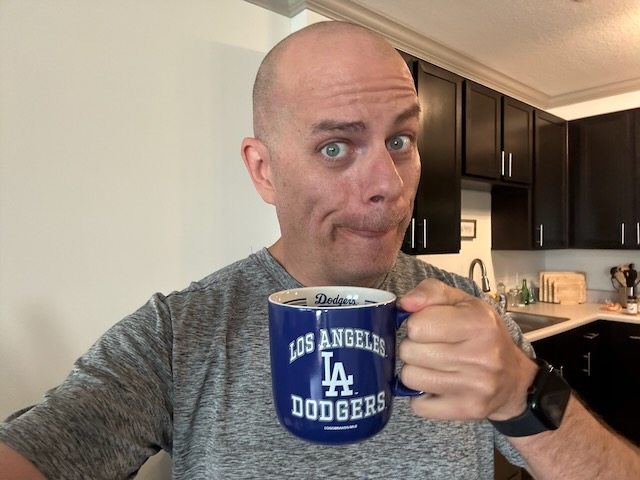

# TBD

## 07:30am

I didn't sleep well last night. I had a horrific nightmare. The kind of thing that people who love horror movies would have found quite entertaining...LOL Aside from the nightmare, my sleep wasn't restful. I do not feel renewed today...hehehe I chuckle because the night before I had one of the best night sleeps I've ever had. Yesterday, I felt quite rested. I wasn't back to 100% energy. And I thought I'd get good rest last night to bring myself back to 100% today. Yeah, I was wrong...LOL

But that's okay. I'm not worry about it. Nights like last night happen. I don't really know what caused my sleep to be so far off. I'm not going to overthink it, though. I'm just going to accept it and hope for the best tonight. I'll still make the most of this day. This is a day the Lord has made. I will rejoice and be glad in it!

I'm *behind* in my Bible in a Year plan. I had a goal to go through the entire Bible this year. Being a bit behind isn't discouraging, though. I don't look at this has something to check off on the *todo* list. It was just a goal I would like to accomplish this year. I may try to catch up this week. But I won't put any pressure on that. The point is to be in the Word everyday. It is for the renewing of my soul. If I make it a chore, that will defeat its purpose.

My morning prayer today was a bit short as well. Like the Bible in a Year goal, I don't want my morning prayer to be something I check off the *todo* list. It isn't supposed to be a chore either. What I did today was for the sake of consistency. As is being in the Word daily.

To be clear, I haven't grown tired of the daily spiritual disciplines. It is more about how my routine has been off for a month. I'm realizing I just need some changes. The new Bible study I'm doing for *The Chosen* is helping with that. It seems to be an important part of the transition I'm making in my spiritual growth right now. I'm pretty excited about all of this, actually!

Today should be a good day regardless of how poorly I slept last night. My spirits are way up. My hope is in God. My hope isn't in my own ability to maintain a balanced life. He brings balance to my life. I just get in the way sometimes...LOL Yesterday, I had a very balanced day. I see the potential already in today being equally balanced. Wouldn't it be something if I get through this day as if I hadn't had a horrible night last night? Wouldn't it be something to have a great day in spite of a bad night? I've got this because God has got me <3

## 08:45am

Okay, so I wanted to document this for posterity sake...LOL I'm actively considering moving back to my hometown of Mooresville, Indiana. I'm sure I've mentioned the possibility before. But this morning, it has been on my mind. I don't necessarily miss Mooresville itself. But the lifestyle there remains attractive to me. What better place would there be than to return home to have that lifestyle?

Something I've realized lately is that I've spent most of my adult life somewhat *chasing* someone else's dream. Who's dream, I do not know. But it hasn't been mine...LOL I didn't leave home because I wanted to leave. I left because I got married. But even the married life I went after back then wasn't quite what aligned with my heart at the time. I won't go into it too deep now. But I wasn't ready for it at the time. It sucked me in because I felt like I belonged. Yet, it wasn't the right place to be and sent me on a path I should not have chosen. I don't regret it. But I realize I didn't choose wisely...hehehe

I've been given a wonderful opportunity to truly pray and think about what I want the rest of my life to be like. Obviously I don't know what the future actually holds for me. But God does. Aligning my life with the path He has set before me has changed my perspective in so many wonderful ways. I never would have imagined I'd consider going back home. Yet, here I am...LOL

One thing that got me thinking about this again today is how I actually want to go up there soon. Sure, I miss the people I love there. But I can honestly say I'm looking forward to being in Mooresville as well. This is the first time in three years that I've wanted to there for other reasons besides seeing people...hehehe Feels a bit weird...LOL

## 09:45am

I don't necessarily need to move back to Mooresville...hehehe The weather there is still one of my concerns...LOL But I could start looking for places that remind me of that lifestyle. Small town feel. Most things are within walking distance. A safe place where everyone offers a friendly *how-do-you-do*...hehehe My hometown still has that feel.

I'm making more progress with work today. I haven't been this productive in quite a while! This transitional year has been a bit boring...LOL It is nice to be working on tasks that I've been waiting for so long to get to do.

Ooh! And I feel a tad like a hobo...LOL My hair growth is in that weird stage. Like, *is he being lazy?* Or *is he sick?* LOL Couple that with some slightly swollen eyes from poor sleep last night, I look like I've given up on my face today...LOL However, it is all part of the process of change...hehehe My beard won't take long to get to a nice and clean state. I have no clue about the hair on top of my head, though. It has been over four and half years since I've had hair growing out up there...hehehe What is it going to look like in a few weeks?!?

## 11:00am

Well, I don't quite look like a hobo in this light...LOL But you can clearly see some *shadows* forming on my head and face...hehehe Plus, I have that goofy grin...LOL

I have a FaceTime call with Dan here in a little bit. It's mostly just to catch up. It has been a little while since we last spoke over FaceTime...hehehe

I'm' writing this timestamped section while I wait for my work computer to log into a remote system for my new company...LOL It takes *forever*! LOL If I have to use this remote system to do my normal development work next year, I'm not going to have fun. I'm hoping we get to transfer all of that to our local laptops eventually. Or perhaps they'll beef up those remote virtual machines?

## 03:45pm

Being out of my routine for more than four weeks hasn't had a negative impact on me. In the past, being off for a week would throw me into an imbalance of sorts. But here I am more than four weeks into an unusual cadence with a sense of peace. Also, despite my having such poor sleep last night, I actually feel incredible spiritually and mentally today. I'm a little tired physically. But I haven't even had a need for a nap. I'm really excited about these things! If I recall, earlier journal entries from this year would indicate being off a routine or lack of good sleep would lead to some sort of imbalance. Seeing and feeling the results of growth is very encouraging...hehehe

I had my call with Dan. Something that stood out from that call was how identifying and acknowledging our shortcomings, struggles, and weaknesses allows us to be open to the Holy Spirit working in our lives. When we deny those things, we are in essence denying the help we need from God. This reminded me of...

::: details 2 Corinthians 12:9-10
9 But He said to me, “My grace is sufficient for you, for My power is perfected in weakness.” Therefore I will boast all the more gladly in my weaknesses, so that the power of Christ may rest on me. 10 That is why, for the sake of Christ, I delight in weaknesses, in insults, in hardships, in persecutions, in difficulties. For when I am weak, then I am strong.
:::

When I woke up today, I had no idea I'd see a shark walking around outside my apartment...LOL I tried to get a photo. But they went by too fast for me to get a good one...LOL It must have been a Halloween costume or something. One of those that you wear that inflates...hehehe

## 08:55pm

I received a pleasant surprise this evening. Valerie texted me to see if I wanted to go on a walk...hehehe I hadn't heard from her in a while and we hadn't been on any walks since just after Hurricane Milton. I wasn't worried or anything. But I had wondered how she was doing. I even mentioned something yesterday about not having heard from her.

Unfortunately, she will be moving soon. When we first met a few weeks ago, she mentioned she was going to renew her lease and stay until next November. However, a new job opportunity came up and is taking her out of state. I'm excited for her and what she'll be doing next! She seemed a little sad that she was moving right when our friendship was starting. That touched my heart. I don't know if we'll be able to maintain a friendship at a distance. But if the Lord wills it, it can happen. I already have a few long distance relationships with friends...hehehe

We had a lovely chat. Since she will be leaving the week I'm in California, I asked if she'd like to get together on Sunday for a meal as a sort of farewell dinner. She was excited at my invitation! We'll plan to go to a seafood place on the water since she's leaving Florida. Seaside seafood is one of the best things about living here on the coast...hehehe I'm looking forward to spending that time with her on Sunday. Even though she is now moving away, I'm grateful for the brief moment our journey's crossed paths.

She paid me a few kindnesses as we talked. I'm grateful she reached out tonight.

I watched *this week's* episode of *The Chosen* twice last night. Then, I watched it again tonight...hehehe When I sat down to do tonight's session of the Bible lesson, I wasn't expecting to write much just yet. I figured I'd at least answer the *Your Turn* question and perhaps start some notes that I'd later flesh out more. I ended up writing quite a bit and even included a little personal note about Sunday dinners at my parents'. That's one of the many things I love about this Bible study. It triggers some amazing things in my soul. And it keeps getting better. I can't wait to share my notes with Cherie this weekend...hehehe

