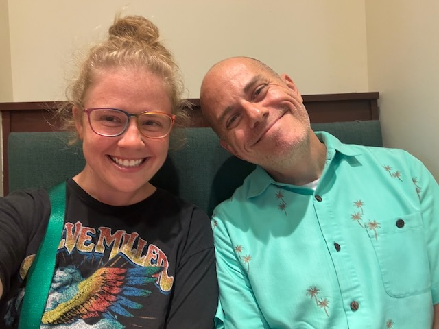

# Growing Pains and the Unexpected

## 07:45am

Good morning! And welcome to another day with meeeeeee! LOL (in Budford's voice, of course...hehehe)

I slept well last night. With the exception of one trip to the bathroom in the middle of the night, I didn't wake until my white noise turned off. I probably could have slept longer had I set that to go longer. But that's perfectly fine. I feel really well this morning.

I'm looking forward to the new day. Besides work, I really don't know what is in store today. That's the case most days lately. Without a specific routine and a *what are we going to do today* focus, I have no expectations for my days right now...hehehe

## 09:35am

It's okay to not be comfortable all the time. Oftentimes, growth comes from discomfort. And as we grow, there will be pain.

I recall how bad growing pains were when I was physically growing. That wasn't fun at all...LOL Now, years later, I still experience growing pains. They just aren't physical anymore. Well, some are...hehehe Sometimes the mental and spiritual pain of growing can manifest itself into physical aches and pains. But the point is that the pain I feel sometimes is a good sign of spiritual and mental growth.

This has been an encouraging thought this morning. This has been a year of growth. With that, came a lot of pain. I've said that last year was the most difficult year of my life. That was because I finally faced my past head on and began doing something about it. This year, has been quite a bit more painful. But I look at this year as the best year of my life.

My personal growth this year has afforded me a perspective on my circumstances that has given me peace. Not peace I've created by making changes that bring me comfort. The peace I speak of can only come from God. I've stepped out of my comfort zone and put my trust and hope in Him. It's the kind of trust I haven't had since I was a child and I trusted my parents with my life. Now, I've returned to that kind of faith when it comes to my Father in Heaven.

I'm not comfortable right now. I'm in a lot of *soul pain*. I'm rejoicing for the transformation God is doing in my heart. He is my comfort <3

## 12:10pm

I attempted to take a walk...hehehe The landscapers are working today. I couldn't relax. So I cut the walk very short...LOL I love doing yard work. I don't enjoy watching others do yard work...LOL

I haven't been taking my morning walks before work in a while. I miss them. But not enough to force myself to take them...hehehe With the obvious exception of my job, I've been just going with the flow lately. This relates to the whole not having a stable routine at the moment. Although I do miss having a regular routine, I feel a sense of freedom in just going with the flow.

This was another topic of discussion I had with Dan the other day. We talked about how sometimes we can become imprisoned by our routines. I'm not sure that is what I was experience just prior to a month ago when I lost my rhythm. But I have had the experience of imprisonment to the routines in the past. I think that is why I would feel a sense of imbalance when I missed my routine. Since I don't have that at the moment, I feel free instead...hehehe

I ended up turning my 9:35am thoughts into today's Vitamin G post. The photo I included was from back in June. I took that photo just before I went into church that morning. It felt right to use that photo since I'm likely going back to physical church upon my return from California next month. I won't be going back to that location, at least at first. But it might be the new satellite location of the same church...hehehe

Speaking of which, it turns out this satellite is one of two they will be starting.

## 03:05pm

I was sitting at Zen having lunch today and began thinking about inner peace. Last week, I was at the ER to support a friend and I didn't have service on my mobile device. So I sat there off the grid for about three hours. The friend I was there with has a different carrier and had service. They were able to communicate with loved ones in the outside world while we were there. By the way, they are doing fine.

I made the most of it by engaging in conversation with them. I also observed the world around us. For some of the situations others where there for, I would make up backstories in my mind about what brought them to the ER that day. Is was like I was in my own little world full of sitcoms running through my head...hehehe

The person I was there with was concerned I might be bored...LOL I assured them I was not and I was actually having a great time. Yeah, you read that correctly...LOL I was having a great time at the ER...LOL Of course, I wasn't there for myself this time. So, that helped!

I did begin recalling the several times I've been in the ER throughout my life. A few of the times I was there were life threatening situations. Other times, it was something minor but still required urgent care to resolve. I think the last time I was taken to the ER was in 2017?

I'm at a place in my life now where I'm pretty healthy and I have inner peace. I still have some health concerns. But nothing I would consider life threatening. The inner peace, though, is my point. This is something new for me. It is why I'm having the best year of my life. The circumstances haven't gotten better for the most part. Some have even gotten worse. But what God has been doing in my heart cannot be explained in any other way than by this passage:

::: details John 14:27
Peace I leave with you; My peace I give to you. I do not give to you as the world gives. Do not let your hearts be troubled; do not be afraid.
:::

The inner peace I speak of isn't from me. It is from Christ who lives in me.

## 08:40pm

From 4ish pm up until about 7ish, my day wasn't quite what I expected...hehehe I ended up in Tampa...LOL I helped Autumn run an errand. She's trying to buy a new car and needed a ride to the place. She was having trouble getting things taken care of over the phone. Just going to the place helped clarify some steps she needs to do for the purchase.

On our way back, we ended up getting Panera Bread. When I ordered my sandwich, the gentlemen taking my order made some suggestions for additions to the sandwich. I went with a few of the suggestions and created an off-menu sandwich. It was incredible...hehehe Honestly, had we not run that errand to Tampa, I would never have tried this sandwich. I love it when fun little things can happen while doing the unexpected...hehehe Here is a selfie we took while we waited for our meals to be prepared!

Today's section of the Bible study had a part that I made a connection to from the above (03:05pm) note on inner peace. It was in the *Wellspring of Rest* section of this week's lesson. God's presence is the source for the kind of rest He intends for us. I felt that related to my thoughts on my own inner peace. It is Christ in me that provides the inner peace. Therefore, it is also He who provides my rest. I loved that both the above thought and today's section aligned like that...hehehe There was more to that section and the following *Your Turn* questions, though. I am truly connecting to this Bible study. I love it! I think I'm writing more this week than I did the previous two...LOL

## 10:05pm

Final thoughts for the day...hehehe

Another day without a routine. Another day going with the flow. I'll admit this is a little weird for me. I mean that in a good way. It's weird because I tend to like a routine. Being able to function well without some sort of routine is something new for me. I feel well rested, at peace, and full of hope.

Tomorrow, I plan to work half my day from Zen. I did that last Friday and was able to be more productive than usual. I've had a really productive week ever since. I want to see if I can reproduce the momentum generated from last Friday. If it works, great! If I can't reproduce that, great! This new attitude encourages me to be open to whatever comes my way...hehehe

## 10:30pm

Final thoughts for the day continued...LOL

I had to take a break from writing because I needed to fold my laundry...hehehe

Tonight, I was relating my recent experiences to something I wrote about earlier this year. [Great Expectations](../04/03_great-expectations) and [Great Expectations Revisited](../06/18_so-i-wrote-a-poem#great-expectations-revisited), I wrote about expectations of myself and other people. I won't rehash any of that because you can read about that by visiting those links. But I can apply the principles I learned in those experiences to my expectations with my day-to-day circumstances today. And I can do the same with the big picture circumstances that impact my life most.

In this case, I can't communicate to my life what I expect...LOL But I can change my view of what I expect from my life. Considering my life, and everything in it, is all a gift from God, I can simply stop expecting anything. I can just accept it for what it is and be grateful. But I can also communicate with God about my expectations. If they align with His Will, I imagine He'll bless the expectations? If they do not align with Him, I imagine He'll redirect me? So long as I am praying about what I expect from my life, I'm giving myself a better opportunity to listen to His Voice. Then it will no longer be about expectations. It becomes all about God. I'll want to give more thought to this, I think...