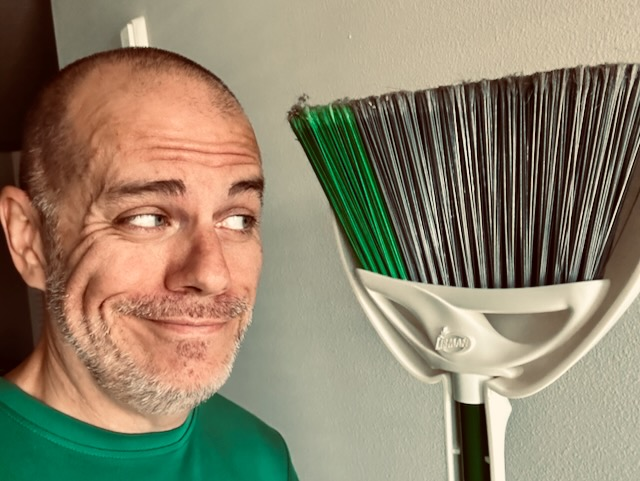

# No Title?

## 07:55am

A new day dawns! A gloomy day outside...hehehe But I will still rejoice and be glad in it! After all, this is Florida. I imagine the sun will shine brightly in just a little bit...LOL

I didn't sleep well last night. Sometimes I don't really know why that happens. But I think this time it was because of the kind of day I had yesterday. I felt it was a good day. But it also triggered some of my overthinking toward the end right before bed. I feel as though my journal entry yesterday somewhat describes it well. It was a rollercoaster. I tend to look at the bright side these days. But I think my lack of good sleep is a good indicator that the rollercoaster I experienced yesterday wasn't so good after all.

I'll be okay, though. I have started this day with a great attitude! I do have a slight anxiety left over from yesterday. It is drawing me into prayer. I always see positive in praying...hehehe God cares about what I care about, right?!

Well, it's time to start my workday...hehehe

## 10:30am

I'm working on a support issue at work that I don't know a lot about. It's part of the new responsibilities I've taken on this year. I'm still in that *I don't know what I don't know* stage and haven't a clue what questions to ask sometimes...LOL I keep reaching out to my boss to have him walk me through some stuff. This one is very similar to one we worked on recently. So, I've been able to do some research on my own. I may end up needing to pull him again, though. If the resolution is what I think it is, I don't actually have access to resolve it...LOL

I took a mid-morning break and walk. As predicted earlier, the sun indeed is shining brightly once again...hehehe It was a pleasant walk and a great time for prayer. I had some people on my heart to pray for. And I had some things about my life on my heart to pray for.

As seems the normal thing between single people, the topic of dating and romance came up last night. Why does that always seem to come up?!...hehehe It actually does make sense considering relationships are always on the mind. I sometimes wish romantic relationships wouldn't be a topic, though. I didn't bring it up this time...LOL I don't mind talking about it with people I know well. But it seems to happen even with new friendships. And for me personally, it happens when I'm becoming friends with single women. I suppose it's okay, though. If they want to talk about, I'm happy to listen.

As the topic came up again last night, that was one of the things I prayed about on my walk. I considered Adam at the beginning of time. He is the only human who ever existed who did not have another human in his life for a period of time. I wonder what that was like?..hehehe But then my heart quickly went to how God created for him a helpmate with Eve. It seems people aren't meant to ever be alone?

I do not currently want to be in a romantic relationship. I'm grateful for all of my friendships with women. Something I mentioned last night is that I can't often maintain friendships with women when I'm in a romantic relationship. I've always been with a woman who somehow felt threatened by my friendships with other women. So, I question whether I really desire to deal with that again.

I'm currently in a season where I want to have a companion to share experiences with. But I don't desire sharing all of life with. Not that I cannot make such a commitment. It's more about what I'd have to give up if I did. The cost seems too great in this season of my life. I'd rather have a friend I can spend time with who is also living their own journey. I'd even love to have such be a neighbor. Someone to take walks with and on occasion go and do something. It doesn't even need to be anything that costs money. Just shared experiences. An independent set of journeys that run parallel most of the time and sometimes intersects <3

## 11:00am

I made four slices of sourdough toast today...hehehe The loaf I get at Sprouts isn't very large. So the slices can be quite small. I typically only toast two slices and yesterday longed for more when I finished the second slice. Today, I went for four instead. It was very satisfying...LOL I spread some ghee and sprinkle some cinnamon on the slices...YUM!

Something else that came up on my walk was the idea of moving to California next year. I'm very much looking forward to my trip next week. I've decided to not rent a car and simply walk most places on this trip. I'll get a Lyft to and from Disneyland. I want to live that carless lifestyle for the week and see how that feels. The few times I've ever gone carless were on my cruise twenty something years ago and on some of my Disney World vacations before I moved here.

California is an expensive place to live. I do not deny that. I know I can afford it, though. And if the Lord is willing it, He is my provider and has already prepared me for it. I trust Him with this if it happens. I'll know when I know...hehehe I have peace about where I'll end up. I just don't know where yet. I know I keep talking about it. And I'll keep talking about it until the plan is clear and I've discerned God's Will. Florida, Indiana, California, Japan, the Moon, Mars? Where will I go?!? LOL

## 01:00pm

For lunch, I had a leftover shrimp taco, tortilla chips, and rice from dinner last night. For dinner, I'll be making my chorizo tacos. I didn't make tacos last week. I really wanted tacos this week...hehehe I wonder if I'll make tacos next week...hmmm

After lunch, I took another walk. It was a pretty long one. More to pray about...hehehe Plus I enjoy the sunshine with a dash of exercise. Although, I didn't walk very fast. So, my watch didn't really register much exercise...LOL

Most of my prayer this time was about my overthinking and about how I can seek His kingdom and righteousness first before anything else. And that everything else will simply fall into place. It felt like I had been doing that well for a few weeks until last night. As mentioned earlier in this entry, my overthinking kicked in again yesterday.

I'm still at peace, though. God is so much bigger than what I'm thinking about today. All of that stuff I've already written about...thinking about friendships, where I'm suppose to live, and what I'm suppose to do with my life in general, again...LOL These are actually all good things to think about. I just don't want to overthink any of it, again. This has been a great opportunity to talk to God about it all.

I'm also still liking my hair and beard progress. I'm highly considering the VanDyke. My beard looks fine. I'm just thinking about which my preference would be...hehehe I'm glad I decided to give this a try. I'm back to not recognizing myself in the mirror...LOL I had that when I first started shaving my entire face early this year...hehehe

## 03:00pm

This photo was originally inspired by the possible sweep by the Dodgers tonight in game four of the World Series...LOL

On one of my walks today, though, I got to thinking about how it could also represent how God has helped me cleanup my spiritual, mental, and physical health these past few years <3

The clouds today reminded me of thought bubbles floating over my head. And a magnolia blossom reminded me how some of those thoughts are muted blossoms blooming in my mind.

For me, prayer does a few things. I imagine it helps the ones I'm praying for. But it also helps my own heart. It is so difficult watching loved ones go through things sometimes. Oftentimes, we must sit back and watch without intervening. Prayer eases the burden and makes it possible to be available to be Jesus for them when they are ready.

Today is the anniversary of my maternal grandfather's passing. He was estranged from the early 80s until his death 11 years ago. His death hit hard at the time. We are all doing well with it now, though. It just happens to be the anniversary today and something on my mind...hehehe

## 07:00pm

The chorizo tacos were delicious. The dishes are all washed. And I completed today's session of the Bible study. I'm all set for game four of the World Series...LOL

I love this week's episode (S1E3) of *The Chosen*. Although we really do not know if such a scene took place, one can only imagine something like it may have. It was just Jesus and children interacting in such a way that, as an adult, I could learn a thing or two from children...LOL The parents of one of the children, Abigail, was also in this episode. But it was only brief.

I had watched the episode yesterday. But I've been enjoying watching them multiple times throughout the week. I think I saw last week's four or five times...hehehe Some of them are short enough to be able to watch them before writing my notes for the day. This week's is one such in length. I think it is 30 mins?

Shortly after I wrote the above 3pm segment, my overthinking stopped.

Let's go Dodgers!!!

## 10:15pm

Something I hadn't considered is that sunset is going to be quite early while I'm in California...hehehe I knew the time change occurs when I arrive, giving me a nice extra hour the first night. That may help with sleep after a day of travel. But I completely forgot that means there is less sunlight after I get off work...LOL Luckily, I'll be off work around 2pm Pacific time...hehehe

Normally I wouldn't concern myself with sunset. The reason I'm thinking about it is I plan to walk around downtown Santa Ana. I hope it is well lit at night. I don't fear the dark. But I also don't like walking around unfamiliar territory at night. I'll find out when I arrive Saturday what the area looks like at night. I'll be arriving after sunset.

I've been enjoying this timestamp journaling. I've noticed my entries seem much longer, though. That doesn't really matter much. But I also never really wanted super long entries in this journal...hehehe Just an observation and not really a complaint.

The Dodgers haven't broken away in this game. They started off on top in the beginning. But they've now been behind most of the game. The game is in the top of 7th inning. They are only down by two and there is still plenty of time left to clinch the World Series sweep...hehehe

## 11:15pm

Final thoughts for the day...hehehe

The game isn't quite over yet. But the score is 4-11 Yankees going into the 9th. I decided I'll wrap this entry for the day instead of waiting for the game to end. I'm not being pessimistic. Just being realistic that the Yankees have this one in the bag...LOL

Overall, it was a really good day. I'm glad my mind finally settle back to its state from these past few weeks. I wasn't worried about my mind racing a bit. It just wasn't comfortable for a little while...hehehe Overthinking isn't fun and is one of those pesky things left over from anxiety and depression. I'll likely always deal with this from time to time. It has been nice to not deal with it for weeks...hehehe

I still have a few things left to do to be ready for my trip. Mostly cloths related. Things like laundry, packing, stuff like that. The weather is looking good both here and there. So my flights on Saturday should be good. I haven't checked Las Vegas weather, though. I should do that since that is where my layover is...hehehe But I imagine there won't be an issue there.

Well, just like that, the game is over. Yankees won...ugh! On to game five tomorrow...LOL