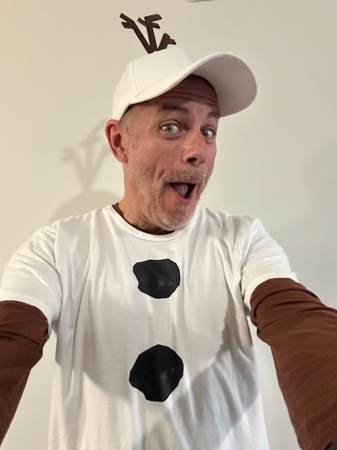

# Happy Halloween

## 09:00am

Happy Halloween!..hehehe

I don't always *celebrate* this holiday. I am certain I didn't do anything last year...LOL This year, I decided I'd wear my Olaf Disney bound attire. I've had one of those years where I just want to be myself. This is very *me*...hehehe

This weekend marks the one year anniversary of my runDisney race! I'm not participating this year. But it is still worth thinking about. It was the literal finish line for the start of my physical health journey last year. A lot has happened since then. But that was the goal I was aiming for to see if this journey would become a lifestyle. And a lifestyle it did indeed become! Yay!!!

Today, I decided to start work before starting my journal. I stayed up late for the game. And I had a rough morning transitioning from being asleep to being awake. My upstairs neighbor was much more active than usual. It was difficult to remain asleep with all the *stomping* he was doing. He wasn't actually stomping. But it sounds like that being under him...hehehe I think this apartment is the first I've had where someone was above me. I'll keep this in mind for my next place...LOL

I was thinking the other day that this place is the first that I feel is truly mine. Even when I've lived alone a few times before, they never felt like *mine*. Someone else was always involved in the decision. My first solo apartment was in 2010. I wasn't doing well financially and needed something cheap. My hometown has some slums...hehehe My family knows the *slumlord* and I was able to get a place for $500/month. He treated me well because of my family. But the key here was that my parents helped me secure the apartment. I paid for it. But they were involved in making sure I could get in.

My next place after that was the first house I bought. Although I did buy the place on my own merit, I was buying the home from a friend. I didn't shop for the home. I was mostly helping a friend out who was having trouble selling. I did love that house. It just wasn't a place I probably would have chosen today all things considered. My friend gave me a really good deal. It just never felt like mine. It felt like I was borrowing it from him...hehehe

I briefly rented a condo in Indianapolis after that house and before my next one. I did acquire it on my own. But I wasn't there very long. Shortly after getting it, I ended up with my wife. She already had a house. So, although I technically owned that house, it was still hers. I always felt like I just lived there versus truly calling it my own.

After that house, I was a nomad until I moved here. My decision to move to Florida, acquire this apartment, and make a life here was all on my own. I did choose to live near my sister and her ex-husband. But they weren't really involved in this. The only thing that still sticks out in my mind is that I came here by running away from my past. This apartment does feel truly like my very own home. But that last bit still hovers over me.

Which leads me to my actual point. Where I end up next will truly be special. It will be all my own and I'll be moving toward it and not moving away from something. Even with my feelings about my current home, I will not be moving for the sake of getting away from it. I'm actually only acknowledging that I'm not planted here. And even though I've talked about moving next year, I really don't know yet. I may decided to remain here at least another full year.

In the event I move back to Indiana, and if Malachi moves in with me, the place will still be special. He is my son. He adds to my life. Him living with me won't make the home less special. It will enhance just how special the experience will be.

This has been fun to think about.

