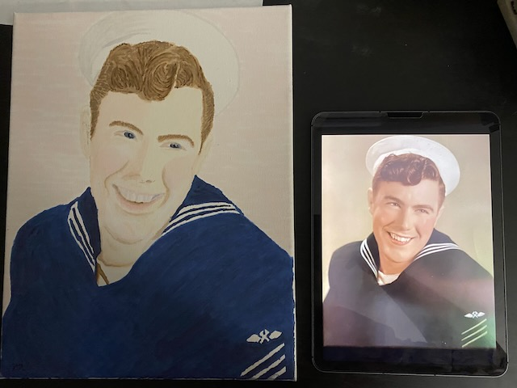

# TBD

## 07:55am

Another day to thank the Lord. Every day is a gift. Every sleep is God renewing my body for another day. My gratitude continues to grow.

Last night I was blessed with a precious gift. This was on top of the gift my friendship with Cherie already is. She expressed the friendship further through a poem she has written for me. It is published through The Unsealed community. You can read [Garden of Memories](https://theunsealed.com/activity/p/25379/) to see for yourself. I'm grateful for the friendship that inspired the words. We continue to plant seeds and water the garden of this friendship. And God is the One who makes it grow. It's a beautiful garden that I cherish very much. Tending to this garden with my deer friend has been one of the best experiences of my life.

## 08:40am

Well, I was blessed again this morning. Tyrese shared with me that she had an *awesome dream* about Animal Kingdom last night. She told me it was solely based on things she'd seen through my eyes <3

I don't often share my experiences on social media. I toss out little bits here and there of things I'd like to share from time to time. But privately, I quite often share my experiences with my closest friends. Some of the photos and video clips are to a an individual as they are inspired by that person. However, I also have several things that I capture for myself and then share with multiple people like Cherie, Tyrese, and Dan.

I'm glad I am able to do that. It is not only a blessing for them, it is also a blessing for me to have friends to share with. I'm physically alone most of the time. God has been showing me that I'm never truly alone, though. He is always with me. And he has also provided some close friends I can share moments with through technology. I'm learning to let go of the physical presence of people. It has been rough this year dealing with that. But I'm grateful for the peace God is growing in my heart. I wrote about this topic in my Bible study notes this week. It's something God is healing me with. What once was a burden is becoming a blessing <3

## 09:25am

I'm not sure if I talked about the healing in my Bible study notes. I may need to revise my notes if I did not. I'll be sure and have a look at that tonight...hehehe Part of that question was about what deeper need did something I lack expose. In the process of exposing that deeper need, healing has taken place. God's process is so beautiful to me. I sometimes talk about the circumstances as I answer the questions from the devotionals and Bible studies. I hope I also talk about the healing God is doing. The questions don't always ask about that part and I feel like sometimes I may not talk about it all as a result...hehehe

It's kind of interesting how not everything I say or write fully conveys what is in my heart. I do not intentionally leave out details. Sometimes I think I've included the details I leave out. That's because I have given it all sorts of thought. Later, I realize they were just thoughts that I didn't write down or say...LOL It's as if I have had the conversation in my head but not in real life. Having it in my head gives me the false illusion that I had the conversation. I hope to get better at this. I'm growing and learning how to communicate better. It's a process. I'm making progress...hehehe

## 10:25am

*Well, Greg just won Christmas* (eye roll)

That was a phrase I heard 3 years ago at the last Marine extended family Christmas I attended. It was spoken in the sort of tone that left me feeling as if I had done the worst thing ever...at least the worst thing to the person who said it. As this weekend approaches, I realize this one statement is likely the main reason I haven't been to a Christmas gathering with that part of my family since. Not intentionally, of course. I'm thinking that on a subconscious level, it might be why I haven't done all I could to be at those parties since Christmas 2021.

As part of dealing with the loss of another marriage at the end of 2021, I had a renaissance of sorts. In an attempt to reconnect with who I truly am, I began painting again. That has since led to some amazing things. But back then, the most amazing thing was a painting I made of my paternal grandfather's Navy portrait. At the time, I hadn't yet fully grieved the loss of grandpa. Doing the painting helped me process his death. I decided I would give it to grandma as a Christmas present that year.

Of course, grandma loved it...hehehe Unfortunately, some folks in the family seemed to expressed how that gift overshadowed everything else she was given that year. I felt horrible. So bad, in fact, that my old self would have given up painting again...LOL Fortunately, though, my reconnecting with who I am led me to my continuing to paint. I had already experienced some healing of my past even as early as that Christmas.

Now that I am heading back to Indiana this weekend and will be going to this year's family gathering, I'll be facing what happened 3 years ago. I highly doubt anyone even remembers that. So it will be an internal encounter. I'm thrilled that I've healed even more over these past 3 years. Especially the growth I've experienced this year. I'm glad I can write about it as part of my processing what happened. It doesn't hurt anymore...hehehe

Here is grandma looking at the painting after she opened the box...

Here is the painting next to the photo that inspired it...

I honestly don't know why people say what they do and in the tone they say it in. I've said some things over the years and in a tone that was very much like this. I'm sorry I've ever made anyone feel horrible by what I've said and how I've said it. And I forgive them for what they've said and how they said things that made me feel horrible. The truth is, we all do this. And we all react in our own ways. They didn't intend to hurt me. So my feelings in that moment were just a reaction. Today, I choose to respond with grace.

## 12:55pm

I received a package today...hehehe One of the gifts mom and dad got me was coffee from Joffrey's. It is entirely up to the TSA person if they'll allow you through security with coffee in a carry-on. I once traveled with coffee in those k-cup packages. They almost denied me. I believe the reason is because coffee is something you can smuggle drugs in. It masks the sent of the drugs from the dogs...LOL So, mom had it shipped to me.

Included in the package, they added a new coffee mug and a candy tin. I'll have to toss the candy as I don't eat that anymore. But the tin it came in is cute. It's from *A Christmas Story* where Ralphie is in the pink bunny suit...LOL It says, *He looks like a pink nightmare*...HAHAHA The coffee mug has the word *grateful* written on it. It is a very appropriate coffee mug for me <3 Both of these items were a surprise.

The other Christmas gifts they gave me, I was able to travel with on the plane. Funny thing is, I had no idea I'd be going back this weekend...LOL I could have saved the Christmas gifts for this weekend when everyone else opens theirs...LOL

Cherie mentioned she'll be mailing my gifts from her tomorrow. They should arrive in time for us to open each other's gifts on our call a week from Sunday. That'll be so much fun!

We are also talking about working in a quick call on Christmas Eve. There are 3 services that day for Community United Methodist Church. Perhaps we can do a quick call between a couple of those. We weren't doing video calls last Christmas. Although we were already friends last year, we didn't share Christmas in the same manner as we are this year. She did send me a card from Bambi last year. I still have it on my refrigerator...hehehe

All years have their thing that is special. But this year is extra special in many ways. It was especially special for our friendship. A lot of firsts happened this year. Not just between us. But we both experienced firsts with each other that neither of us had ever experienced on our own.

## 03:45pm

We talked...we'll have a video call between the latter two services for CUMC on Christmas Eve <3

I keep going over this year in my mind. It truly is the best year of my life. Not to put too much pressure on it or future years...LOL Honestly, though, I don't think I really measure years. I do sometimes apply such labels. But deep down, I realize each year is a series of moments that tell the story of my journey. I don't have to look at things as good or bad. I don't have to weight everything to find what I love and hate. I certainly like to find my favorite things. Those help anchor me a bit. But overall, I'm grateful for all of my moments.

One good thing about looking for favorite moments is that it helps me review how each day, month, or year impacts me. That's honestly why I ask others what their favorite moments are...or what was something that made them smile...or what was the funniest thing they experienced. Memories and stories make an impact on all of us. It's fun to share those memories and stories and it's good to take a moment to reflect on it all. It's even more fun when the memories and stories happen together with the people we love and who love us.

I also have memories and stories that weren't so much fun. And some of them are with people who do not love me. I'm grateful for those memories and stories as well. When I think about how God works all things for the good of those who love him, and are called to his purpose, I can be grateful for all moments.

Case in point, something seemingly horrible happened to me just over 3 years ago when my last marriage ended. It reignited my joy for painting. I then painted that portrait above. God's healing me kept me going despite a few reactions. I continued to paint. I made a Twitter post inviting others to tell me who their favorite Disney characters were. I painted several of them and gifted the paintings to those people. One of those people became one of my deerest, most cherished, and best friends who gifted me with my favorite year this year <3

When I have a look at the journey as a whole, I realize there aren't good or bad moments. There are just moments that, when chained together, make up a good life. God's goodness gives me the hope we all crave. I just need to endure the circumstances I don't like and learn from them. This builds my character to appreciate those circumstances for what they are and gives me new eyes through the Holy Spirit to see God's goodness. And that leads to hope. If this sounds familiar, it should...it's a life with Romans 5:3-5 applied to it.

As it turns out, that passage is part of this week's Bible study lesson...hehehe How about that!

