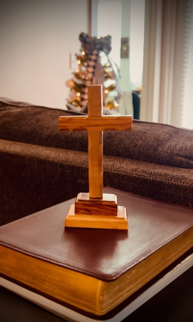

# TBD

## 07:45am

I'm surprised I'm functioning as well as I am this morning...LOL Yesterday, I went all day on 5 hours sleep...LOL I went to bed early on Christmas Eve knowing I'd want to wake early yesterday. I did wake early. But much earlier than I had planned. I was able to get ready for my day, while doing my normal routine, without rushing. And when I was ready, I actually had time to relax before hitting the road.

I went to Disney yesterday. I'm thinking about doing a second journal entry today just for that. I didn't get around to journaling about Thanksgiving. But I would like to document my Christmas. Especially since it was my first Disney Christmas. With Thanksgiving, I have done Disney several times now...hehehe

But just in case I don't journal that experience, I'll go ahead and mention that I arrived at the TTC (Magic Kingdom parking lot) around 7:30am. I went all day and didn't leave the TTC to head home until around 9:30pm. I did 3 of the 4 WDW theme parks. And it was pretty much non-stop all day. The exceptions were the hour for lunch and the hour for the Candlelight Processional. That's 14 hours of go go go after only 5 hours sleep...LOL

Yet, here I am, functioning today after a typical night sleep...hehehe Just goes to show you how God has been healing my body, soul, and mind these past few years. I actually had enough energy to keep going last night. But I knew I had to work today...LOL

God is good! His loving kindness endures forever. AMEN!

## 09:15am

I ordered Joffrey's...hehehe It has actually been a while since I've ordered their coffee. I took a break from them to try the beans available through Sprouts. So for a few months now, I've been getting my coffee from Sprouts. My parents gave me some Joffrey's for Christmas. I had forgotten just how much better Joffrey's is...hehehe

What my parents got was through Amazon. So the beans were probably roasted earlier this year. It was a Disney themed blend and flavor from St Patrick's Day. I had that one back in March and loved it. It is just as good as I remember. It didn't taste old. The problem with the Sprouts beans is that I imagine they were roasted long ago. I've never actually seen anyone else get their coffee from the bulk section. I wonder how long those beans have been sitting in those bins...LOL The taste tells me it is likely quite a while.

I've missed having the Sumatra beans from Joffrey's. So, I order that again. I also ordered a gingerbread themed flavor that is new this year. And I went with an African blend for a third option. It will be nice to have a variety again...hehehe When I order directly, they roast to order. It will take a few weeks to get them. But they'll be fresh roasted; which makes it all taste so much better than store bought...LOL I may need to get a little more from Sprouts before the order arrives, though. I'm not sure I have enough to make it a few weeks...LOL

I originally planned to go to Disney for NYE again this year. I'm on the fence about it, now. I haven't canceled my park reservations yet. I was thinking about staying in a hotel that night and enjoying the parks both days. I did decide not to take NYE off. I'm hoping to still get a half day like I did for Christmas Eve. But I may not go to WDW as originally planned. I'll want to decide soon, though. I'd like to free up the reservations. Although, that doesn't seem to matter so much at WDW. They don't care if you don't show up...LOL They are more lax about it than DLR is...LOL

I'm thinking I'd like to relax as this year comes to a close and the new year begins. New Year being on January first no longer has the same meaning to me. This year, I adopted the concept of my personal New Year being on my birthday. That'll be on March 20th. I'll probably do something special around that time. I have been doing that for a few years now. And now, the day has more meaning as my personal New Year's Day...hehehe

That said, I'll still stay up until 12am to ring in the *new year*. I am also thinking about saying up until 3am to ring in California's *new year*...hehehe

## 11:00am

I don't like to compare or weigh things like gifts. Each gift I receive has its own special significance. But from time to time, I receive something that has a meaning I don't often get to express my full gratitude for. Now that I've been journaling, I get the opportunity to talk about such things.

Cherie gave my a cross this Christmas that has more meaning to me than I actually told her. Luckily, she will be reading this journal entry...LOL

Everything she gave me has special meaning for me. But I wanted to call out the cross. Not because it is a cross. But because it was something my heart deeply desired. As I look around my home, the most common thing I have is a collection of Olaf's...LOL I only have two paintings of crosses that I personally made. I did not have any other crosses to speak of.

The cross is nothing more than a symbol, really. But deep down, I really wanted a physical cross to look at as I focus on God in  my prayer time and Bible study. Most Christian homes have one. I can't say that I've ever purposefully had one all these years. I've never told anyone I really wanted one. And I do mean *really wanted one*...badly...LOL

Having a cross, such as the one she gave me, is something truly special. It wasn't the sort of thing I was going to passively look for and buy just to have one. But it also wasn't something I was actively praying God to lead me to. So, this particular cross is a true Godsend I was not expecting. Just like my friendship and fellowship with Cherie.

I didn't take the time to write this on Tuesday. The day was full and I cut it short by going to bed *early*. And having a few days to process my thoughts and feelings internally as been a good thing. This is one of the most significant gifts I've received from someone in all my life. Thank you, Cherie, for my cross <3 It was as if you read my heart like a story and just knew what the story needed <3

## 01:30pm

I sent Cherie the passages from our fellowship time on Tuesday. I had intended to send her those that night. I didn't get to that task before bed...hehehe I'm glad I was able to take care of that at lunch today. I didn't want too much time to pass after our Christmas fellowship...hehehe

With it being the holidays, work is a little different. I'm able to get most of what I need accomplished. But there are a lot of folks out right now. So, not everything is getting done. I'm sure January will be *fun*...LOL But it's all good. I don't really stress about the work I'm doing. It will get done. And the things I'm waiting on will get done. Everything happens exactly when it needs to. I'm learning to trust that. I can only do what I *can* do...LOL No use in worrying about what I *can't* do. I'm blessed with a boss who understands that. I was always that boss. But I haven't always had such bosses...LOL

I have given some thought to some of the things I'd like to do in the coming year. But nothing is in stone yet. That's mostly because I don't want to put too much pressure on it. This year went really well. Some of the goals were met. Some fell short early on. I never truly know what to expect each year...let only each day. Some things need planned while others just sort of happen.

One thing I'm considering is journaling every day. Even if it is only a few paragraphs, it would be nice to write a little something each day. And I'll be okay if a day goes by without writing something. I just think it would be fun. And one thing I plan to do is go back and reread my archived entries from this year on the one year anniversary of each. It looks like my first entry this year was on January 5th. So, on that day, I'll read the entry from that day. It should be fun!

