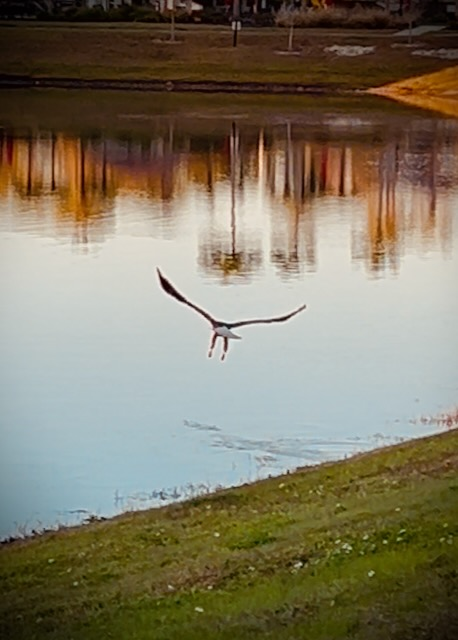
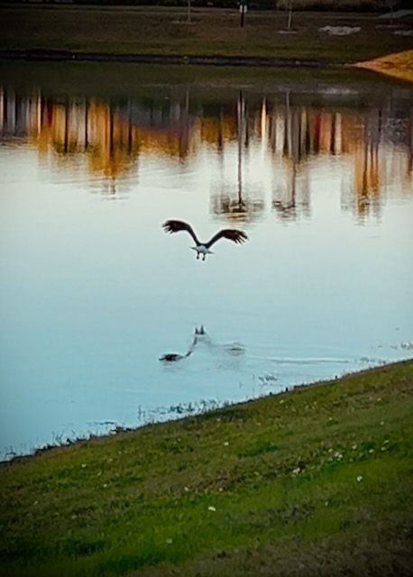
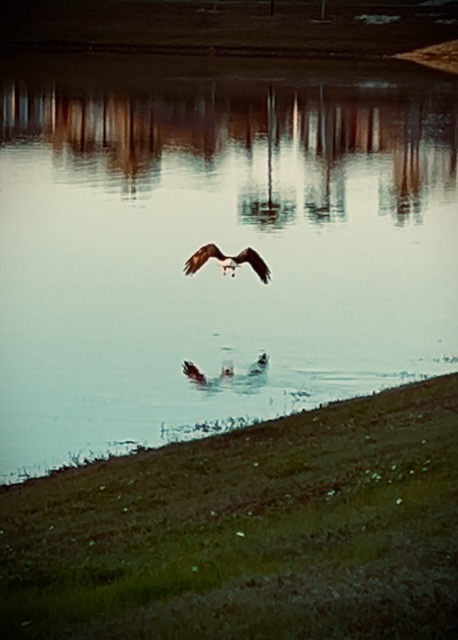

# I Saw an Eagle!

Three days into the new year and I've journaled each day. Will I journal every day this year? I don't know. It wasn't one of my resolutions...LOL But it is a goal, like last year, to journal as often as inspired.

Although I am not putting timestamps to this, I have been writing throughout the day these last few days. That would be why I sometimes jump to a completely different topic suddenly...hehehe

After my morning prayer, I took a walk. I had missed getting outside so early in the morning. Well, not so early. But before work. I don't recall the last time I took my first walk before work. I was able to see what I call the sunrise. It technically isn't the actual sunrise because there are too many things around here to block it. But just as the sun is rising above the nearby mall, I see a beautiful sight. It was great to see that today. It had been far too long.

I feel completely different now than I did on Tuesday. It is as if the new year starting was a switched that got flipped. I'm not sure I can explain it well today. But perhaps, as the year progresses, my journal will reflect what I feel. Of course, things rarely happen overnight. It is actually something that had begun after my California trip in November. But ringing in the new year has made a noticeable change in my spirit. It was as if all that happened between November 10th and December 31st was preparing me for January 1st, 2025.

In a way, I have been training myself for things like this for quite a while. Years ago, I had gotten tired of messing up the year when I wrote out dates on things. To fix that, I would start using the next year's numbered year for certain things. I would still use the current year when applying actual dates to things. But I would use the next year for random stuff. What would then happen is I would use the correct year on January 1st. Once again, that worked this year...hehehe

These past few years, I've been doing something similar going into each new year. If I had some goals for the new year, I would actually begin working on them the last quarter of the current year. The 2023 into 2024 example would be how I start my day with God. I began that in October 2023. That has now continued to this day. Going from 2024 into this year, two of my major goals were to eat at home more often and to wash my dishes by hand most of the time. I began that process in November and it has now continued into 2025. So far, so good...LOL

I admire those who can dive into things. I'm one who needs to gradually transition into things. I've had to dive into things from time to time in my life. It's a little scary. My preference is to make small sustainable changes, though. If I dive in, sometimes I quickly burn out. I'm more like a kerosene lamp with a wick. Slowly burning and providing just enough light to get through the night...LOL If I were jet fuel, I'll be more like a missile that destroys the target upon impact...LOL Not a great analogy...but you get the picture...slow burning light vs total mess and destruction...LOL

I looked at the temperature before my lunch walk and decided I needed a jacket. When I stepped outside, it felt much warmer than I expected. I quickly took the jacket back inside. When the sun is shining as brightly as it is today, it feels so much warmer than what the thermometer says. In the shade, it is very much what it says...LOL Since I was mostly in the sun, a jacket was not needed.

Days like this are nice. It was brisk in the morning, warmish in the afternoon, and it'll be brisk again this evening. We have a few days of this now and then again in a week. It will be near freezing next Friday if the forecast holds true. When I first moved here, I didn't like the idea of cold days...LOL Now that I've been here for 3 years, I enjoy all the weather. All of it has made me appreciate the weather I have here now, and what I had in Indiana before moving here.

I've been taking various video clips today. I may compile them into a video journal of sorts at the end of the day and link it in this entry. If I don't, at least we'll know I thought about it...LOL When I first thought about video journaling going into the new year, I felt like I wanted to be purposeful with it. Yeah, I'd rather just be casual. If I want to remember something I took a video of, I'll toss it in the compilation. If not, I won't...LOL And as far as edits, I'll just trim things. The point of the videos are two fold: 1) To record sights and sounds from the day. 2) Grab some photos; one of which will become the photo of the day.

My sleep tracker says I got another 7 and half hours of sleep last night. I think it was closer to 8. I had several dreams and a few trips to the bathroom through the night. Overall, I rested well. I woke up feeling more energetic than yesterday and I'm not really dragging today. I feel a little tired still. But I'm doing really well today compared to the drowsiness I experienced yesterday.

*The difference between a flower and a weed is a judgement.* ~ Unknown

That was the quote from my tea today. Some of the flower photos I have taken and shared with people or posted are considered weeds by definition. However, I find them beautiful and therefore capture their beauty as I see it. The angles I choose often make them look much larger than they really are. And they look more like something you might find in a garden. Truth is, they are invasive...LOL

I've chosen to look at them as flowers instead of weeds. But it does bring to mind the parable of the wheat and the weeds. The owner of the field plants good seed. His enemy comes in the night and plants bad seed. This isn't directly related but does spark a thought. The world is full of things that are bad that masquerade as good. Be it *health food* or *false doctrine*, there are some *flowers* out there that bloom from an invasive root. Not everything I see as good really is. I need to look to the Creator of all things to know which things are good and which are bad. I also want to be sure I'm blooming from the good root of God. I don't want to be a weed that looks pretty but is invasive...

*Some people are worth melting for* ~ Olaf (*Frozen*)

I'm wearing a t-shirt my parents gave me this past Christmas that has Olaf on it with the above quote. It comes from a heart melting scene in *Frozen* that just makes my heart happy...hehehe Well, I am also reminded of what Christ did. Imagine a scene where someone was about to die from a sin they committed. In comes Jesus telling them he had come to take their place. The sinner asks, *Why would you die for me?* Jesus replies, *All people are worth dying for*

For my third walk today, I encountered the majestic bald eagle <3 I've seen one here a few times before. This time, I got really close to it. I didn't know it was sitting there by the pond until I was almost upon it. I got my camera ready and it took off just as I hit record. So, I wasn't able to show it while it was still on the ground. But I still enjoy how the video turned out. The photo of the day came from this experience:

I'll include the honorable mentions at the end once again. I had a really good day of capturing what my eyes and ears saw and heard.

My Bible in a Year plan and this week's Bible study have been amazing. I've always known a *daily walk with Jesus* was important. But whoa! What began in October 2023 has become something I never expected from this journey. I'm discovering that being in the Word and studying it isn't just about applying it's teachings in my life. Sure, that's a good thing. But I'm learning about God Himself. As in, God the LORD. Being in a true relationship with Him is what it has been all about.

I'm hoping to spend some time tomorrow working on my Bible journaling workflow. I'd like to have a site similar to this journal that will contain all of my thoughts on what I'm reading. There will be notes from my daily reading. As well as some notes from my studies and devotionals. I'll add to it each day and year. For example, if I do a Bible in a Year plan every year, I'll be adding new thoughts to what is already there from previous years. Over time, it will become a great resource for me to keep tabs on my Bible study.

I'll probably make it a public site for others to read if they'd like. I'll not include any personal information on that site. Some of the devotional and Bible study questions get a little personal. I'll either leave those things out or generalize the answers for the site. It'll also be my thoughts mostly. When I'm doing a devotional or study with someone else, I'll not include their notes. I'll look at it as more of an open commentary on the Bible.

We'll see if something comes of that. I really don't know...LOL

For my [video journal](https://youtube.com/shorts/K2is59uGd7Q) today, there is a brief 10 seconds where the audio is muted. The sound from that clip was horrible. But the video was great. So I dropped the audio for 10 seconds...LOL

Here are the *honorable mentions* photos:

