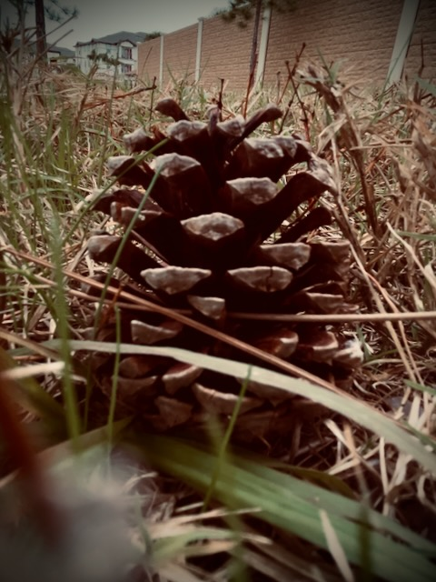

# Please Forgive Me

## 21 Days of Prayer and Fasting

In yesterday's message at theChapel, the pastor mentioned a definition of fasting that resonates with me. He said something to the effect of *fasting is temporary denial of something I want in pursuit of something God wants*. And there is no better way to pursue what He wants than to pray and read the Word daily. Fasting helps me focus my prayers and daily reading when I need to hear something specific. Or this year, a few specific things.

Seasons like the one I'm in at the moment are a blessing because I'm denying some things that I want in the hope that I'll better hear His Voice about what it is He is wanting to tell me. That is why I am doing this. It is helping build my relationship with God. It helps me grow and become a better version of myself. The version God is transforming me into being. It helps me be a better follower of Jesus, to love God more, to love others more, and to find that peace and soul satisfaction God pours out freely.

Today's prayer focus is forgiveness. While hanging on the cross, Jesus said, *Father, forgive them, for they do not know what they are doing.* Luke 23:34a The context is that He had just been crucified. In other words, that was the moment His cross was lifted up and the base was secured in the ground. Here He was an innocent man, being given a criminals execution. And yet, He asks God to forgive the very ones who were doing this to Him. And in a way, He wasn't just asking for the forgiveness of those present...but for the whole of humanity.

*Father, please forgive me. Even when I don't know what I'm asking forgiveness for. Please reveal the sin in my life so that I can repent and turn my life away from it. I'm far from perfect. I've lived a less than perfect life. There is no sin that You do not know about. I do not know what I am doing.*

*Please forgive others who have harmed or wronged me. Even if they do not know they have done so. Although, I believe I'm more often than not hurt by my own expectations. There isn't anyone perfect. Please forgive them and help me to forgive them myself. Just like me, they do not know what they are doing.*

*Lord, the church is also far from perfect. Please forgive the church for the sins they are committing against you, each other, and to the world. It's an imperfect place, made up of imperfect people, and being run by imperfect policy. Please forgive "her" for "she" does not know what "she" is doing.*

*And please forgive the pastors. They are all human just like me. And they have the added burden of responsibility for everything they speak at the pulpit! I cannot imagine the weight of that! So please forgive them of their sins against You and others. They do not know what they are doing.*

*Thank You that I can ask for forgiveness for myself and others. It is a gift I cherish very much. Help me live a life that reflects my gratitude for You gift of salvation. Please empower me with Your Holy Spirit to do the good work You have planned for me today as I seek first Your Kingdom and Your righteousness. In Your Name, AMEN!*

## My Day

Once I started work, I had a really strange morning. It was a good test of some of the work related attitudes I've been trying to adopt over the last year.

I'm one who doesn't like to have meetings before 9am. No sooner than I logged on, someone hit me up saying they were scheduling a meeting at 8:30am...LOL I have a daily 9am meeting. I was concerned at first that this popup meeting would interfere. But I remained calm. I also typically make some toast around 8:30. So, I knew *that* wasn't going to happen now...LOL

I almost asked him if we could have it later in the day. But there were a few other things to consider. One, my not liking meetings before 9am is a *me* problem...not a *them* problem...LOL Also, I had various other meetings today. Moving that one would just gum up another part of the day.

Well, the meeting started late and I grew concerned about my 9am meeting...hehehe Fortunately, we were done just before 9 and I was able to quickly hop over to the other meeting. (wipes brow) All was well in the world...LOL Except my toast...LOL

I don't know if that popup meeting threw me off, or if it was something else. But I had something going on in my body all day. When I would eat, I felt great. But shortly after eating, I would feel fatigued. Once I ate again, I was back to *normal*...until a little while later...LOL But, when I went on my walks, I had energy again. It was so weird. I doubt being delayed on breakfast could have impacted my entire day. I'm doing fine...just an observation in some weirdness today...LOL I feel completely fine otherwise.

I did my morning and lunch walks at their usual time. But there was a growing chance for rain around the time I take my evening walk. So I ended up doing that one early. Around 3:30pm I think. That was the walk where I captured *today's* photo. I also captured a video that I posted as a Instagram and Facebook story.

It was a bit gloomy here all day. I don't mind days like that here. They are few and far between. They don't bring me down like this kind of day did in Indiana. Up there, the *Sunshine State like* days were the ones few and far between. It was glooming most of the time...especially in the winter. I don't miss that part of Indiana life...LOL

I went to the post office today. I mailed a new dog toy to my deer pal for his upcoming *Gotcha Day*. He brings me so much joy and it makes my heart so happy to see how much he loves his last toy. This one is similar to that one in the type of play it provides. So, I hope he loves this one too. I know it is a little silly, but I wrote *him* a letter...LOL It was fun. I made several mistakes, though. I handwrote it...LOL There is a certain beauty in the mistakes of a handwritten letter. I'm full of *oops* moments myself. My letters reflect that sometimes...hehehe I had to write the address label twice...LOL I even messed that up...LOL

I made chowmein for dinner. The sauce I used was the spicy orange. I hadn't had that in a while. It was a nice meal to enjoy as I watched this week's episode of *The Chosen* for the Bible study. I'm not sure if the study itself will provide me an opportunity to say this. So, I'll say it here for now. I relate to the Mary M. character in this episode. I don't recall how many episodes the story arc is for this part of *her* story. But I do recall the story line itself. I've been there *Mary*. Hang on...you'll get through this <3

I love Mondays...LOL Unlike *Garfield*...LOL Who, by the way, was also *born* in Indiana in the 70's...LOL But like Garfield, I once did hate Mondays. I would get those Sunday evening blues dreading the arrival of the work week. It hasn't been for long that I stopped chasing the weekends and dreading Mondays, though. In my own way, I find that all days are equally precious.

I wonder what tomorrow will be like?

## Photo of the Day

The pine trees in my community aren't quite that mighty just yet. They are only a few years old. But they are full of potential already.

As long as I continue to seek growth in my life, I'll remain full of potential too. I can imagine I sometimes make life look easy. But the struggle, it's real. There is always hope. All moments are precious. Good or bad.

## Wrapping Up

I think I'd like to do a timestamp entry tomorrow. I have a variety of types of days. But I am struggling to find the words to describe the day once it is over. I was doing really well documenting the day without timestamps by hopping on the computer to describe things as the day goes on. But I've lost that momentum again...LOL

When this happens, a good old classic timestamp entry usually does the trick. What I'll likely do is continue with the format I've been using during this brief season. I'll just do the timestamp writing in the *My Day* section...hehehe