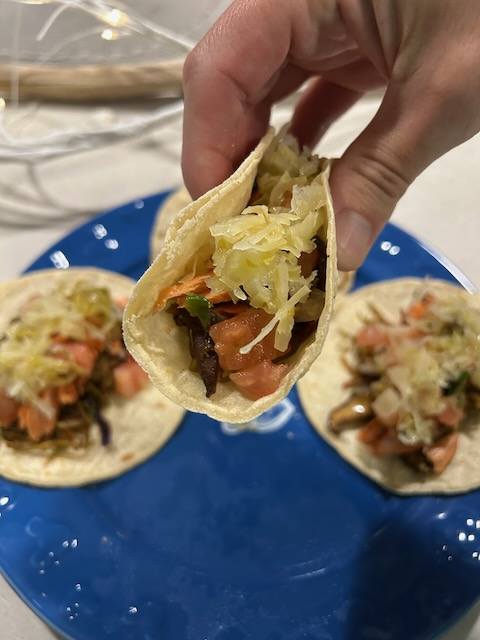

# Gregilocks and the 3 in 1

## 21 Days of Prayer and Fasting

Aah! Would you look at that! Two weeks into the new year. And 10 days into this year's season of focused prayer and denying myself something I want in pursuit of something God wants! What a wonderful thing it is to have another day! Thank you, Lord!

Today's prayer focus is to give myself to God. And to pray that others do as well. This isn't just about submitting to His Will. But rather, giving literally everything to Him. Our problems, our struggles, our successes, our failures, our worries, our anxieties, our happiness...and the list goes on and on and on...well, you get the picture.

This isn't always an easy thing. Oftentimes, we wait until we are so desperate that it is the only thing left for us to do. That was even Jesus' last prayer on the cross. Luke 23:46 reads, *Then Jesus called out in a loud voice, "Father, into Your hands I commit My Spirit." And when He had said this, He breathed His last.*

The author of the devotional challenges us to commit everything to the Father today...right now...don't wait! What if I were to commit my spirit and everything else to Him first thing. Kind of like how we took communion to start of the new year on January 1st. That was a great way to commit the new year to God!

*Father, into Your hands, I give you my everything today. All of the things that make me happy, joyful, and everything I love. I also give you my worries, anxiety, struggles, and all that is weighing me down. I give to you my job, my family, my friends, and everyone impacted by my existence. Father, all I have is Yours. Thank You for coming along on this journey with me.*

*Also Father, into Your hands, I commit my church. I pray that we give you absolutely everything. I don't mean like giving a portion of our finances or talents or time. I mean fully giving the mission you have for us in the community. I pray we commit to You our worship and our hearts. I pray we commit it all and not just a portion. Take all of us, Lord, I pray!*

*Finally, Father, I pray for the pastors. I pray this also commit all of themselves today to the ministry You have called them to. I pray they commit their families to You as well. May they give themselves wholly and fully over to You to carry them in their struggles and in their celebrations.*

*Thank You so much Lord for leading me to a season in my life where I desire to be fully committed to You. To lay aside all of my own desires to focus on what it is You want. Today, and everyday forward, I commit myself and give myself to You. I want to know You more! In this I pray in Your Name, AMEN!*

Starting my days like this has been a blessing. I need to start my everything like this. Committing whatever it is to God first. So, for today, I commit my day to God. When I start something new...a relationship, a job, a creative project, a Bible study, a phone call...you name it...I want to commit them to God from the start. Not just when I'm at my wit's end or even after I've succeed in something. I did this with my New Year's Resolutions...and so far, those are going quite well 2 weeks into the year. Yes, there is a long way to go. But committing these things to God first, I believe, was the best way to start!

## My Day

### 07:30am

I just completed my morning prayer and devotional time. Now it is time to do my morning prayer walk. I start my days with prayer. So I do commit my day to God. But now I'm going to commit my morning walk to God. I'm grateful for these walks. It was just 2 years ago when I struggled to walk a single lap around the pond. Now I walk 4 laps each time at a pace twice or maybe three times faster than I do that very first time...LOL

### 08:45am

It was a little chilly today for that walk. It wasn't too bad, though. It was the time that made my hands and face tingle. But not so cold that I needed an extra jacket or gloves. And at the pace I walk, I warmed up rather quickly. I captured a few moments that will make for some good photo candidates today.

I've made some toast and I've heated up some water. I'm still drinking hot water. I did add a morning glass of room temp water that I drink during my morning devotional. I realized waiting a few hours to have my first water was a bad idea. I didn't plan to wait. It just sort of happened...hehehe

My first meeting of the day is going to begin soon. I have a lot of meeting today. I'll try to be productive in between them...LOL

### 10:40am

I ran into an issue with a project at work that had me puzzled yesterday. Of course, it's one of those projects I've inherited as part of all the changes going on. Not being familiar with it meant I didn't know what I didn't know...hehehe I couldn't get it to work locally on my development desktop or on the server...LOL

Well, this morning, I discovered both issues. Locally, the problem was I needed to log off the desktop and log back in so my user profile could be updated. Before I started work on the code yesterday, I wasn't in the proper security groups to have access to the app in the first place. But after being added to the groups, it still didn't work. It dawned on me this morning I might need to log off and back on again. Yep, that fixed the local issue and everything started working...hehehe

Then I tackled the server issue. The place it was failing was with the database connection. On the server, my groups were working just fine because it downloads the latest profile when you log into the app. Well, I set up my local development environment to use the database credentials used on the server instead of my own account. BINGO! The login was failing for that service account...LOL

I have meetings that interfere with my lunch hour today. This rarely happens. I'll have to split up my lunch break. I must take breaks...everyone should...but I digress...hehehe So, here in a few minutes, I'll do my afternoon walk early. Technically, it will be a second morning walk...LOL But I'll get it in before the first meeting. At some point during or between meetings, I'll find a moment to make something to eat. I'll probably eat one of my food bars after my walk to tie me over. That's one of the reasons I keep those in stock...hehehe

### 1:15pm

I didn't end up eating a food bar. I had time to warm up some soup between meetings...hehehe But I did get my afternoon walk in a little early before the a meeting. I haven't had time to do my Bible in a Year plan yet, though. I'll have to break later for that. One of the big meetings this afternoon was moved to tomorrow. So, I'll have time this afternoon.

### 3:15pm

It has been weird to split up my *lunch* break today. I took my walk at 11am. Now, I'm breaking for my Bible in a Year plan...LOL Well, actually, I just finished reading that and listening to the recap video. And now I'm adding to my journal...hehehe

The day is going well. It hasn't been too fast or too slow. It has been just right. You can call me Gregilocks...HAHAHA j/k Having a minor disruption in my routine a second day in a row has been okay. I've managed and handled it well.

I wish I would have had the opportunity to write after my second walk. I had some things on my mind after praying that I can't seem to recall at the moment. Perhaps I need to come up with a workflow that allows me to write some journal notes from my phone and then later transpose them here.

Well, time for some kiwi...hehehe

### 5:30pm

I just got in from my evening walk. It is such a lovely evening. I like that word, *lovely*. It better describes certain things more so than words like *beautiful*. At least to me, anyway...hehehe

I was reminded of what I wanted to write about before after my second walk. Prayer walks have a tendency to do that to me. I wanted to talk about how changing who I am committing something to has made a difference in my life.

I have often made certain commitments to other people. I would do this or that *for* that other person. That sounds just lovely doesn't it...LOL Well, I often found myself failing at those commitments. Of course, I'm referring to things like getting healthier or going to church.

I still have times when I feel like I'm committed to something for others. But a lot of social media posts over the years got me thinking that I need to make these commitments for myself. And for a time, that did work. In fact, my current health journey began two years ago with the thought that I just wanted to feel better...for *MEEEEEEE*...LOL However, in order for this journey to stick and become a true commitment, I had to turn it into a commitment to take care of *my* temple of the Holy Spirit. I needed to turn it into an act of worship.

This leds me into today's prayer focus...on commitment. Namely, committing *everything* to God. As I look back at all of the commitments I have ever made, the only ones that didn't flop around on the ground like a fish out of water are the ones I committed to God.

What a difference a simply focus change can make. Yet, it isn't very easy to change focus. I'm so easily distracted by my world. I say *my* in the since of everything that impacts me or the things I myself impact. It isn't actually *my* world...hehehe Philippians 4:8 helps me retrain my focus. Whenever I am distracted, I look to the things that help lead me back to God, Jesus, and the Holy Spirit. The Godhead, three in one <3

These past 3 years have been quite the journey. I'm still growing and learning. I'm getting to know God more everyday. I have spent a lot of time today praying about committing various things to God. I'm going to keep those prayers going. I was encouraged by His reminders of all of the things I have already committed to Him and how He is brought me through some tough times.

I think I themed this year incorrectly. I wanted to think of this year as one to *simplify* and *minimize* my lifestyle more. In reality, I am seeing it as a year of committing to God. I started the year off with my first ever New Year's Resolutions. When I prayed about them, I made a commitment to God to be unwavering and determined while asking for His strength. I had no intention of doing any of those things for myself. So, maybe this is the year of commitment? Or, maybe I should stop theming my years...HAHAHA

### 9:15pm

The evening as gone pretty much like normal. I made salmon tacos for the first time tonight. They were amazing! I got the idea when I saw a friend of mine post their salmon tacos a few weeks ago. I hadn't ever thought to use salmon...LOL I suppose you can use just about any protein...hehehe

As I was eating, I watch this week's *The Chosen* episode again. I tend to watch it most nights. Seeing the same episode multiple days in a row helps the story sink in. Yeah, I know it's mostly fiction. But it has been drawing me into to the Bible study; which is only about the Bible...hehehe I really like the show. It's good quality for starters. The stories are always good. They are inspired by the life and times of Jesus. They have to fill in some holes to make it a show, though. I look at it as entertainment that points to Jesus...hehehe

This week's lesson is, once again, speaking to me. I'm really connecting with it. As always, the lesson is very timely and very much needed.

I checked my mail for the first time this year...LOL I think it had been at least 3 weeks. I had a Christmas card from a friend. It is one of this family picture cards. So, I hung it on my fridge...hehehe It'll remain up there for a while. It's next to a postcard they sent me as well and both are being held there by a magnet I got from the same friend...it's there little corner of my freezer door...LOL

## Photo of the Day

## Wrapping Up

