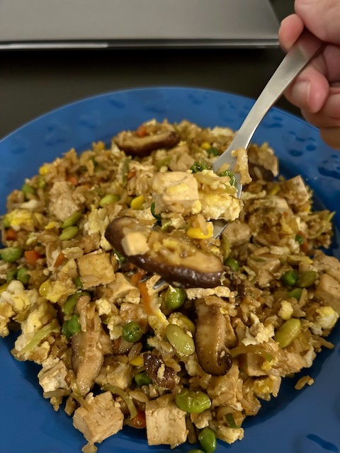
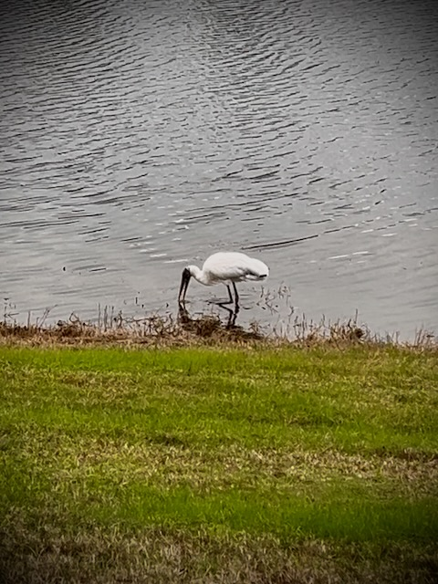

# Half Way There

## 21 Days of Prayer and Fasting

Today marks the half way point in this season. And it just so happens to be the half way point of the first month of the year as well. The number of days behind me in this season are equal to the number of days to come. Likewise, the number of days that proceeded this season for the month are equal to the number of days that will follow it. That's pretty cool!

If I were to live the same number of years as my grandparents, I'm also half way through my life. I was also born in that half way point between generations. By some, I'd be considered to be a [Xennial](https://en.wikipedia.org/wiki/Xennials). And I have a special birthday that falls in all four seasons depending on the year and what hemisphere I'm in. I'm always in between, it seems. Especially today. I'm half way there...LOL

Today's prayer focus is probably the most simple, while at the same time, the most impactful. It to thank God for listening and hearing my prayers. And to know that He always is. In John 11:41-42 Jesus says, *...Father, I thank You that You have heard Me. I knew that You always hear me...*

The context of His prayer was that Lazarus had died a few days prior and He was resurrecting him. He said this prayer for the benefit of those who were standing there that day, so that they would know Jesus was sent by God. Although I will not be using that same context myself today, thanking God for always hearing my prayers seems significant. I've prayed this before. Many times, in fact. But I've never truly focused on the meaning of such a prayer. I'm glad to be doing that today.

*Father, I thank You that You have heard me. When I pray for my son, my family, my friends, and the many other prayers I pray...thank You for always listening to me. I know You do. But I far too often forget the importance of what that means. That we have a two way relationship. That You answer in accordance to Your Will and provide me discernment as I listen to Your Voice. Help me to hear You as You hear me. Align my heart with Yours.*

*Father, I thank You that You have heard the church. As we seek to do Your Will in the communities we live in, You are always listening. You are always guiding. Empower us by Your Holy Spirit to pray to You and to always know You listen. Help us to know that our prayers for our communities, for each other, and for the world are not in vain. And help us to listen to Your Voice as You guide our path.*

*Father, I thank You that You have heard our pastors. I pray today that they are seeking You in everything they do. May they be an example of a life filled with Your presence. Please help them to always come to You for the guidance they need to minister to the church. And I thank You that You hear the prayers of their families. Help them all know You are always listening. Strengthen their faith today and help them to listen to Your Voice as they do Your Will.*

*Father, I thank You that I can come to You in prayer. Thank You that You desire a relationship with me. I pray all of this in Your Name, AMEN!*

## My Day

### 8:20am

Today's reading from John 11 included the passage that is from today's prayer focus. I love when things like that align. It's like a little message from God telling me just how important such things are...hehehe It was also great to expand the context of the passage to include everything that was going on. It wasn't just about the Father hearing the Son or who was there who needed to know the Son was sent by the Father. This part of scripture is also where we find *Jesus wept*. This shows us that He is right there with us in our sorrow. Not only does He hear our prayers, He hears our hearts. He knows what we feel and feels it right along with us <3

Even if there are more bad moments that good moments, it doesn't mean we have a bad life. The bad can help us appreciate the good. And we can learn from it all. We must balance it in our hearts. God is the One who will bring the balance to that scale.

### 2:25pm

Wow! This day hasn't gone as expected or in any way I would call *normal* for me...LOL The meeting from yesterday afternoon that got moved to today was scheduled for an hour. It took 2 and half hours. And there is more to come with that as we didn't resolve everything...hehehe So, I had a late walk and lunch. This is the third day in a row that my routine has been altered due to work. I'm doing far better with that than I thought I would.

I wonder what's in store when I log back into work in a few minutes...LOL There were some tasks left unfinished from my morning because of that meeting. Hopefully I can wrap those up this afternoon.

### 4:00pm

The afternoon as been going well at work. Just one more hour to go for today. I thought my evening might have been thrown off a bit by the mid-day mayhem...LOL But no, it looks like I'll be finished with work at my normal time. And I'll be hungry for dinner at the normal time as well. Having a late lunch just meant I didn't have an afternoon snack like I usually do.

I'm making a batch of rice. I've gotten into a pattern of making rice on Wednesdays. Then making something with the rice for 4 nights. I didn't plan to get into that habit. It just sort of happened...hehehe For now, I'll keep with it. I'm enjoying my weekly rice.

Due to today's weirdness, I have only take 2 videos to pull a photo from for today. Both on my morning walk. And both I'm unlikely to source today's photo from. I hope to grab some videos later. I guess today just isn't one of those to capture...LOL We'll see. I'll find at least 1 photo for today from something I'm doing. My goal was to get 1 per day this year regardless...hehehe It's just a goal, though. It wasn't a resolution...LOL

### 8:15pm

I captured some new videos on my evening walk. I hope they turned out well enough for some good photos...hehehe I haven't reviewed them yet.

That last hour of work went a little past an hour...LOL I finally decided it was *quittin'* time so I could rest my work brain tonight and tackle an issue I'm working on tomorrow instead. I can't solve anything if I'm *beating my head against the wall*, so to speak.

I ended up going 5 laps instead of 4 for my walk. I wasn't finished praying...LOL And that last lap put someone in my literal path to pray for. I stopped to talk to them and pet their puppy...hehehe They are here from out of state visiting their child. They expressed a desire to move down here to be closer to their kid. So, I'll be praying for blessings for a successful relocation. I'm very familiar with how such an adventure can get overwhelming...LOL It got me thinking again about how I don't live near my son and communication with him has been difficult lately.

I was able to enjoy some fried rice for dinner. It turned out fantastic.

This week's Bible study is opening up some things that were hidden in my heart. They needed exposed to the Light of Jesus. I'm so grateful for this process. The heart transformation I've been experiencing continues!!! Yay!!!

### 9:40pm

This past weekend, I picked up some Ranch Rocket Space Balls. The previous weekend I picked up Planet Pizza Space Balls. Between the two, I think I like the Ranch Rocket better. They are both good, though. It's nice to have snacks like those now. They make my soul happy without sacrificing my health. I never eat the suggested serving size. I get just enough to satisfy my soul...hehehe They are *Lesser Evil* brand...I like the name...LOL

The same goes with all my snacks now. They all taste really good. And I never eat as much as the serving size suggests. The cookies are a bit small. But I don't feel like eating 4 of them. I only eat 2 at a time. The chocolate bars I eat suggest half the bar...LOL I eat *half* of that...LOL

I watched the finale of *Star Wars: Skeleton Crew*. I enjoyed the series pretty much. But the finale was bleh. It was one of those that could have been 2, or maybe 3, episodes instead of one. Most of the scenes seemed rushed just to conclude the story. That last movie in the Skywalker Saga (Star Wars 9) was like that too. Oh well...it's just for entertainment. I don't live my life for that stuff anymore...hehehe

I remember when TV was a huge part of my life. I finally broke that 2 years ago during my first 21 days of prayer and fasting season. Before that, my TV was on all the time. Even if I wasn't *watching* it. Sometimes it was for background noise. But most of the time it was to occupy my mind.

Growing up, dad would call TV *worthless mind rot*...HAHAHA Yep, I can say the same thing now that I've broken the addiction 2 years running. What little TV I do watch now seems a little worthless too...LOL I still enjoy movies, though. And the few shows I watch keep me engaged in the story. It just doesn't have the same value it once did in my life. Again, movies are a different thing. I don't think I'll fall out of love for movies...hehehe

Last year's addiction of candy was broken by the 21 day season. I don't eat it anymore. I still have sweets like cookies and chocolate in very small doses. I'll also eat the occasional cake based treat. But all that stuff like Sweettarts, gummies, and taffy...all gone! It has now been just over a year since I've had anything like that.

Coffee is this year's main fasted indulgence. But I'll be going back to drinking it after this season is over. Maybe just a little less of it, though. I'll admit, it was a good choice. I sure do miss it...hehehe

## Photo of the Day

Today's photo did end up coming from my evening walk. I haven't seen this guy around here much. I'm glad I was able to experience him today.

The birds here in Florida are far different than those from Indiana. There are a few species in both places. But not many. And this time of year, I have some northern visitors who migrate here for the winter. The wildlife here is something I do not take for granted. It is truly a blessing to me.

## Wrapping Up

Today, and much of this week, has not gone quite as expected. And I mean that in a good way. Here is how I look at it now. I could get upset that things don't go as expected. Or I can accept that things went exactly how they were supposed to be. I'm grateful for how things are going. The unexpected keeps bringing with it blessings that would not have otherwise come.

Had my day gone the way I expected when I woke up this morning, I would not have come across that person on my evening walk. The timing landed them in my path at just the right moment. If I would have taken the walk at the time I prefer, I would not have be where I was supposed to be.

I love when things like this happen now. I can imagine that's how things have always gone in my life. I just wasn't paying attention...LOL A lot of the amazing things and people I have in my life now are because of the path I've taken. That's one of the many reasons why I don't look at the bad stuff as all that bad after all...LOL