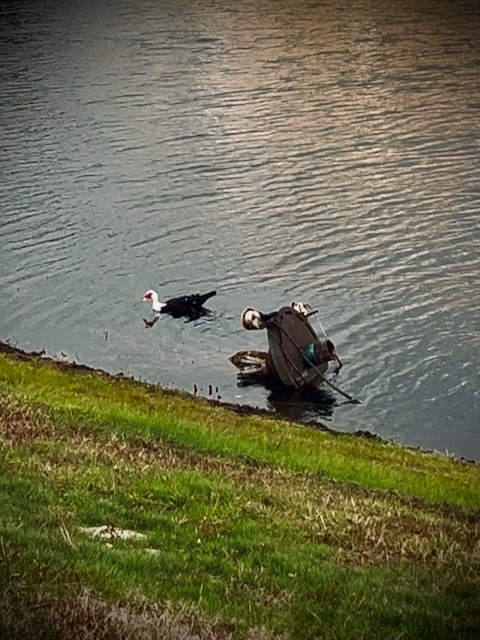

# Because He Did

## 21 Days of Prayer and Fasting

Today marks 2 full weeks in this season. There is only one week left. As I reflect on these past 2 weeks, I'm so glad I'm doing this again. I can't say that enough.

In the devotional, I read the longest prayer Jesus spoke. It is from John 17...the entire chapter. Over the following 6 days, the devotional will take me through each part of the prayer as I conclude this season. For today, the author asks me to *simply contemplate upon this prayer*.

What always stands out in the prayer is how He prayed for all believers, including you and me. John 17:20-21 reads, *I am not asking on behalf of them (His disciples) alone, but also on behalf of those who will believe in Me through their message, that all of them may be one, as You, Father, are in Me, an I am in You. May they also be in Us, so that the world may believe that You sent Me.* His prayer for all believers goes on through verse 25. But that part of it just stands out for me.

One of the reasons I was drawn to this devotional was because it is a guide through some of Jesus' prayers. I want to know more about Him through His prayers so that I can pray as He did.

*Jesus, thank You for praying for me the night You were betrayed. I sometimes feel as though I have betrayed You as well. But as a believer, I know You are sanctifying me through the process of living a life committed to You. Please prepare me for the coming days as I'm taken through Your prayer in John 17. Help me receive the message You are preparing me for as I listen to Your Voice.*

*Jesus, thank You for praying for today's church. Thank You that You are showing me that I should pray for today's church too. To have mercy on it and not be resentful. I'm grateful that this message is coming at such a time as You have revealed to me my lack of mercy and forgiveness for today's church. So, today, I commit to praying not just for the church You'll lead me to, but for today's church as a whole. Through the message of the Apostles, may the church be one with You, as You and the Father are One. I cannot be one with You and the church if my heart is against it. Please forgive me and help me pray for the church.*

*Jesus, thank You for praying for the pastors and their families. LORD, I pray that they remain one with You and the church. Please speak through them all so that their message can carry on as the Apostle's did. In hearing their message, may others become one with You as well. Thank You for calling the pastors to the ministry of Your message so that all who hear might be saved. Empower the pastors with Your Holy Spirit.*

*In Jesus Name, AMEN!*

I have a passion for praying for others. I love to do it *because He did*. Even in all of the miracles Jesus performed, He prayed. He came to do the Will of the Father. So, again, I want to do the Will of God *because He did*.

I'm so grateful for this season <3

## My Day

### 8:50am

I got a late start today. That's because I got to bed a little later last night. I think I'm off by an hour. Maybe a little more. I didn't really *sleep in*. I didn't sleep any longer than normal. It's just that I went to bed later.

I'm about to go on my morning walk. I spent a little extra time on my prayer and devotional time this morning. I had a lot to pray about. I also pray as I walk. But I wanted to focus on some specific things today while I was still inside...hehehe

I'm grateful for my new cross. My deer friend gave it to me for Christmas. She has a wooden cross that she cherishes and wanted me to have one too. They are both unique in that they are hand carved. It is just a symbol. But spiritually speaking, it does help me focus. It is also a great reminder to go to prayer often beyond my habitual prayer times. Prayer has become a lifestyle for me. And this cross has been a blessing to support that.

### 1:25pm

I'm having a great day. I increased my walk distance by adding another lap. By the end of the day, I'll have walked 5 miles around the pond...hehehe It is a little warmer today. So no jacket needed. It will get cold again this coming week, though. I don't recall it being cold for so long last year. But, considering how warm and hot it gets most of the year, these cold weeks just seem longer for some reason...LOL

I've begun the final clean up of my desks. I've gone through the remaining stacks and organized it all into manageable piles. Most of it will get boxed up and placed in storage. Sometime later, I'll go through those boxes to decide what stays with me and what goes away. I didn't want to make those decisions this year. Next weekend, I'll decide the new arrangement for all of my desks.

In the recap for today's Bible in a Year plan, Tara-Leigh Cobble mentioned John 17:20...LOL You might recall from above, that's a verse I honed in on this morning...hehehe This is an important passage today!

On both of my walks today, I saw the same duck. I need to look up what kind it is. I've heard it referred to as a turkey-duck...hehehe It's large for a duck species. And some of its face looks turkey like. But the bill makes me think it is a duck. I'll know for sure once I look it up.

Well, it's time for a grocery trip!

### 3:45pm

I just got back from the grocery. It took a little longer because I also got gas and gave my car a shower...hehehe They had most of what I was looking for this time. I added more fruit to the list. I'm trying to eat more fruit.

There were a couple of *beggars* on the corner of one of the streets I go on for the grocery. When I got to the checkout, I decided to get some cash back to give to them. When I pulled up to them, they had a lovely sign about smiling. After I gave the money, one of the men encouraged me to keep smiling and that it was contagious. I loved that <3 I find that smiles are warm hugs we can give each other without touching. And if they are also contagious, then that's the kind of pandemic I want to spread...LOL

As I was leaving my apartment complex, I saw a Ford Mustang coming into the complex that had a loud engine. You know the type...hehehe As I arrived home, the same car was leaving the complex...LOL We were in perfect balance...HAHAHA

I wasn't looking for it...but I found it! It's the curb...I found the curb with my back tire...LOL It was just a love tap with no damage. But the joke I started this paragraph with popped into my head when it happened...HAHAHA

Now it is time for some kiwi!

### 5:40pm

I was successful at a few things today. I was able to clear those desks and put some things away in storage. Decluttering is so freeing...hehehe And I also managed to walk 5 miles around the pond between my 3 walking sessions. Both accomplishments feel pretty good!

I'll be making dinner soon. I've still been holding strong against the temptations of eating out. There isn't anything wrong with going out once in a while. But I was doing it so much before that I'm trying to avoid it completely for now. I'll eventually eat out again. I'm sure I'll be going to Disney next month. The EPCOT International Festival of the Arts is going on now. I always love that one. Plus, the newest Annual Passholder magnet will be coming out this coming week. I'll want to pick that up in February. But for the time being, I'm really happy eating all of my meals at home.

I'd also like to plan a trip up to Indiana soon. The weather is the main bother at the moment. There are a few times a year when weather impacts when I travel. The winter because of Indiana. And some of the summer time because of storms here in Florida. Now that I want to travel there more often again, I'm a little sad I didn't get to go up this month.

Yes, my duck friend is indeed a duck...hehehe I saw him again on my evening walk. So, I'll most likely pick him for my photo today. He's a [Muscovy duck](https://en.wikipedia.org/wiki/Muscovy_duck).

### 8:30pm

I just finished going over this week's Bible study for the final time before our fellowship tomorrow. I fixed some typos in my notes and clarified a few things. I typically do this on Sundays after church and lunch. But I decided to do it after dinner tonight instead.

Today has flowed from one thing to the next in a sweet harmony. And the day isn't quite over yet...hehehe I had hoped to do some work on my new website. But I didn't get around to it today. So, I'm considering taking Monday off. It is a floating holiday for me. I can take it or use the *holiday* at a future date. I originally wanted to bank it for later. I'm praying about.

Time to wash the dishes...hehehe

### 9:45pm

I'm all caught up on my blog entries from a year ago. Wow! I've changed how I write...LOL And WOW! I sure did think I'd finish my first book and have it published by now...HAHAHA You know the one...the one I haven't finished nor published...HAHAHA A lot can change in a year, I suppose. I sure am glad I started writing this blog last year. It's nice to see where I was to see how far I've come.

Some of the things I thought a year ago have evolved or changed. And some things remain exactly how I felt back then. I've grown a lot in this short time. A year really isn't that long. But so much changed in my heart last year.

I should write 3 letters. The first would be to my future self. I have a lot to tell that guy...LOL The second would be to my current self. I have some things to remind that guy about...LOL The third would be to my past self. I have some things to thank that guy for...LOL Actually, all three ideas apply to all three persons. I have a lot tell all 3 of me, I have a lot to remind myselves of, and I can certainly thank all the me's for other things.

When I read this again a year from now, I wonder if I will have written those letters? HAHAHA

## Photo of the Day

I captured 17 videos of potential candidates for today's photo. But there was only one video that I knew the moment I took it that today's photo must come from...LOL

This [Muscovy duck](https://en.wikipedia.org/wiki/Muscovy_duck) was around for all 3 of my walks today. He appears in I believe 6 of the videos taken today. After a while, I began to think he'd be in the featured photo. Then I took the video that sealed the deal...HAHAHA

The photo represents the poor *alien* having crashed on Earth and being stranded. He's lost, alone, and afraid! Oh whatever will he do?!?

Yes, he does look too large to fit in his *spaceship*...LOL The *spaceship* uses British Sci-Fi technology. The inside is much larger than the outside...HAHAHA How do I know? I just asked the Doctor...HAHAHA

## Wrapping Up

