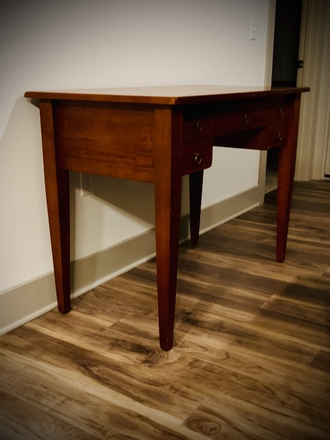

# Today, I'm not ready

## 21 Days of Prayer and Fasting

I have done things a little out of order today...hehehe I read today's prayer guide devotional. But before I read the prayers the author wrote, I wrote out my own prayers below. Then, I went back to read his. The tone is different between his and mine. That's a good thing. I'm not ready to pray in the manner he did. I felt I needed to repent first. Perhaps tomorrow, I'll be able to pray the prayer the author did. Today, I'm not ready.

The context of my asking God to *glorify me* below is a request to prepare me for the important mission of leading others to Him. It isn't for my benefit or personal glory. It is for His glory and so that others will know Him through me. My relationship with God is strong. But at the same time, it is weak. I say it that way because in the former, I'm using a human scale. In the latter, I'm using the scale I'm beginning to see from my studies of the Bible.

I hope today's prayer can lead me to a place where I can ask God to put me *somewhere I can glorify God by telling others about eternal life*. That's why I prayed it.

Today's prayer focus is asking for *a place to glorify Him*. It comes from John 17:1-5. Here is my prayer for today:

*Father, glorify me so that You are glorified in me. Please prepare me for when You give me the opportunity to share the gift of eternal life. Empower me with Your Holy Spirit to not be afraid to share the gospel. I am not ashamed of it. I am ashamed of myself. How can I, a sinner, lead others to You? So, I ask that you prepare me for this most important mission. And once I am ready, I ask for You to send me to the opportunities to help others know You.*

*The church's mission is to share the gospel, baptize, and make disciples. Has the church lost sight of its mission, LORD? Please remind us of why we are here. Please prepare Your church. Please glorify the church so that You are glorified through her. Fill the church with Your Holy Spirit. Give the church the opportunities to lead this hurting world to You. Help the church show the world Who You are. So that the world would know You and Jesus Christ.*

*Please glorify the pastors today, so that You will be glorified. Through Your Holy Spirit, speak the words to the congregations so that they may know You. Strengthen the pastors to share the Gospel with authority. It is the greatest message and the number one mission of all Christians. In today's church, that begins with the pastors. As they pray for the people, pour out Your Holy Spirit on everyone.*

*Please forgive me for loosing sight of why I am here. Remind me to remain focused on the mission. Thank You for Your mercy and grace. Thank You for Your patience with me. I do not yet feel ready. But I know You are preparing me. Thank You for Your love. In Jesus Name, AMEN!*

I think out of all the prayer focuses I've had in this season, today's best supports what I have been fasting and praying for this time. This is a great way to kick off the final week of the season <3

## My Day

### 8:10am

Today's reading from John 15 seems to align well with today's prayer focus. This is the chapter where Jesus talks about Him being the *vine* and we are the *branches*. Jesus also talks about how the world will hate us because it hated Him first. I really shouldn't be afraid of people's responses to my sharing the Gospel. If they receive it, it's because they are ready. If they don't, it means they aren't. I'm no Bible thumper. I'm talking about allowing the Holy Spirit to give me the strength and words. In John 15, He further says that an Advocate (the Holy Spirit) would be coming to testify about Him. And then we are to testify about Him. When I am ready, He will send me to those who will receive the message <3

This will be a heavy prayer today. If I am to bear more fruit, God needs to prune me. I'm grateful for His loving kindness. He is a gracious and merciful God. His pruning is from a place of Love...not wrath. I needed this today.

I slept in a little. I wasn't ready to wake up on time today. I got about 40 extra minutes of sleep, I think. The weather is a little wonky this morning. So, I didn't take my morning walk. And I did the devotional a little out of order. So, this has been a strange morning for me...LOL

Last night, I started using a new (to me) shampoo and conditioner. I struggled with the bottles. It was weird...HAHAHA I think my shower was an extra 10 minutes or more just because of that...LOL And today, I'm trying out a new (to me) deodorant. Just like I've been doing with food and hair/scalp care, I wanted to start using a clean deodorant not filled with junk that was most likely never meant to be absorbed by the body. I'm hoping these two things will continue to help my overall health.

### 9:05am

Sorry if I sound like a bit of a downer above. I'm actually very excited about all of this! It was in times like this that I grew the most over the last 3 and half years. Wow! It has been 3 and half years! Incredible! hehehe

I'll be leaving for church soon. The rain has been a welcome thing. We've been needing it. Water levels have been low lately. I hope this provides enough to restore what we've been missing. I don't think it is a drought or anything like that. Winters here get dry.

I'm having a blessed morning. I love Sundays. I have previously stated that I love all days now. But if I'm being completely honest, I do prefer Sundays over all other days. They feel extra special.

I'm still highly considering taking tomorrow off for the holiday. I have things I can do at work that won't require others to be around. I think everyone I know is taking the day. I've also realized that I do have some things I can do with the time off that didn't get any attention this weekend.

### 10:55am

My time at theChapel this morning was blessed. I enjoyed worship and the message was inspiring.

Well, it's time for CUMC!

### 11:40am

Well, well, well...LOL The message at CUMC closely relates to today's prayer focus...LOL I'm glad I am tuning into their services each week. It has been a blessing in many ways. When the message aligns with things I'm praying about, it is once again clearly an important thing to be paying attention to.

It has been raining off and on all morning. I've resigned myself to not take any walks today. It will be the first time *this year*. I had thought about using the treadmill at the gym here at my complex on rainy days. But I've been walking miles a day for 18 days straight. I think today is a good day to rest...hehehe

### 12:55pm

In about 3 hours, I'll be celebrating the Adoption Day for my deer pal along with my deer friend. Then we will have our fellowship. This week's Bible study was amazing and eye opening...or should I say, heart opening...hehehe Something the pastor at theChapel said made a connection with my study notes from this week's lesson on mercy.

### 10:30pm

I wasn't able to get a hold of my son again today. It has been a challenge communicating with him. I'm not really sure why this is happening now. It hasn't always been this way. I hope he's doing okay. I'll be reaching out to his mother soon. She always seems surprised when I tell her of this challenge.

I did, however, have a lovely time with my deer friend. Our Bible study discussions are always a highlight of the week. And our casual conversations as well. Plus we celebrated her dogs adoption day...hehehe I love my deer pal and deer friend. God has blessed me through them time and time again <3

I also had a wonderful chat with mom and dad. We talked longer than normal this week. There was a lot to talk about...hehehe They are doing well. I asked them if they could send me a link to the nice retro shirt they got me for Christmas so I could get more from the same brand with the same material. I love that shirt and it's quality. I've got some shopping to do now...LOL

## Photo of the Day

I didn't get any videos or photos outside today. Today was a stay inside kind of day. I snapped a quick video at church and a longer video of my deer pal interacting with his Adoption Day present. But neither of those seemed to be photo material for today. The church one because it wasn't *good enough* for this project. And my deer pal because that is a private video...LOL

I love how my vintage desk looks without anything on it. I plan to put my TV on it next month when I rework my living room. So it won't look the same much longer. Before I toss on the TV, I wanted to capture it's vintage look.

## Wrapping Up

I had a blessed day <3