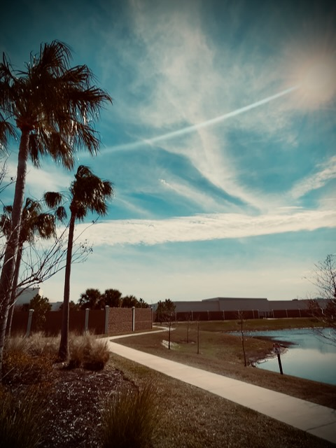

# TBD

## 21 Days of Prayer and Fasting

Yesterday, I admitted I wasn't ready for the prayer focus presented to me. I can't say I'm any more ready today...hehehe Alas, I keep moving forward. When I was going through the book *Your One Life*, I got stuck on the chapter about writing a purpose statement. I got hung up on it. I attempted to go back and continue. I failed to do so. I learned that the book just wasn't for me.

This one is different. I'm not going to get stuck. Even though I'm not ready for what I encountered yesterday, I'm not hung up on it. I still had a prayer to pray to keep me moving forward. And I'm glad I did. Today's prayer focus fully supports what I did end up praying yesterday.

Today's focus is asking God to *give me the words* to say when I'm sharing what gives me Hope and comes from John 17:6-12. As I tell others of the gift of God's love and goodness, I have a testimony to share. And I can ask God to prepare me to share it. He can give me the words that need to be shared with the unique and specific people I encounter on my path. I just need to pray and pay attention.

*Father, although I feel I'm not ready, I know You know when I will be ready. LORD, please prepare me for those opportunities You will place me in the right moment with the right people to share Your love with. Please give me the words to say when those moments come. And I know they will come. Help me to pray to You and pay attention. Help me to hear Your Voice. My testimony is about Your love and redemption of my life. It brings me Hope and I want to share that with others!*

*LORD, please prepare the church with the words to say as we all go out in our communities and live our lives. Prepare us to answer why it is we have Hope. This world is hurting and needs Your love. Please help us to be the Love for the world. Help us not to judge the world by our human standards. Jesus standards are beyond us and not one of us can obtain it on our own. So please guide us in Your Love for all people and give us the words to say. Not our words.*

*God, please bless the pastors as they prepare for next week's sermons. Please give them the words that will inspire the congregations to seek You first and Your righteousness. Your gift of salvation is too important for the pastors to get in the way. So please speak through them and into the hearts of Your people. And please be with their families as they support the mission You have given them.*

*Thank You that I can come to You in prayer. Thank You for hearing my prayers. Thank You for your Love and Goodness. Thank You for the words. In Jesus' Name, AMEN!*

## My Day

### 10:20am

Ooh wow! What an interesting morning...LOL Well, interesting to me. I have done everything out of order today...hehehe Ooh! And I decided to take the holiday off after all...hehehe

I started the day by sleeping in again...LOL I felt like my body needed the extra rest. I'm glad I did it. When I did finally wake, I did my morning prayer. But after that, nothing was quite like normal. By the way, I was wrong about being officially down 5 lbs for the year at my weigh in today. It turned out to be 6...HAHAHA

After I shaved and got dressed, I immediate went for my morning prayer walk. I really missed not being able to do that yesterday. I know there will be a few days yet this week when I won't be able to either. That's okay, though. Just like Saturday, I did 5 laps. I'm hoping to do the full 5 miles again today.

When I got inside, I sat down to do today's prayer devotional and focus for this 21 day season. But it didn't happen. Last night, I messed up the local copy of my website. I'll not go into the details of what happened. But I needed to fix my local copy so I could do this journal entry. I journal my prayer devotional immediate while it is fresh. So, I set out to fix my local copy. Once I got it fixed, I realized I really needed to have my breakfast...LOL

While eating breakfast, I did my Bible in a Year reading for today. Notice how I didn't go back to my prayer devotional yet?!? And I normally do the BiaY at lunchtime...hehehe Today's reading brought attention to how God seems to favor the second born children...hehehe That's meeeeeee! LOL jk But really, with Cain and Abel, Isaac and Ishmael, Jacob and Esau...etc...He chose to bless the second born. Ooh, and the case of Jacob's son, Joseph, the 11th born...hehehe The inheritance or favor seems to skip over the first born despite the cultural norms. Sorry first born kids ;-P

The same is actually true about us and Jesus. [Several times in the Bible](https://www.gotquestions.org/Jesus-first-born.html), Jesus is referred to as the first born. Through His sacrifice, He offers us, His latter born, a full [inheritance](https://www.gotquestions.org/inheritance-in-Christ.html) in Heaven. How cool is that! Yes, even for the first born kids of human decision get this inheritance ;-P HAHAHA

After breakfast, I continued to pray. And then I finally got around to today's prayer devotional. I read yesterdays again, first, though. I'm still praying over that one. But as you can see above, today's helps support yesterday's...hehehe

I didn't get finished with all of that until around 10:15am. Then I wrote this timestamped portion of today's entry. I had a lot to say. So it has taken me about 30 minutes to write...LOL

Now I can start what I planned to do today with my holiday...HAHAHA

### 12:45pm

I wanted to clarify a few things. The first being how I mention things have been out of order. Nothing is truly out of order. Everything is happening exactly how it is supposed to be today <3 It just isn't in the order of what has become my normal routine. Perhaps a new routine is emerging?

Also, my weight loss this month is not the result of this fasting season. At least not directly. I'm not fasting food. In fact, I'm consuming more food due to my increased activity. I attribute the weight lost to the increased activity and healthier eating. I'm not actually trying to loss weight. So I'm considering increasing food consumption more. But, I'm just fasting coffee...LOL

I'm not sure if either of those things were questions on anyone's mind. But I just wanted to clarify that to anyone reading and my future self as I look back on this entry someday...hehehe

### 1:50pm

I read last year's post for January 20. It includes a poem I wrote for a tragedy that occurred in a small town here in Florida. I also discovered an unfinished poem in one of my physical notebooks. I have no idea when I wrote it. But based on the words, I know what it is about. I may finish that poem soon. I don't write poetry often. But I love doing it.

I've been working on my new website today. It is coming along nicely. I hope to have it up yet today. I'll be moving this blog there once I do. I'll migrate over the 2025 journal entries. I'm unlikely to migrate the 2024 entries, though. They'll remain on the current site they are posted on.

If I do get the new site up today, or soon, I'll be sure to point to it from this entry or the entry from that day; whichever day it goes live. It will be using the same software behind the scenes as this one. I'm just reorganizing it so I can get my other stuff going. Last year, I had planned to split up my site. The result is I only maintained this blog. Everything else kind of fell to the wayside. I'd like to remedy that this year...hehehe Here's to hoping!

### 8:20pm

This week's Bible study lesson...whoa! Not only timely once again, it gets to the *heart* of it all! I haven't been referencing which parts of the study we are in. Since I'll be rereading this entry someday, I want to call it out this time. It's *The Chosen Bible Study Series Book 2: Lesson 6 - The Pure in Heart*. <3

I managed to get the new website setup and deployed. I'll be moving over to it starting tomorrow. I'll put a link to it in the *Wrapping Up* section below. I'm basically dropping the *blog* before the domain and putting it after. All of the *by Greg Marine* stuff will be on the same site and cross referenceable now. I'm starting with the blog and will be expanding it to include my daily photos and daily Bible study notes next (think Bible in a Year, random reading, etc). I'll eventually get my other writings and art up on it. At least I hope to finally get around to that...LOL

## Photo of the Day

It was a gorgeous day today. It was a tad on the cold side. My hands were really hurting during my walks...LOL But I walk at a brisk pace now and my body overall remains warm.

The irony of this photo is that it appears quite warm even with it being bitterly cold...LOL That's one of the reasons I captured this...hehehe

The next few days will be rainy and equally cold. Even though the rain should be over midday Wednesday, it will remain cold through the weekend. I imagine the next few photos will be of something inside my apartment...LOL

## Wrapping Up

