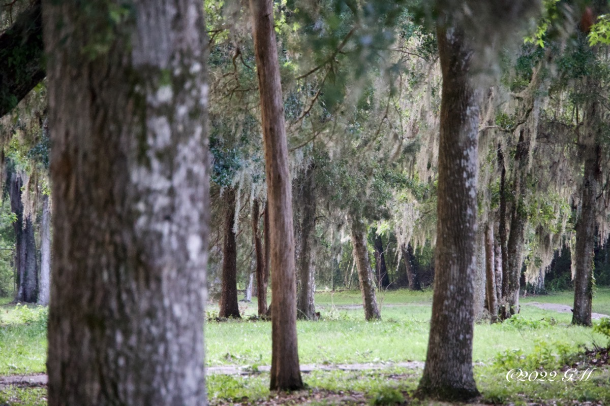

# I Don't *Want* To

> Much of what we would like to do in life requires us to also do something we would rather not do. However, it becomes much easier to endure what we don't want to do knowing that it enables us to do what we really want in life.

One of the most seemingly rhetorical statements I have ever made to my son has been, *We have to do the things we don’t want to do in order to do the things we do want to do.*  Almost every time I have told him this, it was at a time when he did not want to do something. It might have been a chore of some sort or a homework assignment. But in most cases, it was would have been something that would lead him to being able to do something he really wanted to do.

The simple truth is, I am more like my son in this area than I really care to admit. I cannot count how many times I really did not want to do something. Especially when I was a kid! But even as an adult, there are always tasks I'd really rather not take on. No matter how old I get, there always seems to be moments when I feel it is not worth the effort to do certain tasks and responsibilities. Sound familiar?

I can say with full confidence, it all does become well worth it when it leads to my being able to do those life fulfilling activities I really do want to do. It could be something as simple as having food to eat; which is actually a need. Or it could be something such as enjoying a fun hobby. How does a nice vacation sound? All of those things are worth doing a few inconvenient tasks I don't really want to do, right?

With the aforementioned wants and needs, something we need to do to achieve those goals would be having a job. Although some find jobs they truly enjoy, I personally do not know anyone who loves to work for an employer so much that they are willing to do so without some sort of compensation. Money and benefits help to provide the needs of someone and their loved ones. It is a necessity in most cultures today to earn money through the work they do.

So, even if you truly love your job, the mere fact that you need to work often means you will be asked to do things you really do not want to do. Of course, this is not a universal truth. But in my experience, no one I know want to *need* to always be working. For most, it would seem, working is a means to an end. A means to provide their needs and wants along with some sort of retirement *someday*.

There are countless examples I could use to dive deeper into this subject. Paying taxes. Commuting to the office. Cleaning the house. Hours of preparation for the perfect meal. Regardless of the task, you might find yourself doing something that you would just rather not be doing. That's okay. We all have that burden to bear. So, what would make a difference for us to best deal with all of those thing we don't want to do?

I want to encourage you to focus on the outcome. What is your endgame? What results are you expecting from doing anything; especially if it is something you don't want to do. Everything seems to become far more bearable when you can see that in the end, we'll be happy. Rather than focusing on what you don't want to do in that moment, keep your mind on why it is you are doing it. If the end result is something you really want, doesn't it all make it worth it?

I'm grateful to have a job. Not everyone has the opportunities I have had. Even when I'm not working on projects that I enjoy, everything leads to being able to afford food, shelter, and so many other things I truly want out of my life. When Monday comes, I never say, "I *have* to go to work." I always phrase it as, "I *get* to go to work." This mindset has proven time and time again that even the worst of tasks in my life become worth the struggle, because it always leads to everything I need and want.

At the end of 2022 and the onset of 2023, I took a close look at my health. Although I had already started to improve my health in recent years, I was not making much progress. It wasn't any kind of New Year's Resolution, but in January of 2023, I told myself, *I just want to feel good again*.

At the time, I was going through a 21 day period of prayer and fasting. The thing I was fasting at the time was television. And one of the parts of my day I always watched television was on my lunch hour. I didn't feel healthy enough to give up any eating. Every time I would skip a meal, I would actually grow dangerously faint. So giving up food was not an option. I really didn't want to give up television either. But there was a purpose, an end result I was hoping for.

Since I wasn't watching television on my lunch hour, I made the crucial decision to take walks. At the time, I would get winded just walking to my car from my apartment. For some perspective, I parked maybe 50 feet from my front door. I was a 44 year old walking like a 90 year old. I wish I were using hyperbole. But I most certainly am not. It was so bad that a few of my friends were quite concerned about me just weeks prior to my decision to take walks. Their concerns were actually why I started to think I needed to work on this.

Did I want to take walks? Absolutely not! I wanted to watch television! Did I want to feel good again? Absolutely yes! Which one, television or walking, was going to give me the best result? Yes, that is rhetorical. Let me tell you, that first walk was torture. I walked about half a mile in about 15 minutes. I felt like I was dying when I got back to my apartment! Again, not using hyperbole.

The next day when lunch approached, I did not want to walk. I did however want to feel good. So I went right back out there and walked. I did this same thing everyday for about 3 weeks. At the end of that 3 weeks, I was walking for a mile in about 20 minutes. And when I got back to my apartment, I was dancing!

I went from feeling like dying and hating the idea of walking for exercise, to feeling like celebrating and loving walking! I took something I didn't want to do and turned it into an entirely new lifestyle. Fast forward to now. Now I run for fun! You read that correctly, I run...for fun! And I feel fantastic. Wanting to feel good again required me to do something I didn't want to do...exercise. The end results were well worth it.

What are a few of the things you are facing today you would rather not be facing? What tasks or responsibilities do you have that you really don't want to do? But what will the end results be if you go through with everything you'd rather not be dealing with? Would focusing on the results help you accept that you need to do what you don't want to do in order to do what you want to do?

I'm going to presume the answer to that last question is going to be a resounding yes. Whether you are facing a chore that leads to a balanced home, a less than desirable work situation that leads to food on the table and vacations with your family, or a treatment that will lead your body to a healthy recovery, face everything you don't want to do with a grateful attitude for what you will accomplish by going through it.

