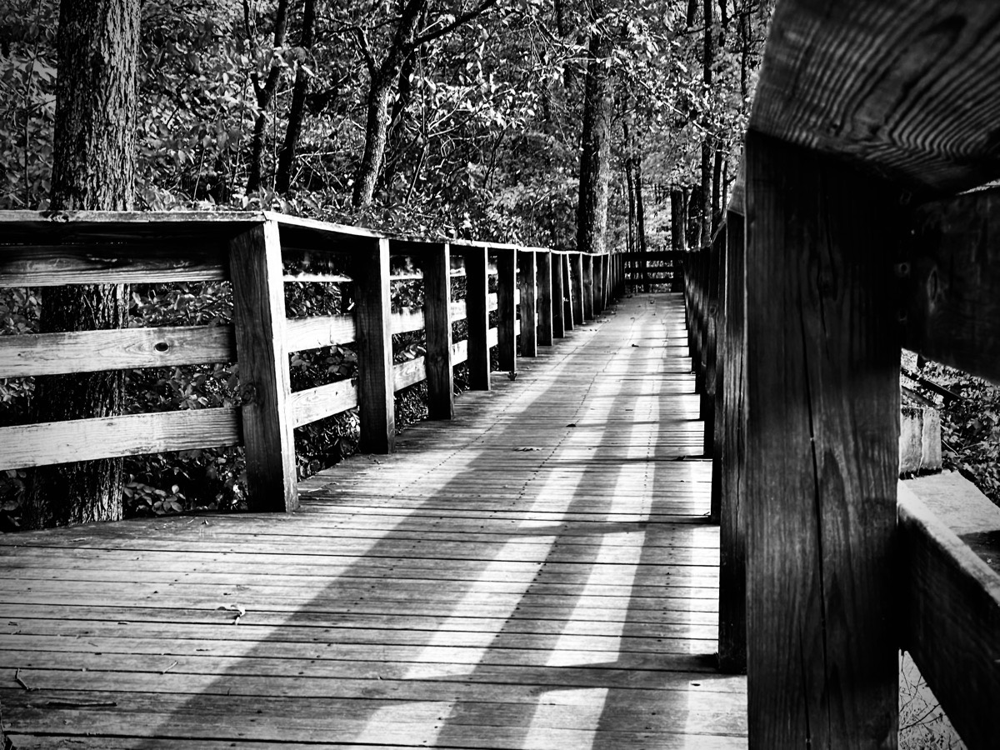

# Perspective is Everything

> Perspective is everything! How we look at things will completely shape how we perceive and react to the environment around us. Even when we look at the same thing at the same angle, we have new eyes each time and new experiences to shape the way we think about everything!

Do you have a *favorite spot*? It could be a favorite place to eat or a special vacation location you visit each year. Your favorite spot is a place you love to revisit over and over again. Now that you have this place in mind, ask yourself: *why is it my favorite place to be?*

Is it that something special happened there years ago? Is it the place where you met the love of your life? Could it be where you made a very important decision that changed your path? Over the years, how have your experiences affected how you feel about this special place? Do you sit in the same seat or table each time? Are the same people with you each time?

All of these questions are to direct you to truly think about how you perceive the moments and experiences you have had in your *favorite spot*. There is a really good chance it is not your favorite because of only one reason. And more often than not, it grows stronger in your mind due to multiple experiences over time. Your perspective of the world around you is a summation of all of the moments you have had in all places and situations you have ever been.

As an hobbyist photographer, I have found that a photograph can only ever be taken once. No matter how much I try to take the same exact photo from the same exact position with the same exact settings, it is impossible to achieve the same photograph twice. Everything from the sun’s position, to how the wind might affect leaves on a tree, nothing is ever the same more than once. There is a certain beauty about that, actually. And it makes each photograph, and likewise each moment, a unique and important experience.

I believe photographs are one of the best examples of perspective. They capture a moment in time and allow us to truly analyze that particular moment. But there is a twist. Even looking at a photograph over and over again, your perspective is evolving. Despite the photograph never changing, our perspective on it is ever changing based on how we ourselves have changed.

Whether it be our favorite spot, or simply a photograph, how we look at something can change over time. I personally believe that is one of the most beautiful things about life. In fact, even the darkest of memories can be changed for the better over time. If we take all that we have learned over the years, and apply it as lessons learned, almost anything can be changed for the better.

The key is to find the positive in everything. With the exception of outside forces beyond our own control, almost anything within our own control can be kneaded back into something good. That’s where perspective comes in handy. We just need to seek the perspective that gives us the best of everything.

When I moved to Florida, I was escaping years of shame, guilt, and trauma. I spent the first 44 years of my life living in the mid-west United States. There isn't anything all that traumatic about that region. I only mention it because life in Florida is so very different. Everything from the climate to the general vibe is far from the climate and environment I grew up with.

It was just the sort of change I needed to do a kind of *reset* on my life. I needed this new perspective to find a new approach in dealing with the trauma, guilt, and shame of my past. Since this book isn't about my past specifically, I won't be going into all the of the details. But gaining this new perspective through a drastic change in overall environment was just the change I needed.

I'm not saying you must make such a drastic change yourself. You can actually do this by simply going to a different park for your walks. Or you can try to seek out a new *favorite spot*. You don't really need to uproot your entire life to find new perspective on your old self or circumstances. I personally needed to do that. Otherwise, I might not have written this book!

No matter how bad my circumstances may have been, there was always something positive that came from it all. And the only way for me to see the positive side of things was with a change of perspective. If I only focus on the bad stuff, that is really all I'm going to see.

Taking us back to the example of photography, most of the photographs I take need some sort of touch up work applied when I get home. Photography isn't just about pointing a device at something and pushing a button. When I go back later and review the photos I have captured, I reflect on my day and the moments I attempted to freeze in time. I think about the lighting, the subject, and the composition. I apply post-production filters and adjustments to knead the image into something even better than moment I original captured.

Sometimes, like in the photo featured in this chapter, I will even remove color through a filter because I feel like the colors may take something away from that moment. When I remove what I did not like about the moment, I'm left with the perfect picture that represents the best of what I see.

This same technique can also be applied to our circumstances. Without completely forgetting the negative aspects, we can still remove them to reveal what is truly best about our lives. Applying *filters*, or lessons learned, over the guilt, shame, and trauma of our past, what we are left with is a perspective to help us heal.

What *filters* do you need to apply to the *photographs* of your past? What new perspectives do you need in order to find the positives of trauma? Whatever guilt or shame you may feel can be left behind. You no longer need to carry it. 