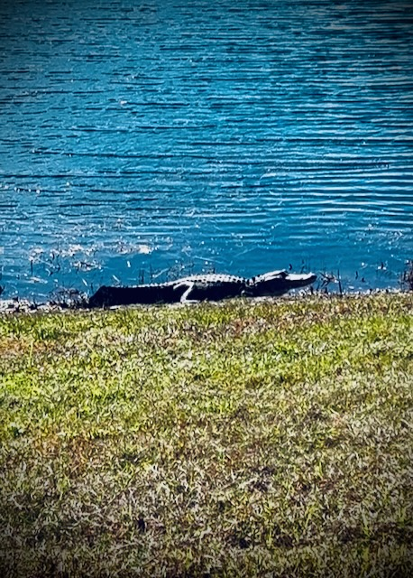

# Dawn

## 21 Days of Prayer and Fasting

<!--@include: ../../../bible/prayer/journal/2025/01/05_21-days.md{3,11}-->

I read and listened to John 1. *In the beginning was the Word, and the Word was with God, and the Word was God. He was with God in the beginning.* I see no better way to begin the dawn of this prayer and fasting season than to acknowledge that Jesus is the Word and is God. Without being in the Word, how could I possibly know God?!? It isn't just a book about Him. It *is* Him! I don't always understand what I'm reading and hearing. But through the Holy Spirit, I will gain enough understanding each day for what that day need needs me to understand. By the way, the Holy Spirit is also God...hehehe

So it begins...for the third year in a row. Aside from partaking in communion as I celebrated the new year, I see no better way to start a year than with prayer and fasting. The dawn is here, and the Son is rising <3

This is [day 1](/bible/prayer/journal/2025/01/05_21-days) of [this year's prayer and fasting](/bible/prayer/journal/2025/01/21-days) season.

## Dogs

I forgot to mention yesterday that I was able to interact with some dogs...hehehe I was able to this morning as well. One of the great things about my walks is I tend to come across folks walking their dogs. I wrote about a few last year as I got to interact with them. And they recognized me and loved when they got to hang out with their pal, Greg...LOL

One of the dogs yesterday was one I have seen quite often. I interact with the humans each time. But the dog always barked at me. So yesterday, I said *hello* to the dog...hehehe He immediately stopped barking and got excited. I guess he just wanted some attention...LOL

I also got to run with one of the dogs yesterday as I walked by the Bark Park. The humans thanked me as their dog was having fun running with me...hehehe

I also got to run a little with a dog this morning. I think this one might have still been a puppy. He was being extra playful beyond the run. Had I been in the Bark Park itself, he might have wanted to jump on me...LOL

I'm grateful when the humans allow interactions with their dogs. Of course, some dogs aren't socially trained to be around other humans or dogs. I do live in an apartment complex, after all. I imagine some people move here with dogs that won't interact well. So, I understand when the humans don't welcome me to interact. I completely get it.

## Back Pain

I've been experiencing some back pain lately. It's something I've dealt with my whole adulthood. My dad has the same issue. Bad times like now don't happen all that often, fortunately. The kind I'm experience this time I haven't had in quite some time. It feels like it might be close to a spasm. If that happens, I'll be down for a day or so.

It *dawned* on me this morning that I have a heat pad. I had forgotten about it because it had been a while since it was this bad...LOL It was as if God reminded me about it through my prayers today...hehehe I did tell Him I didn't understand why He doesn't just heal it instead of me needing the heat pad...LOL I get the feeling I still have these back issues to keep me humble...HAHAHA j/k

It isn't important whether or not it was actually the Spirit prompting me to get the heat pad or my simply remembering I had one. The important thing is that God is good and provides me the means to get through this. He is always with me. So, I'm happy to give Him the credit for the heat pad. But He gave me a memory to remember such things and the intelligence to act upon the memory...LOL

## Third Year in a Row

So, apparently I have sat out by the pool on the first Sunday of the year for the third year in a row...LOL Basically, ever first Sunday I've lived here...hahaha Two years ago, I took a selfie that shows how I looked at over 240 lbs. Then last year, it shows how I had lost nearly 70 lbs, was still bald, and had a full beard. This year, I'm down another 10 lbs, have a full head of hair, and I'm back to a VanDyke...hehehe

2023

2024

Today

It's fun to see progression. I wasn't thinking about it today until I was sitting out there for a bit. I was like, *oh wait a minute! I've done this before!* HAHAHA

## Bible Study

Today's Bible study discussion was amazing! So much insight shared. So many things to apply to our lives. I'm looking forward to the coming week. Each week keeps building...hehehe I'm grateful for the devotionals and Bible studies we've been doing. In mid-March, we will have been doing them for a year. It's one of the best parts of this journey <3

## Photo of the Day

I saw an alligator!!!

## Wrapping Up

I had an amazing day. I didn't write about it all and I didn't make a video journal. Frankly, I'm out of time...LOL Perhaps I can write about it tomorrow? Something else besides the Bible journal site, I'd like to finish setting up my photo site. The photos of the day are just a single photo from each day. I often have several honorable mentions that I'd like to show. I included them on a few entries here. But I've run out of time to collect them for today. If I had that site up and running, I could post them there when I got around to it...hehehe

Anywho...it was an amazing day...hehehe