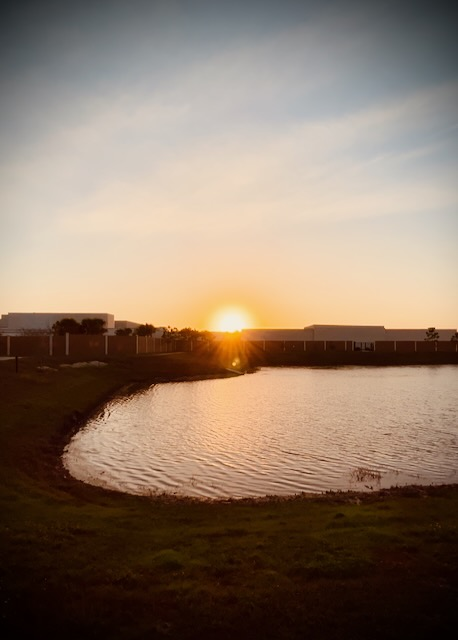

# Blessings

## 21 Days of Prayer and Fasting

<!--@include: ../../../bible/prayer/journal/2025/01/06_21-days.md{3,13}-->

Today's scripture reading was John 2. Here we see the first of His signs when He turned water into wine. This is always where we see Him drive out the money changers from the temple. He also spoke of His death and resurrection when He told them that if they destroy *this* temple, He would *raise* it again in 3 days.

This is [day 2](/bible/prayer/journal/2025/01/06_21-days) of this year's [prayer and fasting](/bible/prayer/journal/2025/01/21-days) season.

<!--@include: ../../../bible/prayer/journal/2025/01/06_21-days.md{17,29}-->

## My Day

I failed to think about what I should write about my day as it went by...LOL I suppose that's because it was mostly uneventful. But it was a swell day anyway.

You know the saying, *the calm before the storm*? Well, around here in west-central Florida, there is a whole lot of ruckus before the storm and then the calm comes after...HAHAHA Today, a storm blew through. Hours before the storm, the cold front coming through caused a great amount of wind. But the sky was still so beautiful. After the storm rolled through, the sky was beautiful once more and the wind was gone. The storm wasn't violent. It was just the wind and rain this time.

Work is going to be picking up this week, thankfully. Something I have been waiting on was finally completed today. So I can now begin more next steps with some of the projects. My boss was out sick today. So I had to wait for tomorrow to figure out those next steps. I pray he is resting well and will be back to himself tomorrow.

Due to doing the 21 days of prayer thing, having a *Bible in a Year* plan, and the Bible study, I've been doing one of each near meal times the last 2 days. It's like I'm getting my *daily bread* with my daily meals...LOL I don't imagine I could keep up with all of that on a regular basis. I don't have any plans this month. So, I think it works out well with my current routine. After the 21 days, I'll likely go back to my regular prayer focuses with some tweaks learned through this brief season. If I didn't have a *day job*, I'd be able to keep up with this pace...hehehe But I have to be a good steward of the resources God gave me...especially time and money.

My back is feeling a little better today. It still caused some issues with sleep last night. But the way it feels right now makes me think that tonight's sleep will be better. I wonder if it was the weather that rolled across the country this weekend and today? When I lived in Indiana, weather impacted my physical body all the time. It was one of the many reasons I wanted to try Florida. The climate here is much easier on people like me who are sensitive to weather. It still makes an impact. It just isn't as extreme.

HAHAHA...I just remembered...I made a silly little friendship video this morning...HAHAHA I got the idea from a social media post I saw sometime last week. I edited it to speed up a few sections and added music. It was fun and a nice little experiment in video editing. It became a warm hug, just for my deer friend <3

I managed to get in my 3 one mile walks today. I've also scheduled those near my meal times. It's a nice balance of time with God, exercise, and nourishment. I'd love for this to be my daily routine always. But you know...life happens...LOL

I haven't gotten back to creative writing recently. It isn't from a lack of creativity...hehehe It has mostly been a matter of time. I thought about squeezing in some time tonight. If I do, great. If I don't, great. I'm really happy with how my routine is balanced right now. I don't get everything I'd like accomplished. But I get all of the right things done...hehehe

## Photo of the Day

The morning was so beautiful today. I love how these *video to photo* things work out. I remember how I would take a sunrise photo most mornings. Back then, I'd use the photo camera. They always turned out well. But they never really looked the way I saw it with my eyes. I would apply filters to get them close. But these new photos I make from video screenshots turn out more natural to what my eye sees. I still apply some filtering. But I love these so much better now. My creative side definitely prefers these and it inspired me to capture my year through video and photos daily. The photos are the snapshot over time. The videos are for me to look back upon and connect to the moments. Two very distinct ways to view the same moment...and I LOVE IT!!!

## Wrapping Up

Today was a Blessed day. [Here is a little video journal](https://youtube.com/shorts/hBfBbDFEKS4) about some of the things I saw on my walks.

I decided not to do any creative writing tonight after all. My mind is tired. My body is still wide awake...hehehe