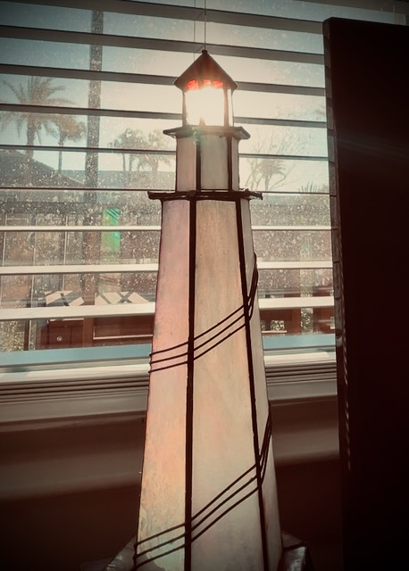

# Lighthouse

## 21 Days of Prayer and Fasting

Good morning and welcome to day 5 of this year's prayer and fasting dedication. There is a long way to go. Yet, I feel as though I've already come a long way...hehehe I'm very grateful for seasons like this. It helps to renew my spirit in a lot of ways.

<!--@include: ../../../bible/prayer/journal/2025/01/09_21-days.md{3,13}-->

John chapter 5 was on the agenda today. This one begins with the climax scene from this week's *The Chosen* episode...LOL The paralytic man at the pool of Bethesda is healed by Jesus. The rest of the chapter was basically Jesus doing a monologue against the Jews who began to persecute Him for healing the man on the Sabbath. Ooh boy, did Jesus put them in their place...LOL

This is [day 5](/bible/prayer/journal/2025/01/09_21-days) of [this year's prayer and fasting](/bible/prayer/journal/2025/01/21-days) season.

## My Day

It sure was chilly this morning. The windchill was in the 20s. The air temp was in the 30s. I was all layered up with my upper body...hehehe I didn't take a selfie. But I looked all cozy and warm...LOL Just before I moved to Florida, I bought a winter hat that was lined with wool and could fold down to cover the back of my neck and ears. I wore it that winter just before I moved and then wore it again when I would visit Indiana the next Winter. I haven't needed it since the Winter of 2022/2023. Well, I got to wear it this morning...LOL In Florida...HAHAHA

I also used the scarf I bought from a friend last year. I didn't need it last year. But I'm glad I bought it. I needed it this morning! She was making the scarves and hats to raise money for her therapy dog's training. I figured I could use the hat and scarf I bought for some of the visits to Indiana in the Winter. Plus it helped her with the cost of training her dog...hehehe

So, anyway, I was glad to have what I needed to stay warm on my walk today. I also have these thermal shirts to wear now. I bought them so I could have them for under my dapper clothes and wouldn't need to wear a coat. They work really well. The walk was cozy and I'm grateful I could do it.

Work has been busy so far today. I've had a meeting. And I've had a lot of work now that I have what I've been needing. I'm chugging right along like *The Little Engine that Could*...chooooo chooooo...hehehe Side note: that was my favorite children's book when I was a child. I still apply its lesson to my life to this day...LOL

Today's *Bible in a Year* reading from Job reminded me of today's prayer focus. Even when we cannot perceived it, God is always present. I also thought about how I've taken this to a new level this year. Last year, I simply read a portion of the Bible each day as prescribed by the plan I chose. This year, I've added a recap from Tara-Leigh Cobble and [*The Bible Recap*](https://www.thebiblerecap.com). I've enjoyed having that addition so far these 9 days. Its plan is similar to last year's as far as what I'm reading each day.

I sometimes wish I had more of this *Bible stuff*...LOL But I was reminded today that when I trained for my 5k in 2023, I wasn't running at first. It all began with a walk. Even after I committed to my race, it took months of training before I got up to a jog pace for even the first mile. Even the week of my race, I still wasn't running a full 5k. Yet, when the day came for the race, I ran the entire thing. So, I need to remember that, today, I'm doing exactly what I need to be doing. I don't need to be doing *more*. And there will be days when I'll be doing *less*. It's a process and a marathon. It isn't a sprint...hehehe I'll keep growing as I trust God's process. And someday, I'll cross that finish line and enter into His Kingdom in His timing.

With the help of a colleague today, I was able to resolve an issue I was having with a new system I'm testing out for the company. I used to try to figure everything out on my own. I could spend hours and hours trying to figure things out. Lately, I reach out to someone who may already have the answers. If they don't, we figure it out together. In the end, we both learn something and we often resolve it in minutes instead of hours. Even if it does take hours, at least I'm not the only one learning...hehehe

There was an issue the other day that took more than minutes. I ended up pulling in 3 other people into resolving the problem...LOL My boss was also involved in the conversation, even though he wasn't part of the solution. So, in that case, 5 people learned something over the course of a few days...LOL All because I didn't try to find the solution all on my own.

The rest of my work day went fine. My other two walks were much warmer. I just had a light jacket on for those. I had fried rice for dinner again. I just can't get enough of it...LOL

Ooh! I've been drinking hot water this week. The last few days, that's all the water I've been drinking. I have hot water 4 times a day. Once for each meal and then again for my evening treat. I'm using my coffee mugs and filling them twice each time. I'm not sure how much it is in total. I could figure it out. But I think it is less than what I was drinking when I would do room temperature water in my 16 oz glasses. I've noticed I'm not filling my filter tank as much now. I feel so much better too. I wonder if I had been drinking too much water.

Since I've been doing some extra devotional, prayer, and Bible reading this week, I haven't been in creative mode. And as a result, I've been watching a little TV at night to wind down. That's before I finish writing in this journal. So, technically, I'm not fully winding down...LOL But I just haven't been feeling like doing my creative stuff.

I saw a round table talk with some actors where Jim Carrey said something I resonate with. He talked about how broken he is and how acting and painting helped him put the pieces back together for a moment. It was like a coping mechanism for him. He wants to give back to a broken world the pieces of himself he has been able to put back together through his talents. I'm probably messing up what he said. But that was my take...LOL

Anyway, I feel the same. When I'm most creative, it's when I'm taking broken parts of myself and putting them back together. It doesn't mean I'm not doing well at the time I'm being creative. It just means that I've recognized some things that need repaired in my heart. I actually do the creative works when I'm feeling my best. So, for me, it is more about showing that I'm doing okay now.

I'm just mentally exhausted this time of day for this short season. I'm doing really well. Just tired of thinking. I'm still writing in this journal because it is like a brain dump...HAHAHA

## Photo of the Day

Today's photo took a few tries at different times of the morning to get just right. I'm glad I was using video to capture this effect. It was a tough one. I was able to capture the sun shining through the top of this lighthouse <3

The lighthouse itself was a wedding gift from my late cousin and his wife 24 years ago. Just before my move to Florida, my first wife gave it to me. She had it in storage for years after our marriage ended. I had no idea...LOL It was such a blessing for her to find it and give it to me for my new home <3

It was originally a lamp. Over the years in storage, it had some mishaps and some of it broke. I salvaged what I could, removed the electrics, and now it adorns my entertainment center. Like me, it has had a rough journey. But also like me, it still stands tall and shines brightly...hehehe

## Wrapping Up

I'm having an amazing week. I'm only on day 5 of the prayer and fasting. I'm glad to be journaling it. It will be good to look back on someday. I still haven't gotten around to looking at my entries from a year ago. But I will soon. I'm also amazed at how this year is starting off. I might only be 5 days into this brief season, but I'm 9 days into the year...LOL I'm still going strong on my resolutions and most of my goals are on track.

I realized today that, with the exception of the popcorn I had at the movies the last Saturday of 2024, I've eaten every meal at home for the last 2 week straight. I've also consistently walked 3 miles for exercise each of the 9 days this year. My bathroom scale has already started to show a decrease and I didn't intent to lose anymore weight...LOL

I have no plans to be out for the rest of January. I still do errands, of course. But I mean that I'll not be doing Disney and most likely won't be eating out locally. So, I may actually go an entire month of eating everything at home. That's probably the first time in my life...LOL