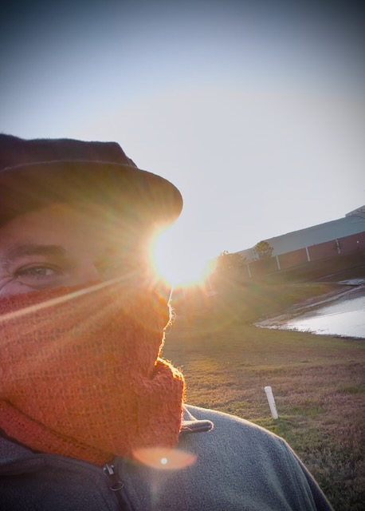
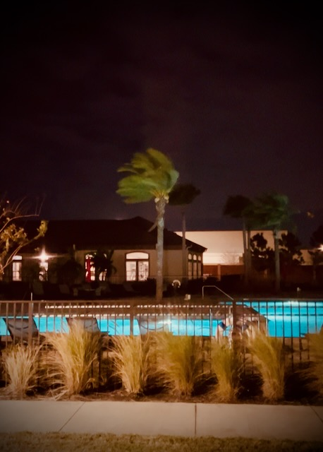

# Faith, Don't Fail Me Now!

## 21 Days of Prayer and Fasting

We've reached the first Friday of this 21 day season. And it's the second Friday of the year. Happy FriYAY!!! I often say the YAY part for other people. For me, I'm still excited everyday now. Each day is a gift from God. Each day has its tasks and special meanings. However, I'm not one to concern myself with what day of the week it actually is. I'm just happy to have another day and that it is one more day closer to God's Kingdom.

<!--@include: ../../../bible/prayer/journal/2025/01/10_21-days.md{3,13}-->

John 6 was full of amazing things. It starts off with 5000 men (and most likely a lot more women and children) getting fed from just 5 barley loaves and 2 small fish! Then Jesus walks on water! Then He talks about being the Bread of Life! Then many of the disciples turn away from Jesus! Finally, Peter confesses his faith in Jesus...hehehe Wow! That's a lot of stuff...and it ends with Peter's faith...the very thing Jesus would later pray about for Peter <3 I love when completely different readings and studies align at the same time like this.

This is [day 6](/bible/prayer/journal/2025/01/10_21-days) of [this year's prayer and fasting](/bible/prayer/journal/2025/01/21-days) season.

## My Day

I had a corporate meeting today that popped up on my calendar only a few days ago. When I received the invite, I thought to myself that it seemed like short notice for an *All Hands Meeting*...LOL Well, I got my answer to that thought.

I somewhat knew this was coming. I just didn't realize the timing and all. It was nearly a year ago when I received the news my part of the company was being outsourced. And soon after that, we were told that other parts of the company would be sold off...not just outsourced. All of that is happening and seems to be accelerating.

I'm not really sure how this impacts me since I'm just a contractor to that company now. I don't think it does directly. But I'm sure it does in some capacity. It was a good reminder that God is my provider. I said it a year ago, and I'll keep saying it. I'm grateful that all I have is from God. I'll keep doing my job. That's doing my part in my relationship with Him. But it isn't my work or my employer that provides my needs. God just uses these things to do it.

My heart and prayers go out for those who are concerned and worried about how this impacts them. I still remember times when I would get news like I did today and pretty much freak out. Not having answers can make you very anxious. I no longer get anxious about these sorts of things for the most part. I still get anxious about other stuff for sure...LOL But I can empathize with how others feel with this since I've been there before. These transitions in life are never easy.

On a lighter note...hehehe It was bitterly cold again this morning for my walk. So, once again, I bundled up. I took a selfie this time...HAHAHA

You can't really tell, but the hat is the one I have with the wool lining and the flaps that come down over my ears and the back of my neck. The scarf helps keep the air around my mouth warm so I'm not breathing in cold air. My lungs hate that...LOL The air around here has a lot of moisture in it. Cold moisture in my lungs doesn't feel great. I'm wearing two coats, a shirt, and my thermal undershirt. And I have gloves on.

It has been this cold in Florida a few times since I've lived here. Colder in fact. But I never went outside for extended periods of time on those days. Just to my car that has a heater...hehehe I really wanted to walk...LOL It was safe to do so since I have this winter stuff to wear. It felt great and I enjoyed it so much. I never thought I'd ever enjoy the cold again. But I am! It's like when I was a kid...HAHAHA I loved the cold back then. I'm learning to love it all over again <3

My afternoon walk was quite different! Although I did wear a light jacket, it was warm enough that I probably didn't even need it. There is a 30 degree difference between the temperature this morning and that of this afternoon! It's like having winter and spring all in the same day...LOL

Back home in Indiana, they are getting more snow. I think by the time it is over, it will be an additional 4-5 inches on top of what they had the other day. With the forecast showing cold temperatures for the foreseeable future, that snow isn't going anywhere soon. I remember times a while ago when it would snow heavy one day and then melt the next...LOL Weather can be weird...HAHAHA

I've said something like I don't need things to bring meaning to my life. I bring the meaning to the things I do or have in *my* life. It is my version of the *You Only Life Once* philosophy. Well, honestly, it isn't even *me* who brings the meaning to any of it. It really is God who brings the meaning. I'm sure I would enjoy life without God just like anyone. But a life without God feels meaningless to me now.

Ooh! My back is doing really well now. I had written about how it was giving me trouble over the weekend. I also had some trouble with it, along with other parts in my body, after my trips to Indiana. I'm happy to report it is feeling pretty good now. There is still some achiness. But I can't complain. I didn't take any pain relief medication for this bout with it. So, it has been worse before. I'm grateful the pain was manageable and that it is almost completely gone now.

Oops! I messed something up at work today. Fortunately, it was in a non-production environment. It is a case of how I should have checked with someone before I did what I did...LOL I thought I was helping out. But I ended up braking something. It isn't a big deal and we'll be able to fix it on Monday. It was with the new project I inherited this week. I'm looking forward to the learning opportunity I just created...HAHAHA Seriously, though, it will be a good way to educate myself on what went wrong. That way, things will go well in production in a few months.

Today's *Bible in a Year* reading had some relatable messages to that of this week's Bible study lesson. It inspired me to think about and pray about righteousness. Specifically the right standing with God. It concluded with a little gem I hadn't noticed before. My *God shot* was this...

Job 28:28 *And He said to man, 'Behold, the fear of the Lord, that is wisdom, and to turn away from evil is understanding.'*

On my evening walk, I saw something peculiar. The pigeons typically fly away when I walk near them. I really don't know why they think they should fear me. I have yet to harm a bird...LOL Anyway, as I rounded a corner, all of the pigeons took off per usual. Save one. A single pigeon remained and just looked at me. After I passed, I looked back and gave it a thumbs up...LOL

This reminded me of the part of Jesus' story when He was arrested. The disciples scattered. In today's prayer devotional, I mentioned Luke 22:31-32 above. This all got me thinking about *The Chosen* and how I look forward to seeing a depiction of Holy Week, the betrayal, the arrest, the crucifixion, and...*drumroll please*...Peter's denial 3 times of having known Jesus...LOL Shahar Isaac's portrayal of the Simon Peter character is inspiring. I cannot wait to see how he handles that scene when it comes...presuming it will be part of the series...LOL I've seen all through season 4. Season 5 comes out in a few months. So far, we aren't that far into the story just yet...hehehe

I'm looking forward to the weekend. I'm planning to take the car in for an oil change, possibly a tire rotation, and likely a brake pad check. I'm a little overdue for this. But my December was too busy to get it taken care of when I should have. I'm not that far over the recommended mileage, though. So, I should be good...hehehe

I'll also be checking out another local church through their website and previously recorded services.

## Photo of the Day

I didn't take a lot of videos or photos today. So, it was really hard to pick one. I only had 4 at first. Then I heard some major wind blowing outside. After I briefly observed the beauty of the wind, I realized I could capture a video of it. So, today's photo ended up coming from the beauty of the night.

I think the palm tree looks like Sideshow Bob from *The Simpsons*...HAHAHA

## Wrapping Up

It was another great day. I'm grateful for these prayer and fasting seasons. I do other such things throughout the year. But these 21 day seasons are special.

I'm looking forward to Sunday's fellowship and friendship. I'm so grateful for God providing us these very special times. He has blessed our friendship in ways we never expected and certainly do not deserve. His grace abounds and I praise Him for it. With how amazing this week's lesson was, I'm very excited for our discuss Sunday! And I'm excited for the casual conversation we'll have after. Ooh! And we've decided to take communion each time now! It is amazing how we get to witness each others spiritual growth. It is truly special <3