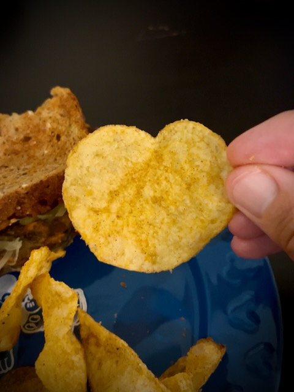

# Heart Shaped Potato Chip

## 21 Days of Prayer and Fasting

Today, I begin the middle week of this season. I'm excited for how last week went. I still haven't looked back at a year ago. I do recall, at some point, I began to struggle a little. I wonder if I'll have a moment like that this year? Remembering what it was like, it is something I'll want to prayerfully consider in this season.

That said, today, there isn't a prayer focus beyond the 7 focuses I've already be through the past week. Today is more of a reflection break as I meditate on all I've been learning about the prayers of Jesus so far. Here is a recap of the 7 prayer focuses I've had this past week:

1. [Praying anywhere and everywhere](./05_dawn#_21-days-of-prayer-and-fasting)
2. [Blessing others, even those who have harmed or wronged us](./06_blessings#_21-days-of-prayer-and-fasting)
3. [Thanking God for revealing Himself](./07_god-revealed-in-the-journey#_21-days-of-prayer-and-fasting)
4. [Prayer for God's Will](./08_gods-will-be-done#_21-days-of-prayer-and-fasting)
5. [Asking God to not forsake us, that we always recognize His presence](./09_lighthouse#_21-days-of-prayer-and-fasting)
6. [Asking God to help our faith to not fail](./10_faith-dont-fail-me-now#_21-days-of-prayer-and-fasting)
7. [Asking God to help us strengthen our sisters and brother in Christ](./11_strengthen-me-to-strengthen-others#_21-days-of-prayer-and-fasting)

The author of the devotional where I'm learning these things suggests that it is important to follow and move on to each as I'm ready. It seems he should have mentioned that in the foreword instead of on this reflection break...hehehe But that's okay. For me, I was ready each day. I built upon the previous day each time. That's probably why yesterday's morning prayer walk was my favorite of all time. I went through all 7 on that walk.

That said, this order and plan is one man's plan. He is a pastor and leads others. I imagine and hope that he interpreted the Spirit's guidance in this faithfully and correctly. I'm learning so much and will try to adapt and apply these lessons to my own life. I interpret that the Spirit led me to this book for a reason. It is strengthening my prayer time so far. I'm very grateful for the opportunity to learn more about how Jesus prayed. After all, He is the model of a God fearing and turning away from evil lifestyle, right?!? hehehe

John 8 starts off with the story of the woman caught in adultery. The Pharisees and scribes try to trap Jesus in His words here. He begins to write in the dirt on the ground. We don't really know what He wrote. But I have come to imagine He was writing down all of the things those people were guilty of. After all, He did say that whoever was without sin should throw the first stone. But no one threw a single stone.

The rest of the chapter was more of Jesus saying things that seemed to divide the crowd. Even claims to be God Himself at one point. They wanted to stone Him after that...LOL I need to study these things a little more. I want to learn about this side of Jesus. It seem confrontational. But there must be something in it that shows His attributes found throughout scripture. Of course, one key context here is *who* He was speaking to. I just want to understand it all better...hehehe

## My Day

I slept in for an extra 30 minutes today. I didn't really plan it. When my white noise app finished, I went right back to sleep. I suppose I needed it. When I woke 30 minutes later, I felt really good.

As you can see above, there wasn't a specific prayer focus today. It was more of a recap; which is good. My morning walk was full of prayer again. Similar to yesterday's. On my last lap around the pond, I had a sudden urge to attend theChapel service at the Port Richey location...LOL Just when I thought I was done there, I went back...LOL

After praying about it, I felt like it was the right thing to do. I'll not go into the details of all that happened. But it was a very blessed experience all around. I'm so glad I went. I'll likely be watching the sermon again. But it wasn't just the sermon. It was everything. God is so good!

The CUMC sermon was about baptism. I recalled that I've been baptized twice...hehehe The pastor mentioned that the United Methodist Church doesn't support doing a second baptism. I can understand why. They say *God got it right the first time*...LOL To which I agree. But I also know that people like me don't get it right the first time, ourselves...LOL Although I have since restarted my life *again* after the last baptism, I have no plans to do it again...hehehe I'm good...LOL I didn't lose my faith after the second time. I just lost my way. I was a lost sheep that has been found again. But between the two baptisms, I did lose my faith completely. That's why I wanted to do it a second time...hehehe

I was able to get in 4 miles of walks today. I did it in 3 walks by doing 4 laps each around the pond. It was a little chilly for that first walk. But the others were warmer.

I had a wonderful fellowship and friendship video call with my deer friend. I really enjoyed the devotionals we used to do. But these Bible studies we've been doing are so amazing. We do them throughout the week separately. And then we come together on Sunday to discuss. This has truly been a blessing I did not expect before we started doing this fellowship almost a year ago. Although our friendship began long before that, it was March last year when we started doing this fellowship experience through our first devotional.

I also had a pleasant phone call with mom and dad. It is always nice to talk to them on Sundays. I don't recall when I started making it a weekly thing. But it has been a while now. I appreciate these calls as much as they do.

## Photo of the Day

I had a few really good candidates for today. But the one that stole the show was a potato chip...HAHAHA I was impressed by this little guy. Ooh! And it was delicious as well...LOL

I had one of those amazing days...seeing a heart shaped potato chip just seems perfect for a day like today.

## Wrapping Up

I didn't write as much today as I have been. It was a full day, though. Sundays tend to be days of family, friends, and fellowship. Such days are full, and they make my heart full as well.