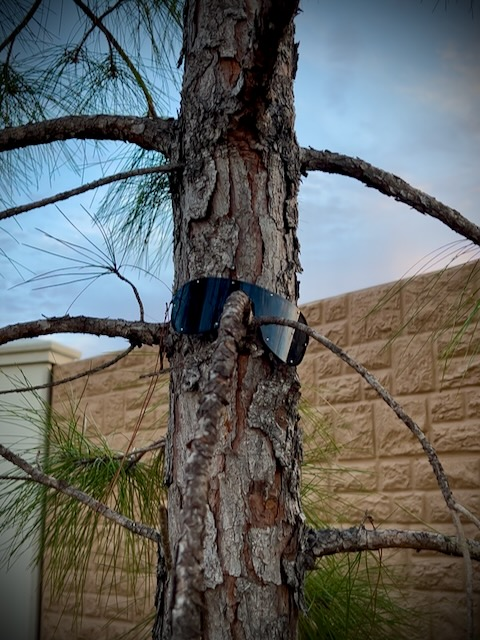

# Title Not Found

## 21 Days of Prayer and Fasting

Today, I take another break from a specific prayer focus to reflect on the previous 4 days. The next section of this devotional is on *the longest prayer*. After that week is over, it concludes with another break to finish out the 21 days. And then there are a few days of recaps that will take me just past my 21 days.

On my last break this past Sunday, I had mentioned I hadn't yet gone back to last year's journal entries. But then last night, I mentioned I finally started to do that. I love to see the progress I'm making on this journey called life. Journaling has been a blessing that I'm so glad I started last year. Well, technically, I started it the year before in a private journal. But it wasn't well organized like this one is...hehehe

So, what I have learned in the last 4 days? Once again, the author mentions the importance of not moving on from one prayer to the next until I'm ready. In my last break, I wasn't sure how that really worked. But this time, it is becoming more clear to me. Again, it's still based on the authors plan and the path he is taking with these prayers. I think I'm starting to understand a little more about what he means, though.

Here is a recap of the last 4 prayer focuses:

1. [Forgiveness of others](./13_please-forgive-me#_21-days-of-prayer-and-fasting)
2. [Giving ourselves to God](./14_gregilocks-and-the-3-in-1#_21-days-of-prayer-and-fasting)
3. [Thanking God for hearing us](./15_half-way-there#_21-days-of-prayer-and-fasting)
4. [Help us to know we are sent and that others will know we are sent](./16_sent#_21-days-of-prayer-and-fasting)

The fasting is helping me focus on asking, seeking, and knocking. I'm asking for God to guide me in some areas of my life this year that I feel are important to my relationship to Him and others. In my pursuit to love God with all my heart, soul, mind, and strength, and to love others as myself, I need all the help I can get...hehehe I'm seeking His Will in these matters so that I'll know which doors I need to be knocking on.

This devotional is a way for me to change the way I pray. I wanted a better understanding of what prayer is and how I should be praying. I felt led to this devotional in my pursuit to better understand these things. It has been taking me through the actual prayers of Jesus from the Word. It goes beyond the infamous *Lord's Prayer*. I feel I needed this and I'm grateful to be on this journey.

## My Day

### 9:30am

It's been a busy morning...hehehe But I wanted to jump in a make a quick timestamp. I enjoyed my morning walk once again. I'm so glad to be back to doing those this year. I'm now up to 4+ miles per day overall. And most of the time spent walking includes prayer. And with the prayers, sometimes it's me talking and sometimes I'm just listening.

I have more thoughts on the Eaton fire. I made a placeholder for it above. I'm not yet sure if I'll write anything or just remove it. If I do write, you'll likely have read it already...hehehe But as of writing this timestamp entry, I don't yet know if I'll do it or not. If you didn't see it above, I removed it...LOL I mostly have thoughts based on this week's Bible study on mercy.

Unsurprisingly, these 2 weeks of prayer and fasting so far are making an impact on how I feel, think, and pray. No matter where I am in life in the future, I hope I keep doing these seasons <3

### 10:45am

I think it will be official on Monday, but it appears I have lost 5 lbs this year...LOL I wasn't aiming to do so. But I can attribute it to my daily walks. For the past 16 days, I've taken 3 walks a day. The only exception was one Sunday when I walked twice. But on that day, the second walk was 2 miles for a total of 3 for the day. And now, I'm up to 4 miles a day. Plus the general movement activity I normally do outside of those purposeful walks. Today is looking like I'll continue my walking trend.

Even when I started this health journey 2 years ago, I didn't have a goal to lose weight. That just became a natural and positive consequence to the process. I've increased my food consumption this month to compensate for the increased activity. Yet, I'm back to losing weight again. Honestly, I'm still not at what is considered the ideal weight for my height and body type. I don't really concern myself with the weight, though. I'm focused on just taking care of my body and allowing it to do the things God created it to do.

I'm also not eating out at all. I haven't had any food outside my home since my Disney Christmas Day. That was over 3 weeks ago...hehehe And the food I'm eating at home is all good ingredients. I've been working hard at changing all of that and it seems to be working well.

On that subject, since my return home from California in November, I've eaten at home except the few times I went to Disney and those 2 weekends in Indiana. This is making a positive impact on my health and bank account...LOL

### 1:35pm

Today, I'm dealing with a new problem at work. It's another inherited project that I know very little about. The error we are getting doesn't really make any sense to me. I've been reaching out to various folks along the systems that are involved with this part of the application. I'm finding that I lack the knowledge and understanding of even how to test this piece. But I'm learning. It is a personal growth opportunity for knowledge and understanding of this particular system. What I hope I'm learning can be transferrable to other projects...hehehe

In today's Bible in a Year reading, I saw the birth of the nation of Islam through Abram, Hagar, and Ishmael. Something I learned today is that it is believed that Jesus Himself visited Hagar in Genesis 16. I didn't realize that *THE* angel of the *LORD* beginning in verse 7 is considered to be Christ. That was interesting to me. This warrants further study...hehehe

I find it fascinating that so many of the world's problems began with Abram/Abraham...LOL At least as far as war is concerned. Ishmael and Isaac have been enemies since they existed. *The angel of the LORD* foretold of this conflict. And this conflict remains to this day...some 4000 years later...LOL

### 4:15pm

*The angel of the LORD* subject above led me to look this up on [Got Questions](https://www.gotquestions.org/angel-of-the-Lord.html). That's a nice resource...hehehe It confirms what Tara-Leigh Cobble was saying in today's recap video. These sorts of discovery are why I'd like to add a section to my website for Bible study resources. On a day like today, I can add things like this to my on going notes. The next time I study the same scripture, such notes will be waiting for me to remind me of what I've learned before.

My deer pal's package arrived!!! *He*'s going to open it on Sunday while on our video call...hehehe I'm sooo excited to see his reaction...LOL Sunday is his *Gotcha Day*. I love how the timing worked out perfectly! I sometimes wish dog's knew why we celebrate them. But I'm glad they are just happy that we are happy...hehehe

### 7:25pm

As you can tell by the lack of a follow up to yesterday's Eaton fire thoughts above, I did not write about it again today after all. I still have thoughts. I'm just not ready to write them...hehehe

That issue at work was resolved. I discovered the problem and passed it along to those who could fix it. I wasn't quite sure what the problem actually meant. But I knew who to go to and have it fixed. Once it was resolved, it led to the next problem...LOL That's how these things go sometimes. But my boss knew exactly what that next problem was and reached out to those who needed to resolve it.

I had to fix a few bugs in code this week. But most of the issues have been related to other systems that my apps connect to. So it has been a matter of discovery and getting others involved. I've spoken to more people this week than I have ever talked to in this job...LOL

### 10:00pm

I enjoyed the season 2 finale of *Silo*. After I watch the end of a season of a show I love, I typically do a search to see if there'll be a *next* season...hehehe I just discovered that *Silo* was renewed for 2 more seasons. That 4th season will be its last. It's based on a book series...or the first of the series. I don't really know for sure. But perhaps I should read the book(s). It's a fantastic show and I imagine the book(s) is(are) much better...hehehe

I'll be watching the season opener of *Severance* here shortly. But I wanted to wrap up today's journal entry...LOL

## Photo of the Day

I've take a photo of this before. For some unknown reason (to me), this tree is styling some shades...HAHAHA

Those have been there for quite a while. I'm not sure who put them there or if anyone else has noticed them or not. I suppose they aren't causing any harm? That tree looks sooo cool...HAHAHA

## Wrapping Up

I really miss coffee...the smell...the taste...but not the mugs...HAHAHA I've been drinking hot water. So, I've been able to enjoy my mug collection <3

This has been a productive week at work. A busy week as well. I'm glad the weekend is here. I need a break from that for a few days. I'm looking forward to getting a few things done this weekend. Not too much though. It should be a somewhat relaxing weekend.

I'm almost caught up on reading last year's journal entries up to the current date. I read a few more earlier this evening. I should be all caught up tomorrow and then I'll be able to keep up by just reading the entry from the same date a year ago...you know, if there was one.

I write so differently now. I'm more conversational than I used to be. I still have my moments that are like how I wrote a year ago. But I feel this is becoming more like a chat.

Well, it's time to proofread. I'm sure I'll still miss something...HAHAHA

Ooh! And now I have walked consistently for 17 days straight now...LOL Is this some kind of personal record?!? HAHAHA