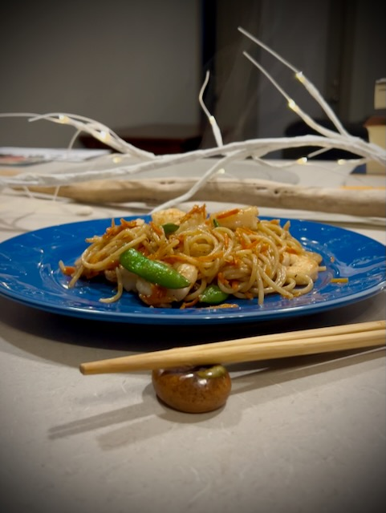

# Gulf Shrimp, Dapper G, Peace Out

Today was a good day. I took 3 walks. They were shorter than the other times. I think I walked about 2 miles total? Plus that approximately 1 mile I walk around just going about my day. The weather was perfect for being outside. So, I'm glad I went out...hehehe

I decided not to journal about the reflection day from that prayer devotional I've been doing. It was getting redundant here...LOL I'll just finish organizing all of that on the [Bible](/bible) section later this week and not do anything else here in my blog about it...hehehe

I made Gulf shrimp chowmein for dinner today. It turned out terrific. I think it is technically more like lomein. But how I cooked it is more chow than lo. I'm not entirely sure I'll ever be *good enough* to make it exactly right...hehehe It did taste great, though!

I call it *Gulf* shrimp because the shrimp are sourced right here out of the Gulf of Mexico. The shrimp took on the flavor of the coco aminos really well. The carrots, shiitake mushrooms, and snap peas all went well with this too. I'll definitely be making this again!

I'll be enjoying a day at Disney tomorrow. My target is the EPCOT International Festival of the Arts. I may end up just doing that for the day. But I'm open to visiting one of the other parks too. I'll be dressing dapper once again. It will be my first time in the new year...hehehe

I looked at the menus for the festival food and I'm impressed with the options. I've read on socials that this year's food is pretty good. I even watched parts of a video review of a few items I have my eye on. I don't normally do that. But I'm opening up to checking things out before I go now...hehehe

My dapper theme is green this time. It has inspired me to look into doing a dapper bound of Kermit the Frog...LOL That isn't what I'm doing tomorrow, though. But I do have some pants that might work for a Kermit bound.

I also have ideas for other characters like Donald Duck and Snow White...hehehe I don't think I'll get to all of my ideas this year. But that's the beauty of these things. I can dream up ideas and gradually implement them over time. I think this dapper thing is something I'll keep enjoying for years.

I can mix and match different things each time. But I do think that I'll end up with enough things that I'll either need a special place to keep it all, or dedicate an entire section of my closet just for this stuff...LOL I live in an apartment now. So, I'm currently limited on space. But I think I could eventually set something up in the corner of the bedroom for these things. It is all really nice stuff. Having a nice rack out in the open room might look neat...hehehe

Taking a day off in the middle of the week for Disney will be nice. I used to do that in 2023. I preferred the weekday park visits. The crowds are typically lower and I can do more. It just requires me taking a day off work. Last year, I did most of my park visits on the weekends. But I found that I did a lot less stuff and spent more time in lines.

I can't take time off all the time, though. In 2023, I would sometimes work extra hours on my workdays so I could take a day off without using PTO. I may see about doing that other times this year. For tomorrow, I actually took vacation time for it...hehehe

I sometimes miss going to Disney with other people. I did ask my sister if she was available tomorrow...she wasn't...hehehe But I'm still enjoying the solo days there. I love watching people enjoying the magic of Disney. And when I dress up, like tomorrow, random people tend to find me more approachable and like talking to me. A stranger is a friend I haven't met yet, right?!? LOL

Tomorrow's featured photo is likely going to be from Disney...LOL Imagine that! LOL

I laid down at 1am and got up at 7:30am again this morning. I really do think that's what my body wants. I originally thought about going to bed early tonight so I could get up early tomorrow and have more time at Disney. But then I realized I don't really mind having a shorter day tomorrow. It made sense to do that on Christmas because it was a special day. But tomorrow is just about the festival. If I feel like going to another park, I can. And I can stay until closing if I want. But I don't need to rope drop anything. So, 1am tonight is my target bedtime again...hehehe

I'm a lot less constipated this week than as I was last week. I think reintroducing coffee may have something to do with that...LOL I hadn't ever noticed coffee impacting that before. I've heard that it helps. I just never observed that with my own body until now...hehehe

I watched this week's episode of *The Chosen* (S2E7) and read through this week's lesson to prepare for what is in store for the week. I feel as though it will be an intense week...hehehe Of course, I mean that in a good way. I'm learning so much about God, myself, and my deer friend. These lessons are growth opportunities. I'm hungry for this. And I am satisfied <3

I think that's all that's on my mind for today. Here's my featured photo for today...

## Photo of the Day

<!--@include: ../../../photos/photo-a-day/2025/01/27.md{3,}-->