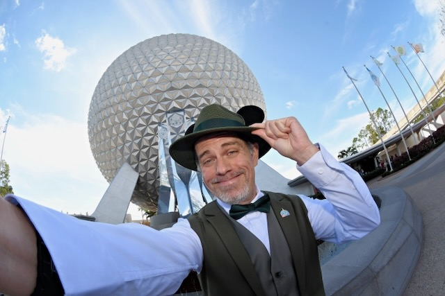
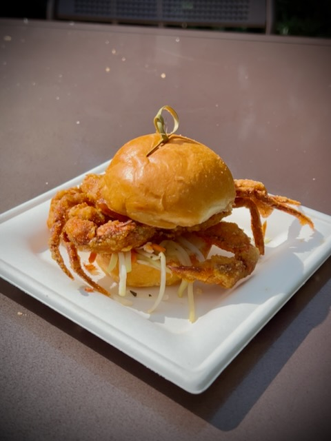
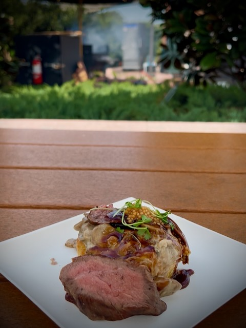
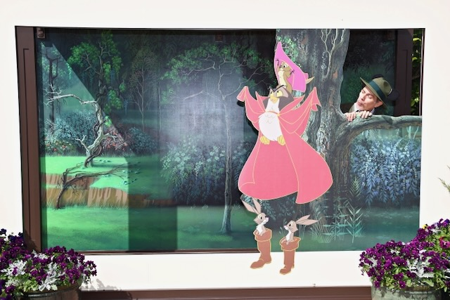
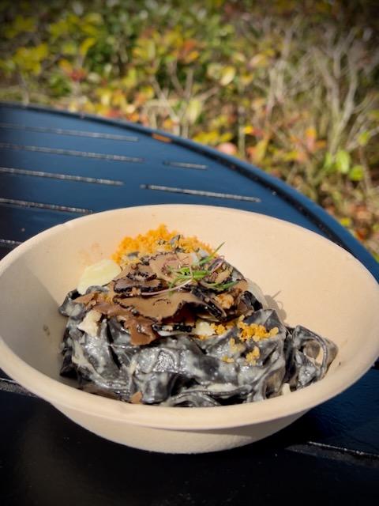
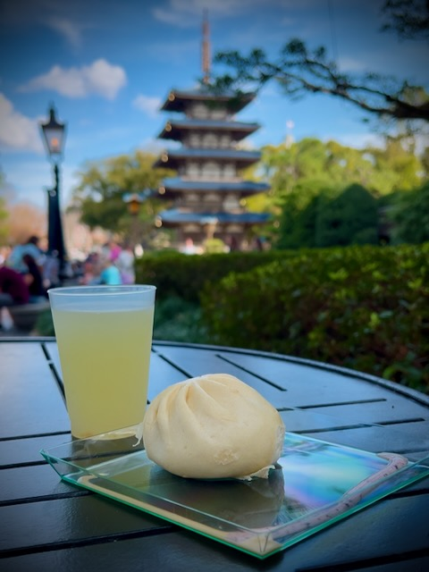
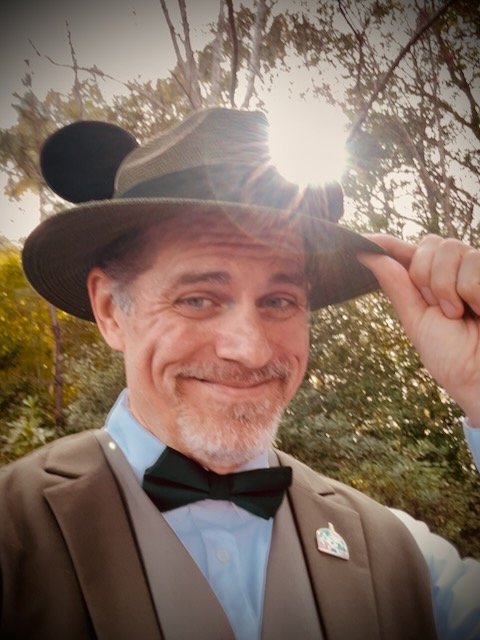
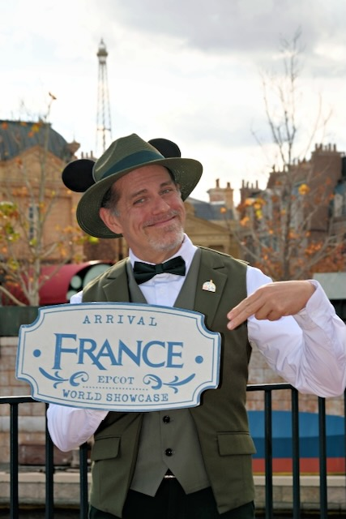
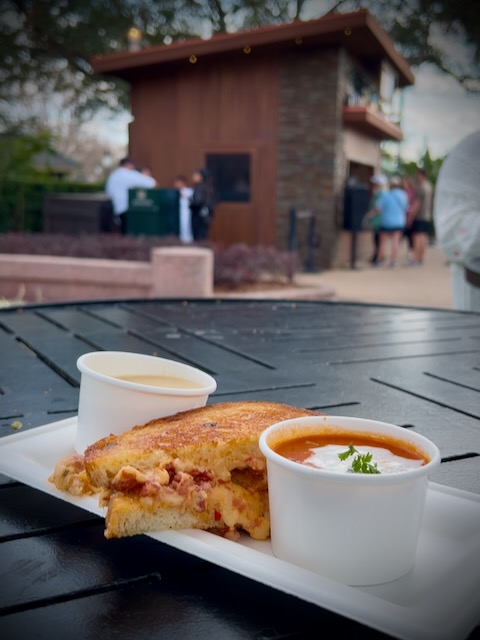

# TBD

I had an amazing day! I kept notes throughout the day so I could journal about it all. And I took 65 videos...LOL I'll have to sift through the videos before I can build a video journal from them. I'll likely choose videos based on what I write about the day. The parts of the day I made note of are the most...*noteworthy*...moments...hehehe

## My Day

### 9:00am

I had a bit of a late start to my day. Basically, I did end up going to bed around 1am like I planned. I woke up at 7:30am, also like I planned...hehehe I decided I would go about my morning pretty much like usual...with a few small changes. I brewed my coffee, made my cinnamon toast, and did today's *Bible in a Year* reading and recap. I was basically in no rush...hehehe

Even when I got ready for my dapper day at Disney, I took my sweet time getting dressed. I wanted to be sure everything was perfect before I walked out the door. I also wanted to be sure I didn't forget to wear my pin. I wore the matching castle *Dapper Day* pin I got for my deerest friend and me last year in California. She wore hers today too...hehehe We were twins!

I wore the magnetic *Mickey ears* she gave me with the hat my parents gave me...hehehe They seemed to work perfect. I just had concerns if the wind would knock them off...hehehe

### 9:20am

Well, I'm off to Disney! I often wonder what my neighbors think of my dapper attire when I leave home on days like this...LOL I have no idea if any of them see me or not. No one has said anything yet...hehehe

I should get there in 2 hours...

### 11:26am

I arrived safely at EPCOT. I didn't run into any significant traffic. Even that little 3 mile stretch of I-4 wasn't very bad today. It was a great day to be traveling to Disney...hehehe I parked in Dory 411. I remember when parking out there would require me to use the tram. My health journey has brought me to wear I'm excited to walk the full distance without using the tram. Even after a long day today, I'll likely walk all the way back to my car...hehehe

### 12:40pm

When I got into the park, I got a selfie with the festival sign and then got a set of PhotoPass photos in front of Spaceship Earth...the big EPCOT ball...hehehe I've gotten into the habit of getting PhotoPass photos when I do a new dapper outfit. Which has been every time so far, since I've only been doing this recently...hehehe One of the PhotoPass photos looks like a selfie...hehehe The photographer set it up for me and I think it looks fun!

Then I headed over to try my first festival food...the crab slider! It was fantastic! People joke about it being Sebastian from *The Little Mermaid*...LOL Now, why in the world would I eat him?!? HAHAHA

After the amazing crab slider, I enjoyed the beautiful sax sounds of Don Black. He was performing as part of the festival. I even did a little dancing to his music...hehehe No video proof of that, though...HAHAHA You'll just have to trust me...HAHAHA

### 1:05pm

My next festival food was the Beef Wellington. Ooh my! It was *really* good!

I asked if I could sit with this couple who appeared to be there with their grandson. They were a very nice couple. They left while I was still eating. Another couple was looking for a place to sit a little later and I offered for them to sit with me...hehehe It was great to chat with all my *new friends*...hehehe

While I was sitting with the second couple, someone else came by to ask me where I got my hat...LOL I told them the ears were just magnets...hehehe I had already gotten so many compliments about my attire at this point. Apparently, one of the couples who complimented me were famous vloggers. I found out later when one of the Cast pointed it out to me...hehehe I didn't personally know who they were, though...LOL They didn't offer to put me on their show...LOL

After I finished eating, I went to check out the Disney Broadway costume and prop exhibit. I'll include parts of that in my video journal when I do it. There is too much to include in this blog entry...LOL But it was amazing to see! I wish I had spent more time in there. I'll go back to take more of it in next time. I had limited time today since I didn't get here early today. Plus, I don't plan to stay very late...hehehe *The Lion King* part really stole the show...LOL And I stole baby Simba! HAHAHA jk

### 1:40pm

Look ma! I'm a painting! HAHAHA I took advantage of the PhotoPass again to become part of a couple of paintings!

I picked out a new pin...hehehe It's Figment as a painter. It is themed for the festival. I think it was from a previous year. But I didn't have it already and I wanted something to remember today. That's kind of the point of a pin collection, you know...hehehe Well, not entirely. But all of the pins I have so far have significant meanings. I'm not yet at the pin trading level in my collection...hehehe

My next festival food was squid ink pasta. It was fantastic! I also got more compliments on my hat and overall attire...hehehe This photo doesn't do the video justice. I can't wait to do the video journal from today. The video of this dish includes the monorail and Spaceship Earth...hehehe

### 2:05pm

I'm relaxing in the Odyssey pavilion enjoying a Figment frozen lemonade with chipotle pineapple...yum! This will be another one where the video will be better than this photo...LOL But you can kinda of tell how the video will be funnier for sure...HAHAHA

### 2:50pm

I decided my next festival food was going to be in Japan. So I made the trek back to that Japan pavilion. I went with the Taiyaki; which is a sweet red bean pastry. It was really good!

I also bought my traditional wooden sake cup. This year, I had them put *God's Blessings* on it. They didn't have a word for blessing. So they just spelled it out in Japanese letters. The translation works to English. But someone from Japan would probably just look at me funny...LOL jk

### 3:05pm

I'm still in Japan...HAHAHA I decided I wanted the Wagyu bun and Okinawa Lemonade. Both were really good! I also did an eclipse selfie...hehehe

### 3:55pm
France photo, tomato soup and bacon cheddar soup (special today) and grilled cheese 

As I was walking past the France pavilion, I saw the PhotoPass photographer there. I don't recall ever getting France photos before. I may have and just forgot. But I decided to get some today...hehehe

I then meandered over to have a grilled cheese with tomato soup. They told me there were giving out an extra soup today; which was bacon cheddar soup. Yay! Two soups for the price of one! Thanks Disney <3 Both were very good; as was the grilled cheese.

### 4:05pm
Victor Espinola…dancing fingers 

### 4:35pm
Eating in China, shared table, shrimp dumplings, strawberry bubble tea

### 5:00pm
Waiting for Broadway concert series, just before spit out part of bubble tea on vest but caught it quickly enough 

### 6:10pm
The Broadway music was amazing 🤩 , applauded tech booth

### 6:20pm
Italy, ravioli, shared table 

### 6:40pm
Bill and Kim, pictures and selfie video, felt like a celebrity 

### 6:50pm
DJ, Spaceship Earth show?

### 7:05pm
Joffrey’s 

### 7:20pm
Headed home 

### 9:15pm
Made it home safely 

## Photo of the Day

<!--@include: ../../../photos/photo-a-day/2025/01/28.md{3,}-->

## Wrapping Up

Decanter warmer