# Dapper Makes Me Happier, and a Celebrity!

I kept notes throughout the day so I could journal about it all. And I took 65 videos...LOL I'll have to sift through the videos before I can build a video journal from them. I'll likely choose videos based on what I write about the day. The parts of the day I made note of are the most...*noteworthy*...moments...hehehe

This is a bit long today. It was an amazing day with a lot in it. I basically journaled about it all...LOL

## My Day

### 9:00am

I had a bit of a late start to my day. Basically, I did end up going to bed around 1am like I planned. I woke up at 7:30am, also like I planned...hehehe I decided I would go about my morning pretty much like usual...with a few small changes. I brewed my coffee, made my cinnamon toast, and did today's *Bible in a Year* reading and recap. I was basically in no rush...hehehe

Even when I got ready for my dapper day at Disney, I took my sweet time getting dressed. I wanted to be sure everything was perfect before I walked out the door. I also wanted to be sure I didn't forget to wear my pin. I wore the matching castle *Dapper Day* pin I got for my deerest friend and me last year in California. She wore hers today too...hehehe We were twins!

I wore the magnetic *Mickey ears* she gave me with the hat my parents gave me...hehehe They seemed to work perfect. I just had concerns if the wind would knock them off...hehehe

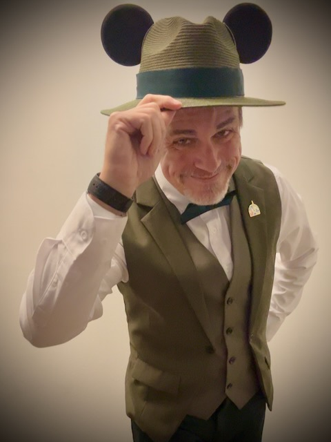

### 9:20am

Well, I'm off to Disney! I often wonder what my neighbors think of my dapper attire when I leave home on days like this...LOL I have no idea if any of them see me or not. No one has said anything yet...hehehe

I should get there in 2 hours...

### 11:26am

I arrived safely at EPCOT. I didn't run into any significant traffic. Even that little 3 mile stretch of I-4 wasn't very bad today. It was a great day to be traveling to Disney...hehehe I parked in Dory 411. I remember when parking out there would require me to use the tram. My health journey has brought me to wear I'm excited to walk the full distance without using the tram. Even after a long day today, I'll likely walk all the way back to my car...hehehe

### 12:40pm

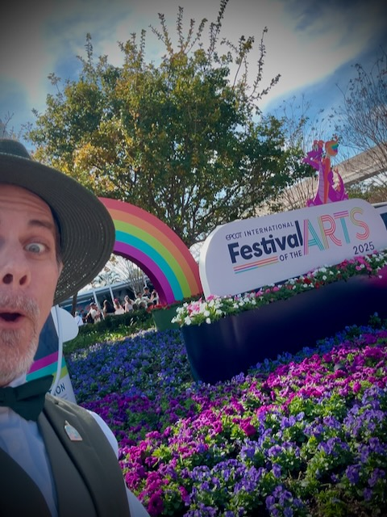

When I got into the park, I got a selfie with the festival sign and then got a set of PhotoPass photos in front of Spaceship Earth...the big EPCOT ball...hehehe I've gotten into the habit of getting PhotoPass photos when I do a new dapper outfit. Which has been every time so far, since I've only been doing this recently...hehehe One of the PhotoPass photos looks like a selfie...hehehe The photographer set it up for me and I think it looks fun!

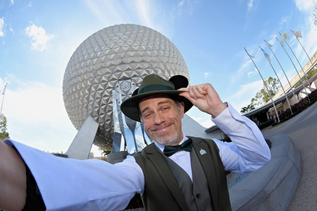

Then I headed over to try my first festival food...the crab slider! It was fantastic! People joke about it being Sebastian from *The Little Mermaid*...LOL Now, why in the world would I eat him?!? HAHAHA

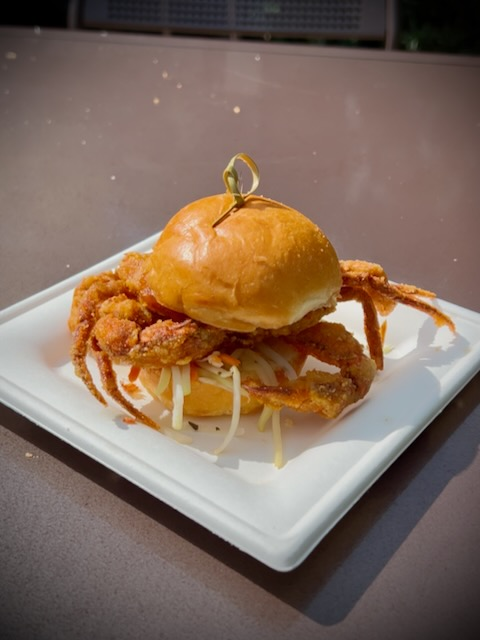

After the amazing crab slider, I enjoyed the beautiful sax sounds of Don Black. He was performing as part of the festival. I even did a little dancing to his music...hehehe No video proof of that, though...HAHAHA You'll just have to trust me...HAHAHA

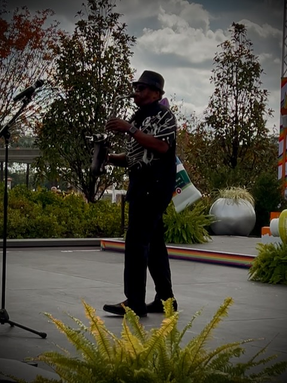

### 1:05pm

My next festival food was the Beef Wellington. Ooh my! It was *really* good!

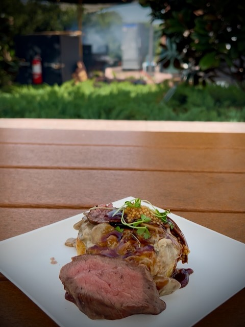

I asked if I could sit with this couple who appeared to be there with their grandson. They were a very nice couple. They left while I was still eating. Another couple was looking for a place to sit a little later and I offered for them to sit with me...hehehe It was great to chat with all my *new friends*...hehehe

While I was sitting with the second couple, someone else came by to ask me where I got my hat...LOL I told them the ears were just magnets...hehehe I had already gotten so many compliments about my attire at this point. Apparently, one of the couples who complimented me were famous vloggers. I found out later when one of the Cast pointed it out to me...hehehe I didn't personally know who they were, though...LOL They didn't offer to put me on their show...LOL

After I finished eating, I went to check out the Disney Broadway costume and prop exhibit. I'll include parts of that in my video journal when I do it. There is too much to include in this blog entry...LOL But it was amazing to see! I wish I had spent more time in there. I'll go back to take more of it in next time. I had limited time today since I didn't get here early today. Plus, I don't plan to stay very late...hehehe *The Lion King* part really stole the show...LOL And I stole baby Simba! HAHAHA jk

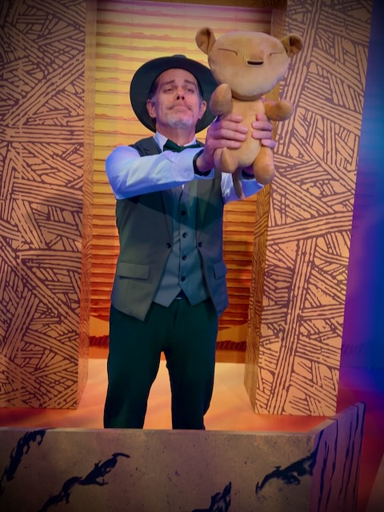

### 1:40pm

Look ma! I'm a painting! HAHAHA I took advantage of the PhotoPass again to become part of a couple of paintings!

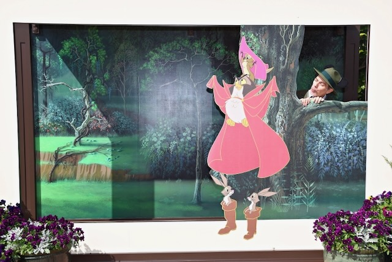

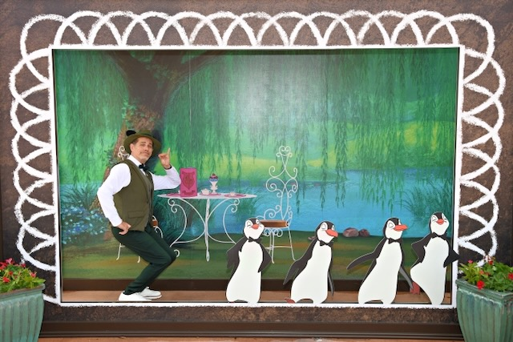

I picked out a new pin...hehehe It's Figment as a painter. It is themed for the festival. I think it was from a previous year. But I didn't have it already and I wanted something to remember today. That's kind of the point of a pin collection, you know...hehehe Well, not entirely. But all of the pins I have so far have significant meanings. I'm not yet at the pin trading level in my collection...hehehe

My next festival food was squid ink pasta. It was fantastic! I also got more compliments on my hat and overall attire...hehehe This photo doesn't do the video justice. I can't wait to do the video journal from today. The video of this dish includes the monorail and Spaceship Earth...hehehe

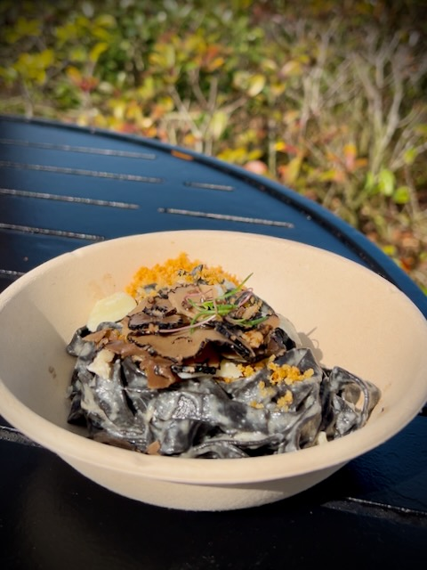

### 2:05pm

I'm relaxing in the Odyssey pavilion enjoying a Figment frozen lemonade with chipotle pineapple...yum! This will be another one where the video will be better than this photo...LOL But you can kinda of tell how the video will be funnier for sure...HAHAHA

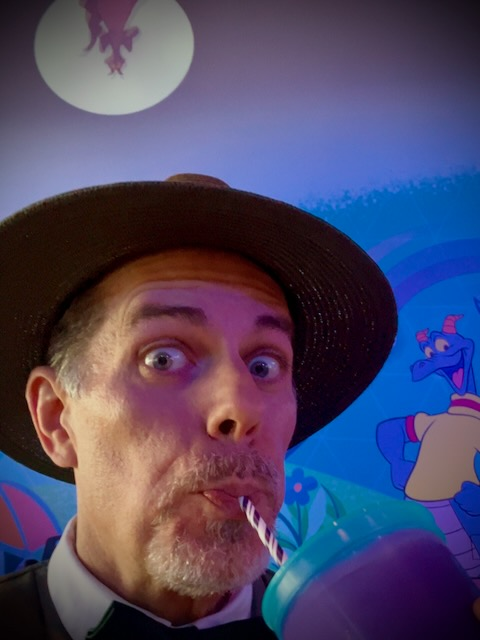

### 2:50pm

I decided my next festival food was going to be in Japan. So I made the trek back to that Japan pavilion. I went with the Taiyaki; which is a sweet red bean pastry. It was really good!

I also bought my traditional wooden sake cup. This year, I had them put *God's Blessings* on it. They didn't have a word for blessing. So they just spelled it out in Japanese letters. The translation works to English. But someone from Japan would probably just look at me funny...LOL jk

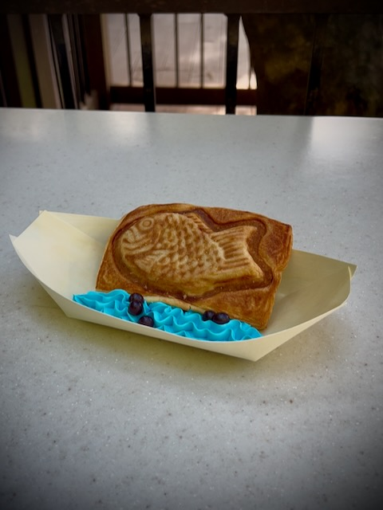

### 3:05pm

I'm still in Japan...HAHAHA I decided I wanted the Wagyu bun and Okinawa Lemonade. Both were really good! I also did an eclipse selfie...hehehe

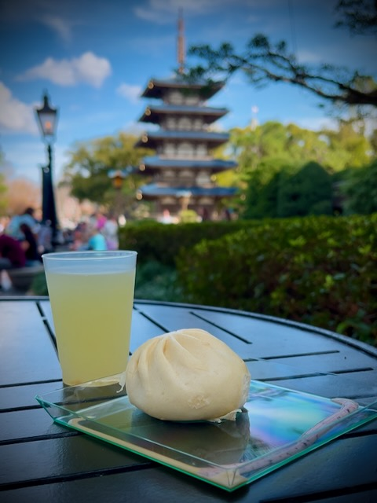

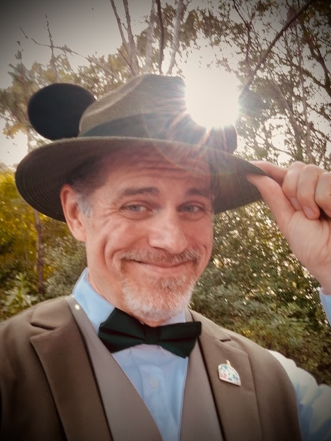

### 3:55pm

As I was walking past the France pavilion, I saw the PhotoPass photographer there. I don't recall ever getting France photos before. I may have and just forgot. But I decided to get some today...hehehe

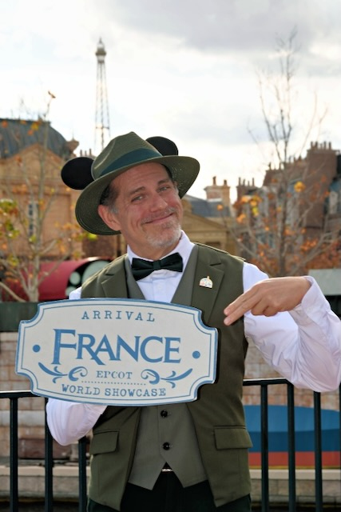

I then meandered over to have a grilled cheese with tomato soup. They told me there were giving out an extra soup today; which was bacon cheddar soup. Yay! Two soups for the price of one! Thanks Disney <3 Both were very good; as was the grilled cheese.

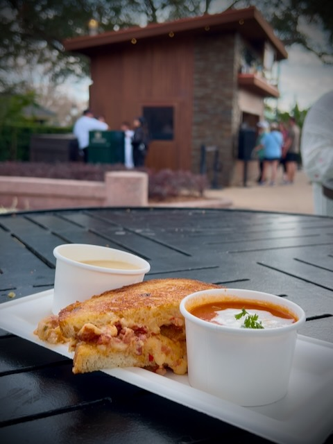

### 4:05pm

Ooh! Wow!!! The musical talent of Victor Espinola! His fingers danced across the strings of his harp! He was amazing <3 I'll share a small clip in my video journal. Words cannot do him justice. I'm not even sure the video I captured will do him justice...HAHAHA

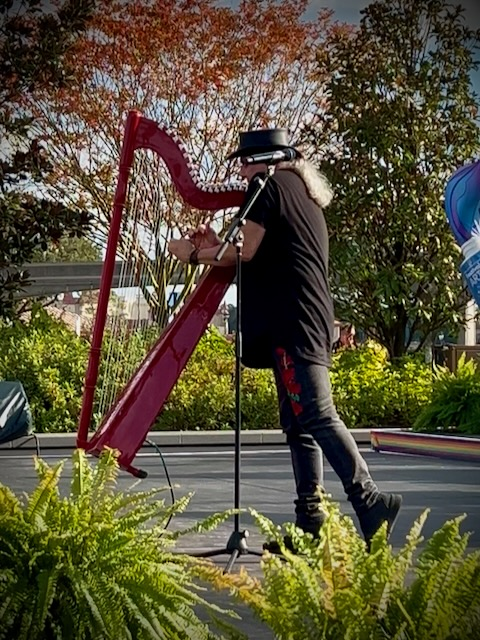

### 4:35pm

I'm eating in the China pavilion. I ate Har Gow; which is a shrimp dumpling with pumpkin purée and a drizzle of chili oil. I also had their strawberry bubble milk tea...hehehe

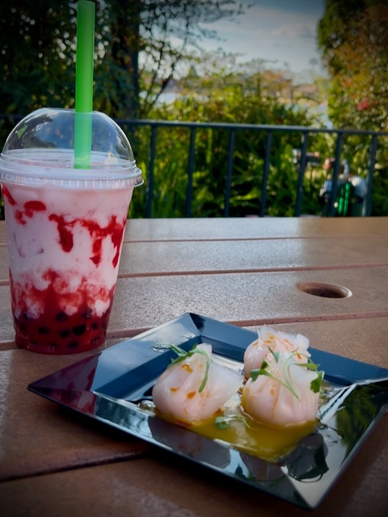

This is another place where I was able to share a table and chat with some *new friends*...hehehe I am finding it easier to approach people and for them to approach me when I'm dressed dapper...hehehe If I make a dapper section of this website, it'll be called *So, dapper makes me happier...* HAHAHA I was talking with my deer friend earlier today and we coined that phrase together <3

### 5:00pm

I'm waiting for the Broadway concert series performance to begin. Just a little bit ago, I was starting to cough while I had some of that strawberry bubble milk tea in my mouth. I spit some of it out and onto my vest! OOH NOO! Luckily, I caught it quickly enough and it didn't soak in. Crisis averted! HAHAHA

### 6:10pm

Ooh! Wow!!! Once again...photos and my short video clip cannot do this justice! Patti Murin and John Riddle where amazing! They sang songs from Mary Poppins, Hercules, The Little Mermaid, and Frozen Broadway musicals <3 I believe this was the third time I've experienced the Broadway series at the festival over the years. This was by far my favorite performance <3 I'll include the short clip in the video journal.

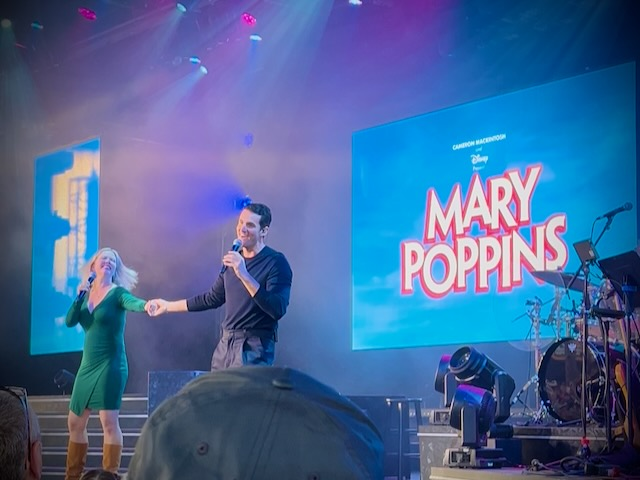

### 6:20pm

I'm in Italy now...hehehe I'm enjoying their Tricolore; a cheese-filled ravioloni with pomodoro, cream, and pesto sauces.

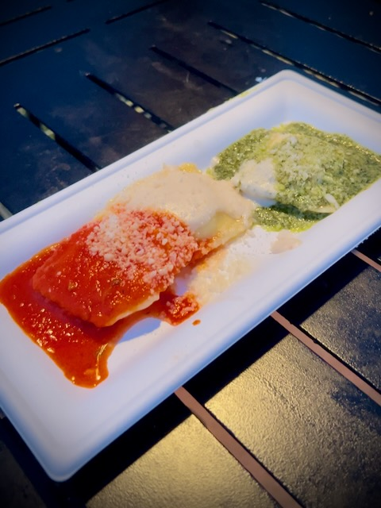

Guess what?!? Another shared table experience with *new friends*! They asked me what my favorite food was today. I went with the crab slider. But I probably should have said the Beef Wellington...hehehe I sometimes answer wrong when I'm put on the spot. I really do need to get better at thinking on the spot...LOL Then again, that first thought might have been correct. The crab was very unique!

### 6:40pm 

After the ravioloni, I decided I was done for the day. As I was walking to the front of the park, I was entering the UK pavilion when a lovely couple stopped me. They had seen me throughout the day and wanted to meet me...hehehe We chatted for a bit about my dapper attire and what got me into doing dapper. They asked if they could get their picture taken with me! I felt like a celebrity! We stopped another couple who was passing by to see if they would take our picture...HAHAHA At that moment, I truly felt like a celebrity! I was suddenly getting a lot of attention. This is the first time this has happened to me...HAHAHA It really made my day. I'll forever be a part of their journey. And they'll forever be part of mine <3 I also took a video selfie with them after the other photo. I don't have their photo. But I do have my video. I'll include it in the video journal. But here is a selfie I grabbed from the video...hehehe

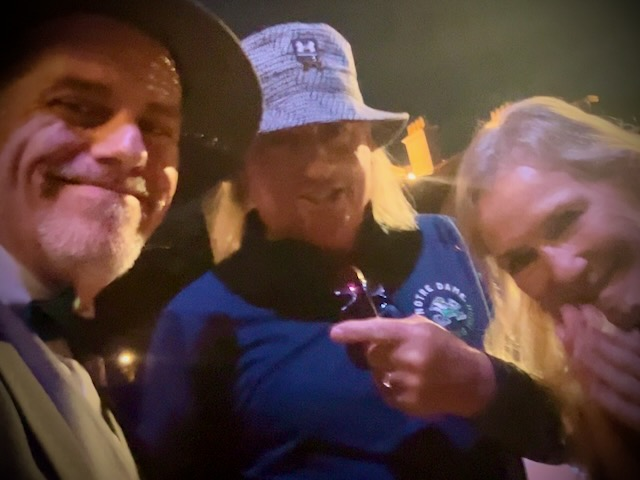

They were so kind <3 This dapper thing has completely changed the way I experience Disney parks <3

### 6:50pm

On my way out, I stopped at the Encanto stage. There was a DJ there playing Latin music and kids were dancing. It was fun. I hadn't seen that before. I didn't record anything from that.

Someone else asked me where I got my hat...LOL I explained that the ears came from my deer friend and the hat from my parents. I told them I just put them both together and it became what it is...hehehe Since they are magnetic, they aren't permanent. I'll use the ears for other hats...hehehe

I also stopped briefly to watch the Spaceship Earth light show. It wasn't much. I may include it in the video journal.

### 7:05pm

I ordered my traditional EPCOT cup of Joffrey's coffee...hehehe I typically grab one on my way out for the drive home. I don't need it tonight. I just like it since it's tradition...LOL They had to brew a fresh batch. Fresh Joffrey's tonight!

I chatted with a gal who also ordered something. She complimented me on my hat. She thought I worked here...LOL When I told her I was just there enjoying the parks all dressed up, she then complimented me on my whole attire. She seemed impressed. I got to talking about how fun it was to dress up from November through April. That's what I'm calling dapper season for me...hehehe It will be too hot after April. I didn't tell her, but that's why I'll switch to my retro clothes that I'm giving a try this year...hehehe

### 7:20pm

I'm at the car now and heading home! I walked all the way...no tram again! Looks like it will be about 2 hours again. Apparently traffic isn't too bad right now. When I leave after park close, the traffic isn't too bad. But this feels like it might still be rush hour this early. Maybe it isn't too bad tonight. I've left this early before and it took more than 2 hours. A great day for travel!

### 9:15pm

I made it home safely. Yep, just shy of 2 hours! Yay! Now, I'll write up my day. I've been keeping notes all day of everything. I'll write it up as if I've been journaling all day. I used the timestamp format in my notes. I'll just copy that and write it all out from my notes...hehehe

## Photo of the Day

<!--@include: ../../../photos/photo-a-day/2025/01/28.md{3,}-->

## Wrapping Up

Well, that's a wrap for today. I'll work on the video journal soon. It is worth putting together.

I ordered a warmer for my coffee decanter. It arrived while I was gone today. I used it tonight for my evening coffee. It works well. I think I'll use it for my hot water too...hehehe

I didn't go over the whole thing before publishing. I hope it isn't full of typos...LOL