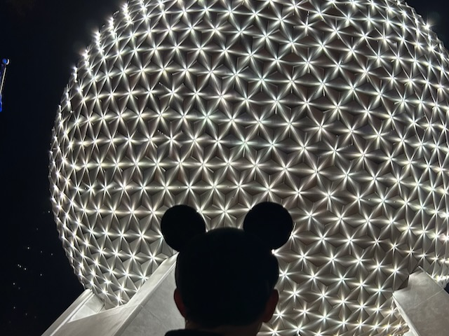

# I Love My *Ears*

## My Day

February has arrived! Yeah, that's a little on the nose...LOL But I'm going to celebrate the change in months. So, Happy February!!!

As I mentioned yesterday, today is a Disney day with my sister. I'll be getting ready to leave soon. I decided I would start my journal this morning. I'll probably keep track of the day's moments like I did on Tuesday. But regardless, I wanted to journal today.

I've still been keeping up with rereading last year's journal entries on the month and days I wrote. I normally wait until the end of the day to read those. But today, I read it already...hehehe It seems I was exhausted after January last year...LOL I still declared it a good month. I was just worn out a little.

I had a lot of inspiring things to say last year. I'm so glad I started this blog last January. I may still migrate those entries to this site. For now, they are *archived* on [my previous website](https://blog.bygregmarine.com). As I mentioned last month, I decided to move everything to this main one instead so I could cross reference everything. A year ago, I had ambitions to keep it all separate and tend to each section. But I ended up only doing the blog. Now that I've merged it here, I've already started to work on new sections...like [Photos](/photos/) and [Bible](/bible/)...hehehe

I've already had my breakfast, coffee, and I did today's *Bible in a Year* reading and recap. I've enjoyed starting my day this way today. I'm still enjoying my daily routines. They ebb and flow a little. But in general, each day has a good balance...hehehe

I mentioned something yesterday about *toxic positivity* and how I believe I don't have that. In my journal entry from a year ago, it was pretty clear I dont' fall into that...LOL I think my Bible study notes reflect that as well. When I write, I tend to identify what struggles I have while also including either how I deal with them or how God is revealing Himself through them. It shows my life isn't all rainbows and sunshine. But it also shows how I find God in the storms. I'm still grounded in reality. I see the bad and the good. I just hope that what I say to and do for others reflects that as well. This blog is only a piece of me. How I treat others should also reflect a good balance.

Well, I best be getting ready for my day with my sister! Today will be a good day because she is a part of it <3

We had such a wonderful time together today <3 I didn't keep a log of everything after all. But I did take lots of short videos throughout the day to remember it by...hehehe I might do a video journal of it all. But not tonight...LOL

I ate more festival food than she did. But I didn't eat as much as I did on Tuesday. We shared a few items. I started off with the deconstructed BLT. We then shared a Figment pastry. We also shared caprese "poutine". I then had the deviled eggs, beef short rib, and the sushi donut. As we were leaving, we both had our own separate grill cheeses with tomato soup. The soup was the same as I had on Tuesday. But the grill cheese was different. That's it for the food and it was spread throughout our time today...not back to back...LOL

We got to hear some live music and see a few chalk artists drawing on one of the side walks. We saw Disney Legend Tony Baxter. I saw one of my social media *friends* as well. I hadn't seen him since 2023. We still follow each other on social media. But we never talk anymore...hehehe It was good to see him, though.

I was glad to have lived in the moment the whole day like I usually do. But I still kind of wish I had been logging it all throughout so I could better summarize it here.

I was reminded once again how much I love to visit Disney parks. I love it all. During the Broadway Concert Series performance, we could see wild birds who just so happened to be flying in formation in the background...LOL I kept thinking to myself, *only at Disney can I see such wonderful things while someone is singing such beautiful music right in front of me*...hehehe

I haven't quite reached the part in my journal last year when I was thinking about giving up my Annual Pass to Disney World. But it was around this time last year I was considering it. I'm grateful my deer friend reminded me of what I love about Disney parks. Had she not said something to me a year ago, I would have missed so many wonderful moments like the ones I had today. Thank you so much for reminding me <3 It is a great gift that you gave me a year ago 🥹

## Photo of the Day

<!--@include: ../../../photos/photo-a-day/2025/02/01.md{3,}-->

## Wrapping Up

As we were leaving EPCOT tonight, we got to see one of the light shows they do with Spaceship Earth. It was gorgeous <3 My sister was behind me while we watched it. She took a few silhouette photos of me...hehehe

Those are the magnetic ears my deerest friend gave me...hehehe She is always with me at Disney in spirit. Now that I have those ears, a part of her is physically with me as well <3 At least when I wear the ears or when I wear one of the pins I got with the gift card she gave me last year...HAHAHA Actually, now that I think about it, part of her is always with me physically anyway. I carry that gift card with me always 🥹

I was complimented on my ears a few times again today...hehehe I love them so much <3 Thank you!