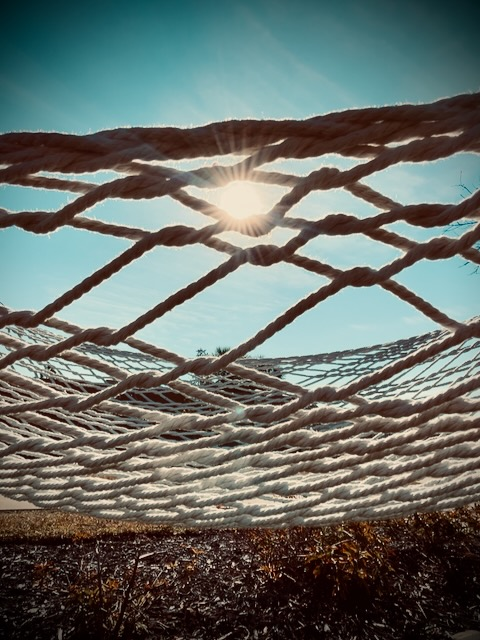

# Warm Hugs 🤗

Today's *Vitamin G*:

>If I do even just one thing for someone else today, that will be the best thing I do all day 🤗❤️
>
>An other-focused mind gives me clarity on my own circumstances and helps me share the blessings I have with those who need them most ❤️🤗

Society seems to promote a *me* centric philosophy of putting ourselves first. Even some of my *Vitamin G* seems to promote taking care of yourself first. While it is important to take care of ourselves, that doesn't mean we have to put our focus on ourselves. We just shouldn't put others first at the expense of ourselves.

That said, focusing on others really has given me clarity on what I deal with in life. Learning to love God first, and then others, has changed my perspective these past few years. I've learned I'm truly blessed. And I'm so glad I can share that with others. I'm not talking about money or material possessions. I'm talking about my *warm hugs*. But I do have those moments when I'm able to share financial blessing as well. People do like money too...LOL

I've been given a lot of gifts by God. I'm happy to share them. I never seem to have any ambitions of making money with my talents. For example, I've never sold a single painting. I just love to make them and give them away...LOL I'm thinking about that now because I'm working on a few at the moment. But my point is that I absolutely love making them and giving them away. I always hope the recipient feels that *warm hug* those paintings are...hehehe

I chose my career because of the income potential. But that was because, at the time, I wanted to provide for my family. Now, it allows me to do all the creative works without doing them for a living. For a time, I wanted to leave my career so I could pursue my creative side. But that would mean I would need to start selling my work...LOL I now realize I should stick with my career and continue doing my creative works for the love of it. With my current routine, I have plenty of time to pursue my creative side now...hehehe

I did a little more work on one of my current paintings tonight. It's coming along nicely. I take *in progress* photos as I go along. It is so much fun to look back on how the projects progress throughout the process. I've done that with all of my paintings since 2021. Part of the reason is to do comparisons along the way to ensure the colors are coming out as I see them in my head. I'm far from perfect with this process. But the progress photos help. So far, this project has 11 progress stages captured. It should have been 12...but I missed one of them...LOL

Tomorrow, I'm hoping to make some progress on a few other things that I haven't gotten around to yet. One of those being my February goal. I may double up on that. I'll probably do last weekend's step along with this weekend's...hehehe

I'd also like to do more work on my website. I have some maintenance to do on some of the existing content. But I'd also like to flesh out more of the Bible section so I can start adding more daily content to it. I do a daily reading and study. It would be nice to start putting some of my notes on this site...hehehe I have plenty of time daily to do so. But I haven't yet because I haven't set it up to do...LOL

Today was a really good day. Sometimes I have to be patient with the process. But everything works out for the good. It would be great if everything happened when I wanted it to. But thankfully I'm not in control...LOL God is! And the good is right on the other side of the struggle. Knowing that actually makes the struggle feel good too. This sounds a little strange...but if you know, you know...

## Photo of the Day

<!--@include: @/photos/photo-a-day/2025/02/07.md{3,}-->