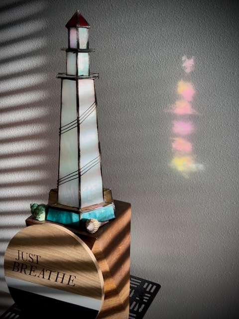

# TBD

When I woke up this morning, one of my first thoughts was how I’m grateful for another day. After my morning prayer, I decided to make note of this feeling in the Apple Journal app. That was at about 7:35 am and I titled the entry *New Day*...hehehe

In the middle of the night, I woke up singing *Good Night Sweetheart*...HAHAHA I haven't sang that in yyyeeeaaarrrsss!!! Why I was singing it in the middle of the night last night is beyond me...LOL I don't even have a sweetheart...LOL It was kind of like the scene in Frozen 2 when Olaf is going through the woods by himself looking for Samantha...HAHAHA He's like, *I don't even know a Samantha!* And then he chuckles...hehehe I also sang another song that I don’t remember. Then, like Olaf, I chuckled and went right back to sleep...hehehe

My actual first thought this morning was two sides of the same coin. People often spout out their opinions on things they know nothing or very little about. And the people who do know often think things like, *They just don’t know what it is like.* I don’t want to do or think either of those. I don’t want to speak against or for anything I don’t understand. And I don’t want to presume someone doesn’t know what it feels like to be me. I’d rather be empathetic and have mercy with grace. God has both. I want to adopt His character in these things.

Later in the day, I continued this thought. I can never assume someone is happy. I can never assume they should be. I can never assume anyone else understands what I’m going through. I can never assume they know how I feel. Those who don't understand depression, anxiety, or mental illness in general have often told me to just choose happiness. Or some have said things like *watch a funny movie*. Yes, happiness is a choice. But no, it isn't something some of us can just *choose*. We don't want to be unhappy. We actually aren't choosing to be unhappy, depressed, sad, or anxious. In fact, depression and anxiety doesn't always feel like sadness. And some things can still make me happy even when I'm depressed. These conflicting feelings can lead to difficulty doing simple tasks or even paralysis.

I’m not sure why, but I was feeling very anxious this morning. Anxiety is a curious thing. I often don’t really know what triggers it. And I can rarely describe it. Sometimes, it’s a companion throughout the day. Not a welcome companion, of course...HAHAHA Thankfully, the companionship ended and didn't continue today...LOL My prayers helped me refocus my mind and kicked anxiety out for the day. Will *he* be back tomorrow? I hope not! LOL

I did a *Vitamin G* post today that was inspired by some things going on. I tapped into my past to hopefully encourage whoever will read it. I never go into great detail, but I did bring up the suicide attempt this time.

*It isn’t easy 😔 But keep going 🙌 The blessing often comes through and after the struggle 🤗❤️ This is coming from someone who attempted suicide 20 years ago. I’m grateful for the suffering. It helps me see and appreciate the blessings I have now ✨💞✨ Please, keep going 🙏*

Today is a truly blessed day. My cousin and her husband had the ceremony where they officially adopted their newest daughter. We have a new family member ❤️ Praise the Lord 🙌 This was years in the works. They've had her since she was a baby. She is a child now. I don't recall how old. But she isn't a baby anymore...LOL Children are such a blessing <3

## Photo of the Day

<!--@include: @/photos/photo-a-day/2025/02/11.md{3,}-->