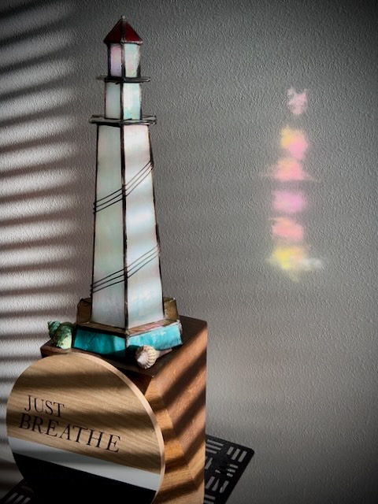

# How *by Greg Marine* Was Born

When I woke up this morning, one of my first thoughts was how I’m grateful for another day. After my morning prayer, I decided to make note of this feeling in the Apple Journal app. That was at about 7:35 am and I titled the entry *New Day*...hehehe

In the middle of the night, I woke up singing *Good Night Sweetheart*...HAHAHA I haven't sang that in yyyeeeaaarrrsss!!! Why I was singing it in the middle of the night last night is beyond me...LOL I don't even have a sweetheart...LOL It was kind of like the scene in Frozen 2 when Olaf is going through the woods by himself looking for Samantha...HAHAHA He's like, *I don't even know a Samantha!* And then he chuckles...hehehe I also sang another song that I don’t remember. Then, like Olaf, I chuckled and went right back to sleep...hehehe

My actual first thought this morning was two sides of the same coin. People often spout out their opinions on things they know nothing or very little about. And the people who do know often think things like, *They just don’t know what it is like.* I don’t want to do or think either of those. I don’t want to speak against or for anything I don’t understand. And I don’t want to presume someone doesn’t know what it feels like to be me. I’d rather be empathetic and have mercy with grace. God has both. I want to adopt His character in these things.

Later in the day, I continued this thought. I can never assume someone is happy. I can never assume they should be. I can never assume anyone else understands what I’m going through. I can never assume they know how I feel. Those who don't understand depression, anxiety, or mental illness in general have often told me to just choose happiness. Or some have said things like *watch a funny movie*. Yes, happiness is a choice. But no, it isn't something some of us can just *choose*. We don't want to be unhappy. We actually aren't choosing to be unhappy, depressed, sad, or anxious. In fact, depression and anxiety doesn't always feel like sadness. And some things can still make me happy even when I'm depressed. These conflicting feelings can lead to difficulty doing simple tasks or even paralysis.

I’m not sure why, but I was feeling very anxious this morning. Anxiety is a curious thing. I often don’t really know what triggers it. And I can rarely describe it. Sometimes, it’s a companion throughout the day. Not a welcome companion, of course...HAHAHA Thankfully, the companionship ended and didn't continue today...LOL My prayers helped me refocus my mind and kicked anxiety out for the day. Will *he* be back tomorrow? I hope not! LOL

I did a *Vitamin G* post today that was inspired by some things going on. I tapped into my past to hopefully encourage whoever will read it. I never go into great detail, but I did bring up the suicide attempt this time.

*It isn’t easy 😔 But keep going 🙌 The blessing often comes through and after the struggle 🤗❤️ This is coming from someone who attempted suicide 20 years ago. I’m grateful for the suffering. It helps me see and appreciate the blessings I have now ✨💞✨ Please, keep going 🙏*

Today is a truly blessed day. My cousin and her husband had the ceremony where they officially adopted their newest daughter. We have a new family member ❤️ Praise the Lord 🙌 This was years in the works. They've had her since she was a baby. She is a child now. I don't recall how old. But she isn't a baby anymore...LOL Children are such a blessing <3

I had a brief interaction with a *friend* on Instagram today that reminded me of a benefit of moving to Florida. There have been significant improvements to my tremor. The benign tremor has had a negative impact on my mental health for years. But improvements here in Florida with that have now improved my mental health. Something in my brain tells my muscles to keep moving 🤣 The benign part is that it isn’t something that will get worse over time as I age. So it isn’t like Parkinson’s disease. It does worsen from other things. But I mitigate that through diet, exercise, and by living in a climate that helps improve the condition. I turn the disability into an ability to adapt and make it work for me and not against me 🤗❤️

When I began painting again in 2021, I immediately started to notice improvements too. The extra concentration I need to keep my hands steady while painting gave me more focus and lessened the effects of the tremor. When I noticed that, I started to paint even more...LOL The painting I did last week into this week was a huge help with some setbacks with my tremor I've been having lately. It's officially complete and ready for its new home, by the way...hehehe I'm grateful I can make these for people. They may not know it, but they are helping me with something that has been a nightmare for so long...hehehe Each painting represents moments in time when my tremor takes a backseat <3

Something else that has been helping is that I now have better control of the tremor through these things and can wash my dishes by hand now. That has been so therapeutic. Similar to the paintings. Some of the things that can be so simple for most people can be so difficult for me. But it is a good reminder that I don't know what others are going through. Which ties back to what I was saying above...hehehe What can't be seen might have a great impact on people. I know this first hand. Empathy can go a very long way.

I had heard something about this earlier today but thought it was fake. It turns out, the President signed an executive order to change the name of the Gulf of Mexico to the *Gulf of America*. I live on the Gulf. It’s my home. It was renamed two days ago. Google updated the name on Maps. So has Apple. The federal government is renaming it on all official sources. This was causing me confusion and pain. So, I refocused my thoughts. I made a post that turned into somewhat of another *Vitamin G*. It even got positive attention on Twitter/X...hehehe

*I have trouble getting out of my own head sometimes 🤣 So I’m trying to fill it with good things. Like this tree for example ❤️ It was at the highest point of a mountain hike I spontaneously took last year. Although it’s unlikely still there, the memories remain ❤️ This spot was consumed last month in the Eaton Fire (LA Fires) Cherishing this moment reminds me of what is important. Although it is gone, I experienced this moment. Nothing, and no one, can take that away ❤️*

A recurring thought I've been having lately...hehehe I hated my name most of my life. The only person I had previously told that at one time was someone I should have been able to trust with such a secret. Then one day, they decided to announce it to my family at one of our gatherings. I have no clue why. It was random. Nothing else was being discussed to lead to them saying anything about it. Hearing one of my deepest thoughts being blurted out and seeing my family’s reaction prompted me to find a way to appreciate my name.

This eventually led me to “by Greg Marine”. One thing I have always loved about myself was my creativity. Created works, especially literary, have a byline. Hence...by *me*, Greg Marine...hehehe Attaching my name through a byline gave way to my appreciation of the name. I eventually renamed all of my social handles to *ByGregMarine* and started this website with the same name. I still have my old website without the “by” part. I may eventually have that one redirect to this current one.

## Photo of the Day

<!--@include: @/photos/photo-a-day/2025/02/11.md{3,}-->