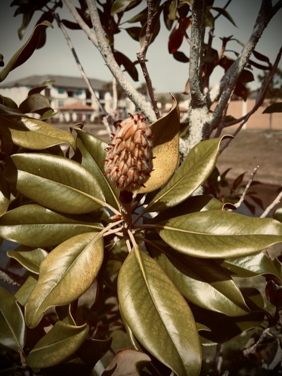

# TBD

Yesterday, I mentioned something about having anxiety in the morning. And also talked about how things like that can make simple things more difficult to do or can be paralyzing. I should have mentioned that I wasn't experiencing that level of anxiety yesterday. I did mention it went away through prayer. But I failed to mention that I did not run into any issues doing things while I was experiencing it. I mostly experienced the slight chest discomfort that comes with elevated cortisol levels I get with my anxiety sometimes.

Last year, I mentioned I was thinking about starting a private journal so I could write out thoughts I wouldn't put out here in the public. Nothing dark or anything. Just things for myself that are sometimes on my mind that no one else would need to know or would even be interested in. Well, I've been using the Journal app on my phone for two days now. It is a private journal that only exists on my phone. It even takes an extra security step to open it. So today I started jotting some personal notes in it that I wouldn't share here. I think it will be a good place for a private journal. I'll keep giving it a try and see how that goes...hehehe

I mailed off a couple of packages today. One is off to my son. The other is off to my deer friend. I think I’d like to send more packages 🤣 It is such a peaceful feeling to send someone mail. I could write more letters and postcards too 🤭 I remember when I used to mail products from my 3D printing business. I miss doing that. But today’s packages have more meaning as they are personal. They are gifts and not products 🤭

Since I only feature one photo each day, the other photos I capture each day sort of sit in my Photos app with no place to go. I hope to start posting them here on my website soon. But in the meantime, I sometimes scroll them looking for inspiration for things like *Vitamin G*. As I was scrolling today, I came across one of a magnolia bud. It inspired today's *Vitamin G*:

*Some of the best things in life take time and patience 🤗 Instant gratification isn’t always the most gratifying 😏 Please be patient and wait 🙏*

## Photo of the Day

<!--@include: @/photos/photo-a-day/2025/02/12.md{3,}-->