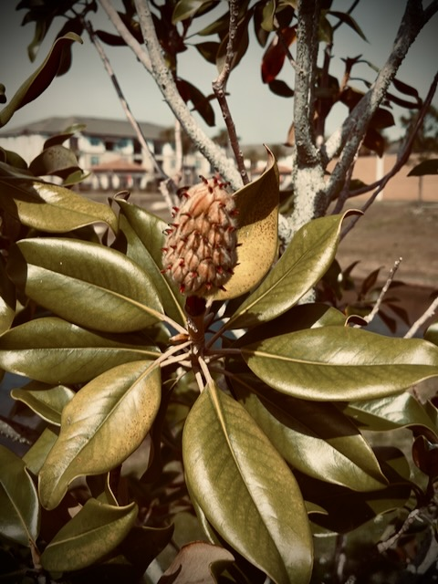

# Private Journal, Patience, and new Perspectives

Yesterday, I mentioned something about having anxiety in the morning. And also talked about how things like that can make simple things more difficult to do or can be paralyzing. I should have mentioned that I wasn't experiencing that level of anxiety yesterday. I did mention it went away through prayer. But I failed to mention that I did not run into any issues doing things while I was experiencing it. I mostly experienced the slight chest discomfort that comes with elevated cortisol levels I get with my anxiety sometimes.

Last year, I mentioned I was thinking about starting a private journal so I could write out thoughts I wouldn't put out here in the public. Nothing dark or anything. Just things for myself that are sometimes on my mind that no one else would need to know or would even be interested in. Well, I've been using the Journal app on my phone for two days now. It is a private journal that only exists on my phone. It even takes an extra security step to open it. So today I started jotting some personal notes in it that I wouldn't share here. I think it will be a good place for a private journal. I'll keep giving it a try and see how that goes...hehehe

I mailed off a couple of packages today. One is off to my son. The other is off to my deer friend. I think I’d like to send more packages 🤣 It is such a peaceful feeling to send someone mail. I could write more letters and postcards too 🤭 I remember when I used to mail products from my 3D printing business. I miss doing that. But today’s packages have more meaning as they are personal. They are gifts and not products 🤭

Since I only feature one photo each day, the other photos I capture each day sort of sit in my Photos app with no place to go. I hope to start posting them here on my website soon. But in the meantime, I sometimes scroll through them looking for inspiration for things like *Vitamin G*. As I was scrolling today, I came across one of a magnolia bud. It inspired today's *Vitamin G*:

*Some of the best things in life take time and patience 🤗 Instant gratification isn’t always the most gratifying 😏 Please be patient and wait 🙏*

We live in a society of *now*. Instant gratification seems to be common these days. In the past year or so, I've personally slowed down and taken in as many moments as I can. I don't mind waiting for things now. Of course, I make that sound easier than it is...LOL I've been conditioned like everyone else to want things *now*. But when I saw the magnolia bud, I was reminded how the best things in life take time and patience. So I wrote that soliloquy as a reminder to myself. I posted it as *Vitamin G* in hopes that it might encourage others as well.

Something else I thought about today, and may end up in a *Vitamin G* post someday, is that with changed perspectives, I can reevaluate things I used to dislike or *hate*. It's similar to how my food tastes have evolved over time. I used to be a picky eater. I also used to dislike the rain. Now I love eating just about anything and I love the sound, smell, and feel of the rain. Now that I don't shave my head anymore, I wonder how I'll feel when it rains on my hair? HAHAHA I used to hate rain on my head. But when I shaved, I loved it. With new perspectives on life, I may love rain in my hair now...hehehe

I didn't get a lot of new insights in today's [*Bible in a Year*](/bible/plans/bible-in-a-year/02/12) reading. But I linked it just so I have it linked in the future. I think I'd like to link it or include it in my blog entries from now on. That way I can keep a log of it along with everything else. That's what I do with the photo of the day. It is actually included/imported from a file I keep in the [Photos](/photos/) section of the website. For today, I'll just link to the Bible reading and recap video like I did yesterday. But I may change to including/importing it into the blog entry in the future.

I had baked salmon with vegetable fried rice for dinner tonight. I marinated the salmon in regular coco aminos. That's also what I used for the rice. I ate it all with chopsticks. I usually use a fork with fish. But I thought I'd give it a try with chopsticks tonight. Salmon seemed to work well with those. I'm not sure it would with some other types of fish. Most fish need a fork...hehehe

I love using chopsticks. It helps with my tremor. I used to have pain with my tremor when I allowed the shakes to just do their thing. But when I focus on keeping my hands steady, there is pain relief. I don't feel the pain much these days. Between my diet, exercise, and the Florida climate, it doesn't feel so bad anymore. Using chopsticks takes extra concentration to keep my hands steady. It's kind of like my motor exercises. It's one of those disabilities you *can* control with your mind and with disciplined thought. I'm grateful I don't need to take medication for it anymore. When I was on that medication before, there were side effects just like any medication.

There have been a few days when I didn't feel like blogging. Today was one of those days...hehehe Yet, when I sit down to do things like the photo, I suddenly get inspired to write...LOL Some of today's came from the Journal app. But some of it just flowed right when I sat down and begin typing. I've blogged 49 days straight now...HAHAHA These first 43 days of the year, as well as the last 6 days of 2024.

## Photo of the Day

<!--@include: @/photos/photo-a-day/2025/02/12.md{3,}-->