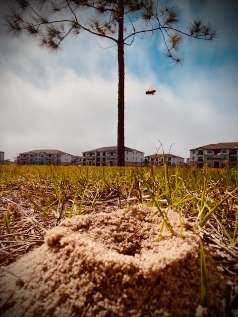

# February 13

I don't have much to say today...LOL But I still had a *Vitamin G*, photo, and I decided to include the *Bible in a Year* reading in this post. It has a neat video about Leviticus from [BibleProject](https://bibleproject.com).

Today's *Vitamin G*:

*When you expect something, you will be disappointed when it falls short of your expectations. So, expect nothing 🤭 And instead, appreciate everything 🤗*

## Photo of the Day

<!--@include: @/photos/photo-a-day/2025/02/13.md{3,}-->

You can find [this photo](/photos/photo-a-day/2025/02/13) in the [photo](/photos/) section too.

## Bible in a Year

<!--@include: @/bible/plans/bible-in-a-year/02/13.md{3,}-->

You can find [this reading](/bible/plans/bible-in-a-year/02/13) in the [Bible](/bible/) section too.
