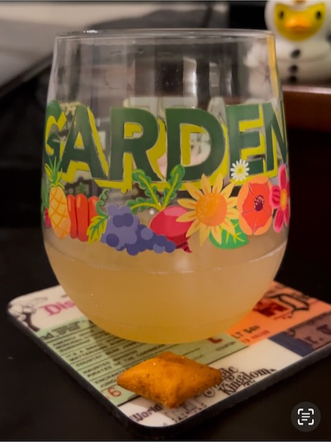

# The Journey

I posted a Vitamin G today...hehehe

*How it begins is often as important as how it ends. The journey in between is a process. Trust the process. Seeds planted yesterday become the garden of tomorrow. Embrace today as part of the journey.  What you began yesterday takes today to get to tomorrow* 🤗❤️

This was inspired by my New Year’s Resolutions. The photo represents the communion I started the year with.

Some of the journey I am on today was planted a few years ago. And of course, everything in my life up to this point as well. But I’m making a specific connection to the part of my journey where I’m focusing on my relationship with God. This part of the journey is impacting all other parts. It has become the most important thing of my life. And rightly so. That may seem a little on the nose. But I’m calling it out now because how I’m experiencing it now is far different than I ever expected.

*Trust the process, Greg. Trust God. He is the Author. He created you to love and be loved. Love isn’t easy. But it is worth it. Keep growing. The garden is going to be beautiful* 🤩 

I’m coming to the end of my 47th year. I’ve grown so much. I’d even argue that this past year has seen more growth in me than all 46 prior years combined. I'm pretty excited about my upcoming personal new year...hehehe I don't really have any plans yet. I may not do anything special this year. The past couple of years I have done something special. Lately, I feel like everyday has something special all its own. The journey itself is special.

## Photo of the Day

<!--@include: @/photos/photo-a-day/2025/02/17.md{3,}-->

You can find [this photo](/photos/photo-a-day/2025/02/17) in the [photo](/photos/) section too.