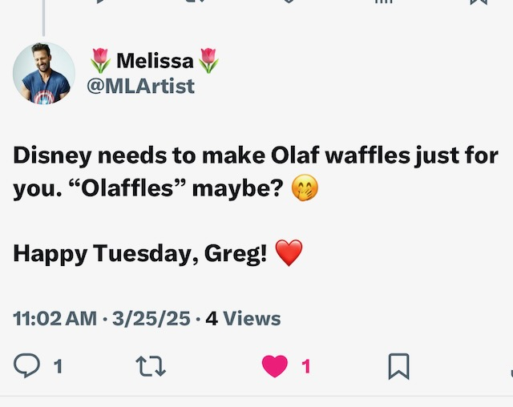

# Another Day in the Life of Meeeeeee

## 07:45am

Good morning! My sleep hit the mark a little better this time...hehehe I didn't go to bed until around 12:30am this time, though. I watched the Dodgers game last night. They lost in the bottom of the 9th to the Angels. Fortunately, this game didn't count...LOL But I hope they win tonight! Anyway, I got up around 7:15am. So, just about 6 and half hours of sleep. And I feel fantastic!

I'm so glad to be back to journaling. I really missed it for the 3 weeks I didn't journal. It felt so weird not to be writing...anything! Now, I'm back on a nearly daily pace again.

Normally, I've done these timestamp entries to help me get back into the swing of things. When I went back to writing last week, I didn't do one though. Today, I was inspired by Cherie to do one...hahaha Something I really love about these is that it feels like going on a journey throughout the day when we go back and read them again. A year from now, I'll likely read this and enjoy the day all over again. At least, I hope I can enjoy it this first time around...LOL So, here we goooooo! (In classic Disney Peter Pan's voice, of course)

## 09:30am

The morning is going really well. Work be working...LOL And the cinnamon toast was amazing. The coffee be vibing...LOL And now I'm taking a moment to reflect.

Speaking of toast. I don't recall when I started having this multigrain toast with cinnamon. But I sure to enjoy it. It's a light breakfast that carries me well into my lunch time. I'm very glad I started doing it. And the bread was created by someone who spent 15 years in prison. He changed while he was in there and his brother welcomed him back into the family bakery. Second chances are important. Especially when someone has turned their life around. I connect with his story. I never went to prison or anything like that. But I certainly needed some second and third chances in my life.

I'm still having trouble reconnecting on social media. That's okay. But it does have me thinking about some communities outside of the mainstream social media networks that I'm considering. Last year, I thought about joining The Unsealed. I'm still considering that. But I'm now also considering The Bible Recap. In both cases, there is a cost to join the communities. That has it's pros and cons. A solid pro is that everyone in those communities has paid just like me. That means the connections are more likely to be genuine. There isn't anything 100% aside from the Goodness of God...HAHAHA But the odds seem better considering the cost. How many bad people would be willing to pay to be in a community to just mess with people?! LOL

I've also thought about creating my own community. I had done that long ago in 1999 with Internet Community Church. I'm thinking about starting that back up again. It had a purpose back then. And it was before social media was a thing. I lost sight of things back when I closed its doors around 2002. Is it time to bring it back? Its certainly something that has been on my heart for months.

## 10:15am

I've been randomly singing hymns I learned as a child...hehehe I just recited *Trust and Obey*. I didn't sing it, though. I appreciate those hymns. I do enjoy today's worship music. But those hymns told stories from the Bible. They help me connect better, I think. I've been doing this often the last few years. Now that I'm watching the traditional service from CUMC, I've started doing it more often...hehehe

It's a bit gloomy here today. At least this morning. The forecast is showing sunshine here in a bit. I never enjoyed the gloom in Indiana. That's because it would last for days or weeks. Here in Florida, it comes and goes. I do enjoy the climate here and the constant changes. I'll be going out for a walk here soon. It will be my first of the day. I wonder if the sun will appear while I'm walking?

I'm glad to be taking photos and videos more this year. I've been more intentional with it. I choose the featured photo based on how I feel about the day. But having that as part of my routine has inspired me to take more videos and photos. It has helped me pay more attention. Most of the photos come from my walks around the pond...LOL That's okay. It's a big part of my day most of the time.

## 11:00am

On my walk, I came across 9 species of birds. Having noticed so many yesterday, I have set out to count them better today. I got up to about 15 yesterday. Today, I'll keep counting until I'm done for the day...hehehe

I came across one of my neighbors I hadn't seen in about a month. He thought I might have moved...LOL I told him that about a week after we last talked, I took a 2 week vacation and that it has been difficult to get back into my walking routine after I got back...LOL He's looking to move this summer. So I only have a few months left to have chats with him and pet his dog :(

As I hoped, and the forecast predicted, the sun came out while I was on my walk. If the forecast continues to be accurate, it will be sunny the remainder of the day. I may need to switch into shorts for my walks later. It gets warm-to-hot when I walk in directly sunlight...hehehe

I've been doing laundry today. I don't like to do it during the week. But sometimes that happens. The last time I did laundry, it was after my long time away. Clothes, towels, and bedding all needed washed. I did something like 7 loads that day. Today, it will only be 3.

## 11:15am

I'm thinking about tacos...

...and Olaffles!!!

## 01:15pm

I saw another species of bird on my lunch walk. So, I'm up to 10 now...hehehe I also saw some butterflies and dragonflies. I saw a few repeat birds from this morning. But there wasn't a lot of bird activity at high-noon...LOL

I saw someone fishing in the pond. I imagine that is therapy for them. I remember when I used to fish, it was so peaceful. I could do it for hours even if I didn't catch anything. Just being by or on the water while casting a line was therapeutic. But I haven't done that in over 20 years. Yeah, I don't think I've done it once since around 2001-2004ish.

I've had a visit to a Disney park on my mind quite a bit lately. I was there a few weeks ago. And I'm already ready to go back...LOL Even with the bad press the parks have been getting lately, it is just fueling my desire to go back. No matter how much other people complain or how much Disney does things even I don't like, there is still something special most times I go. I still have that spark that got reignited last February. Or was it the end of January? LOL It was around that time last year...hehehe

Today's *hot of the presses* news was that a new DVC thing was added to the Canada pavilion. Yes, I think it's ridiculous myself. But hey, it got me wanting to go to Disney...LOL They had been working on *something* in the Canada pavilion. I was hoping for a new restaurant. I'm not likely to check this new DVC thing out. I think it is supposed to be another way for them to sell their timeshares...this time for the new additional Poly resort they just built next to the existing Poly near Magic Kingdom. It's strange they put this *model* in another theme park that's only a few miles away from the actual resort...LOL

## 03:40pm

A beautiful bird just pitched up on the screen of my patio! It flew off just as I was getting up to capture a photo or video of it. But it was definitely a unique species for today! So, that makes 11...hehehe

I wanted to move so badly last year...HAHAHA My attitude blinded me from being able to see such wonderful things here. These last few months have been eye opening. I've seen stuff like this before. But I wasn't really paying attention. When I started looking at what I actually do love about living in this apartment, I feel like a blind man who can now see <3

## 04:15pm

My boss got me started on another new project today. It isn't something that will likely take off until after the *Big Bang* in May. But he wanted me to start on it today. He and I don't typically agree on what new apps should be named. But we came up with a great name that we both agreed on. And he is renaming one of his other apps to something to I really love too.

## 05:00pm

I'm now entering into one of my favorite part of weekdays. I'll be going for my third walk here in a moment. I'll then be making and having my dinner. I'm making chorizo tacos! Yum! I'll do part of my Bible study. And then I'll do some relaxing. I may take a shower before the game. Last night, I took one after; which was later than I wanted. Just before the game starts, I'll make my evening coffee and snack. I love these evenings. Weekends are a little different because I don't work...hehehe

## 05:30pm

I saw 2 more species of birds on this final walk of the day. Which brings us to a total of 13 for the day. I'll not be going back out for the remainder of the day. So it looks like that is where it'll stay. Consider there were a few I saw yesterday that I did not see today, that number makes sense...hehehe

Now, it's time to make tacos!!!

## 06:30pm

The tacos turned out really good. The tortillas I get now come in a pack of 8. Except this time...LOL There were only 7. So I did 4 for tonight. But next time, I can only make 3...LOL I remembered to get sauerkraut on my last grocery trip. I was able to top my tacos with it this time. That really has been making a difference. I definitely like that better than salsa or pico. I sometimes still do salsa or pico and put the kraut on top of that. But this time, it was just the kraut. And it was perfect!

Now, it's Bible study time!!! I watched this week's episode last night. I don't watch it every night like I did with the previous 2 seasons. But I may watch it again later this week sometime. It's another really good episode. I'm looking forward to diving into the study guide tonight!

## 07:50pm

In this week's Bible study, I was reminded of why I began watching *The Chosen* in the first place. And then how it led to doing the devotionals and Bible studies. One of the scenes from this week's episode was included in a devotional I did with another friend a while back. The video was presented at the beginning of the devotional and was followed up with some discussion and questions. There were a few other devotional days that included other scenes. But I had forgotten about that until this week's episode. And it turns out, the scene I'm thinking of is one included in this week's study guide too...LOL Seeing those few scenes back then is what inspired me to finally start watching the show itself. And that later inspired the devotionals and Bible studies we have be doing for almost a year now. It's fun to look back and see how God's timing and guidance is bringing us along on an amazing journey with Him.

I'm going to take my evening shower now. The game starts in an hour. I want to be all set by then. And I don't want to take the shower after the game like I did last night...hehehe

## 09:15pm

Shower done, snack eaten, and the game has started. I'm going to choose today's photo and get the Bible in a year plan put together.

Ooh! I just read my journal entry from a year ago. That continues to be a good thing for me. A year ago today, I made buckwheat bread for the first time. I think I'd like to start doing that again soon. That first time I made it, I did it as close to what Cherie explained to me and to the recipe she gave me. I think I made it that way a few other times too. But I also tweaked some things about it other times I made it for my own personal tastes. I miss make that bread. It was good and made me happy.

## 10:15pm

I have chosen today's photo and added today's Bible in a Year content. You'll see those below. The game is going okay. Dodgers are currently in the lead. I've enjoyed doing this timestamp entry today. I'll not likely do it again tomorrow. These tend to be longer entries. I've had at one time thought about doing a timestamp every time. But I've since decided to keep it special from time to time or when I need to get back into the pace of writing after a hiatus. I did have another idea. What about doing a day-stamp entry? One where I write a little summary each day for the week and then publish 1 entry at the end of the week.

## 10:45pm

Something I've been praying about is subscribing to [Logos](https://www.logos.com) Bible Software. In the early 2000s, I owned a license to their software with a library that was quite extensive. I think it was the version just above what the average pastor would have. Like a scholar's edition or something. I loved having it. But back then, it was a little more than what I *needed*...LOL I have since lost that license. But they've also changed how that works now anyway. You can still buy all of the resources from them if you want to keep them. But they also have a subscription to the most common resources. So, I'm thinking about doing that. I'm finding myself wanting to dive deeper and deeper into what I'm reading. The software helps with that and also helps keep you organized as you study. Plus I could use it to write my own devotionals and Bible studies. Most of the pastors I've known used Logos for their study and sermon prep. I'm praying if it is something I should invest in for my own journey. I don't want to subscribe and then not use it, you know? But the good thing about a subscription is that I can cancel at anytime. I can save money by paying for 1 or 2 years up front. So, that's something else for me to consider...because the savings are significant.

The game isn't over yet. I'm not going to bed yet either. But I'm going to go ahead and end this entry. Today was a good day. I'm glad I did this as a timestamped entry...hehehe

Today's photo 📸

<!--@include: @/photos/photo-a-day/2025/03/25.md{3,}-->

You can find [this photo](/photos/photo-a-day/2025/03/25) in the [photo](/photos/) section too.

📖 [Today's Bible in a Year session](/bible/plans/bible-in-a-year/03/25) in the [Bible](/bible/) section.