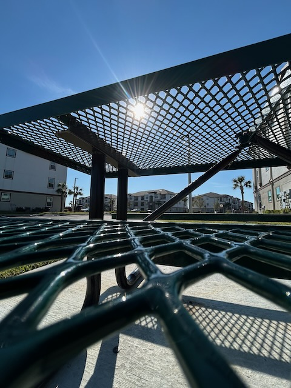

# TBD

Well, going to the movies this weekend is a no-go...LOL My sister reached out to me to see if I wanted to hang out with her tomorrow...hehehe It made my heart happy to find out she had the day off and wanted to spend it with me. I don't yet know what we'll be doing. But I have some ideas to pitch. Going to the Disney parks is not on that list...LOL But doing some resort hopping and maybe Disney Springs is on the very bottom of the list...hehehe The rest of my ideas are down south of where we live. She already lives south of me. But there are some places I've been wanting to check out that are further south. It should be a fun day regardless of what we end up doing.

Most days, I have more than one photo to choose from for the featured photo of the day. Some of them inspirational, even though that don't end up being chosen for the featured photo. I should probably post them here on this website under the photo that is chosen...hehehe Well, one from yesterday ended up inspiring me to post on my socials. It was basically a *Vitamin G* post. I've not been posting like that for a while. I suppose today's post could be considered *Vitamin G*...LOL

> *The world around me is so beautiful. I just need to see it from different perspectives sometimes 🤗❤️*

I walk by this picnic table around 9 times on days that I take my walks around the pond. That's on my 3 mile days, that is. On my evening walk yesterday, I got the idea to see if the sun would glare through the table if I were to bend down and look at it from a lower angle. Yep, it sure did...hehehe I took a few like this. This one was using the wide angle lens. I really like how the composition worked out. There is even a shadow in the frame.

One of the benefits of doing these photos and videos is that I'm looking at the world from different perspectives. I am finding beauty from new sources just by paying more attention. That's actually the surface meaning behind what I said in the post. I'm seeing more and experiencing more of the beauty in the world around me. And sometimes, I look from different perspectives...hehehe

Taking this a little deeper, the same is true about how I experience everything. I have opinions and view points just like anyone else. But now, I'm asking more questions about how others feel and think about things. This is opening me up to *seeing* a lot of things from different perspectives. Now that I'm more self-aware, and I'm getting better about setting boundaries, I can keep an open mind while filtering some things. There is a lot of ugliness in the world. Some opinions and ways of thinking aren't healthy for me. With a discerning heart and applying a Jesus *filter*, I can still find the beauty. I'm finding God in places that I hadn't look in before. And that is a beautiful thing in my mind <3

I counted my coffee mugs today. I have 39...HAHAHA I never counted them before. As a continuation of the Twitter conversation from yesterday, today someone mentioned they had a large collection now. So, I went to my cabinets (yes, plural) to see how many I had...LOL I counted 38 at first. I posted a reply to that effect and found out I had way more than they did...LOL I then realized I missed one and mentioned it was actually 39. I wasn't trying to compete with them. It was just part of the conversation. Yes, that's a lot of mugs. But in the spirit of *The Little Mermaid*...I want mmmoooorrreee!!! HAHAHA Each mug has meaning and, in some cases, match my mood...hehehe

I've had various collections over the years. As a kid, I had a keychain collection, I collected baseball cards, and I filled up one of those baseball sticker books each season. I currently have a large collection of Olafs, various pins, and the above mentioned coffee mugs. I have a few other collections that are currently in storage. And I have a lot of paintings I've made since 2021. Ooh, and I just thought about all the lighthouses I have now...hehehe

I'm staying up a little later than I have been lately. Tonight's Dodgers game is later. I'll have some games like this during the season. I'm not sure if I'll be able to stay up and watch them all. But tonight's worked out well. I'll be publishing this entry before the end of the game. So, I won't be able to announce the win...hehehe I hope they win, at least...LOL As of now, they are not winning :(

Just as soon as I typed that, I thought they needed to score. I even said that to Cherie. A moment later, they scored...LOL My feed is slightly delayed. So they were probably scoring as I was typing...HAHAHA

I've had a good week over all. And this week's Bible study has been heart transforming. I'm so grateful for the Bible studies we're doing. And I'm grateful for all God is doing. God is good!

Today's photo 📸

<!--@include: @/photos/photo-a-day/2025/03/28.md{3,}-->

You can find [this photo](/photos/photo-a-day/2025/03/28) in the [photo](/photos/) section too.

📖 [Today's Bible in a Year session](/bible/plans/bible-in-a-year/03/28) in the [Bible](/bible/) section.