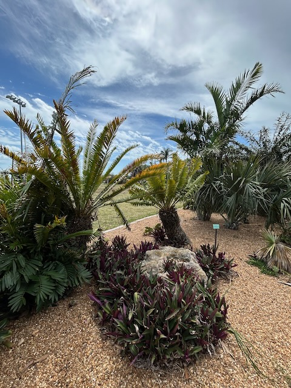
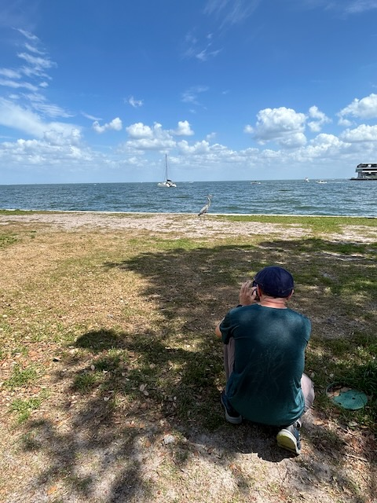
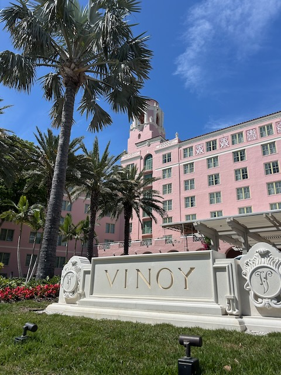

# St. Pete Pier

Today was such a lovely day. As I mentioned yesterday, I was to spend the day with my sister. I had a full list of ideas for us to do. It all came down to going to Gizella Kopsick Arboretum in St Petersburg. This is the same palm tree arboretum I started my 2024 birthday with...hehehe I was wanting to get back to it someday. Today turned out to be that day.

It looked like the property had taken on some damage from all the hurricanes we experienced last season. I imagine the big one that destroyed the Tampa Bay Rays stadium did the most damage. But I was glad to see that most of it was still in good shape.

While we were there, it looks like a wedding was getting setup. The wedding party had arrived and the ceremony equipment was being set. Before we left, we even saw them taking some photos...hehehe It looked like they were all there via a really fancy 1920's speakeasy themed bus. I wish I had taken a photo of the bus. It was amazing! Later in the day, we saw the bus again. I imagine they were on their way to the reception...hehehe Congrats to the happy couple!

After the arboretum, we noticed how close the St Pete Pier was and decided to walk over to it. It turned out to be a great idea. We had a nice walk and experience things we didn't expect. Plus, we discovered just how close everything was to the free parking we had. All of the parking at the pier area was expensive...LOL

Today's featured photo, below, came from the walk between the arboretum park and the area where the pier is. While I was taking some photos and a video of who I named Roy, my sister took a photo of me...LOL

We came across this really fancy hotel called The Vinoy Resort. It's one of those $500+ per night places. So, when I'm a billionaire, I wouldn't mind staying there a few nights...LOL j/k The entire area is super nice and nothing like what I've seen in St Pete before. The city isn't known as a nice place...hehehe It is better known for its crime...LOL Yet, there are still places like this that are amazing and seem very safe.

Today's photo 📸

<!--@include: @/photos/photo-a-day/2025/03/29.md{3,}-->

You can find [this photo](/photos/photo-a-day/2025/03/29) in the [photo](/photos/) section too.

📖 [Today's Bible in a Year session](/bible/plans/bible-in-a-year/03/29) in the [Bible](/bible/) section.