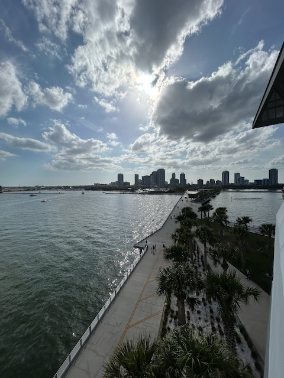
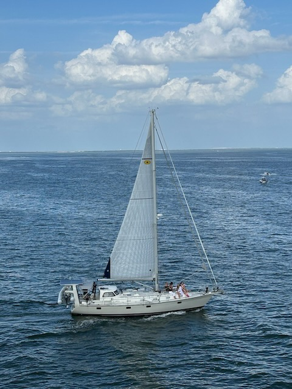

# St. Pete Pier

Today was such a lovely day. As I mentioned yesterday, I was to spend the day with my sister. I had a full list of ideas for us to do. It all came down to going to Gizella Kopsick Arboretum in St Petersburg. This is the same palm tree arboretum I started my 2024 birthday with...hehehe I was wanting to get back to it someday. Today turned out to be that day.

It looked like the property had taken on some damage from all the hurricanes we experienced last season. I imagine the big one that destroyed the Tampa Bay Rays stadium did the most damage. But I was glad to see that most of it was still in good shape.

While we were there, it looks like a wedding was getting setup. The wedding party had arrived and the ceremony equipment was being set. Before we left, we even saw them taking some photos...hehehe It looked like they were all there via a really fancy 1920's speakeasy themed bus. I wish I had taken a photo of the bus. It was amazing! Later in the day, we saw the bus again. I imagine they were on their way to the reception...hehehe Congrats to the happy couple!

After the arboretum, we noticed how close the St Pete Pier was and decided to walk over to it. It turned out to be a great idea. We had a nice walk and experienced things we didn't expect. Plus, we discovered just how close everything was to the free parking we had. All of the parking at the pier area was expensive...LOL

Today's featured photo, at the bottom of this entry, came from the walk between the arboretum park and the area where the pier is. While I was taking some photos and a video of who I named Roy, my sister took a photo of me...LOL

We came across this really fancy hotel called The Vinoy Resort. It's one of those $500+ per night places. So, when I'm rich, I wouldn't mind staying there a few nights...LOL j/k The entire area is super nice and nothing like what I've seen in St Pete before. The city isn't known as a nice place...hehehe It is better known for its crime...LOL Yet, there are still places like this that are amazing and seem very safe.

I didn't get any photos from the surrounding shopping and restaurant area we explored. But we did stop to have a snack and get some waters. We sat for a spell to enjoy the ambience of the area. There are a lot of parks around and a few museums to check out sometime.

But the crown jewel of the day was the St Pete Pier. That place is truly amazing. The pier itself is like a large work of art...hehehe It looks like a lot of thought and design went into it. There are several things to do on it and some restaurants. I could visit the pier once a month and not do the same thing twice...LOL I can just imagine myself working from there from time to time too. That thought definitely crossed my mind today...LOL

I didn't take a lot of photos. I just enjoyed being there with my sister. I can't wait to take our parents there. I think she will be taking her husband there soon. It's pretty new. I think it officially opened in 2020. It replaced an older pier. We got to see dolphins, sailboats, motorboats, airplanes, Tampa Bay, people fishing, all sorts of people dressed up for something, and the list could go on. There were grassy knolls, fishing spots, one of those splash parks, a place to play pickle ball, and a spot for the kiddos to rollerskate. There were history museums, a nature center, and some folks selling things they had made. And there were a lot of street performers doing singing and magic tricks. The pier itself is free. Parking is expensive. And you have to pay for things like the food, merch, and museums. But if you are there just to enjoy the views, ambience, and a nice long walk, it's perfect. We were there for hours and had a great time! We each only spent $10 the whole day when we stopped for a snack...LOL So, $20 total for the day.

Once we experienced our pass through the entire pier, we headed back to the car. It was a bit of a walk since we parked all the way back at that arboretum...hehehe But it was a beautiful walk back. On a weekend visit, I'd likely park at the arboretum again. If I were to go in the middle of the week to work, I'd probably park at the pier. I'm not sure if they have a lower weekday rate for parking or not. That might be something to look into...LOL

In the above photo of the sailboat, we found out that was a bridal shower...hehehe Congrats to the bride!

This was an amazing experience. I didn't even come close to describing everything. This was one of those days I wish I could download my memory to watch it all like a movie...hehehe We had conversations about our childhood, family history, and we had some laughs. One laugh was we saw a *couple* with matching shirts. As the *couple* got close, I noticed their shirts had *St Pete Pier* on them...LOL I started to laugh and mentioned to my sister I thought they were wearing matching shirts. Turned out she thought the same. Then I told her that those were work shirts...LOL They weren't likely a couple at all...LOL They were co-workers...LOL

Today's photo 📸

<!--@include: @/photos/photo-a-day/2025/03/29.md{3,}-->

You can find [this photo](/photos/photo-a-day/2025/03/29) in the [photo](/photos/) section too.

📖 [Today's Bible in a Year session](/bible/plans/bible-in-a-year/03/29) in the [Bible](/bible/) section.