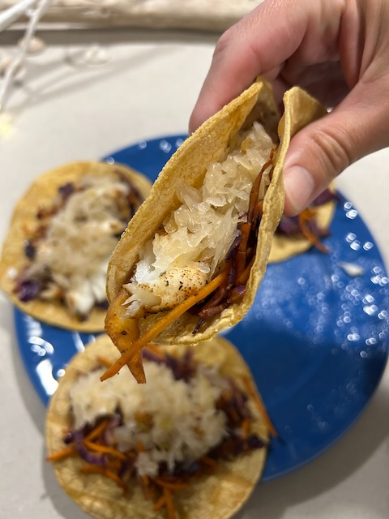

# Man in the Mirror

## My Day

### 07:55am

I wasn't expecting how much sleep I got last night. I was exhausted early and was in bed by 11:30pm. I woke up at 07:27am...LOL One of my first thoughts was, *I guess I needed it!* The sun is hidden behind a blanket of water vapor (clouds) today and I thought it was probably pretty early when I woke. It seemed like it was early dawn. Nope! It was well past sunrise when my eyes opened...hehehe

### 11:00am

Do you ever write something, and then delete it later? I do that all the time. There was something I wrote yesterday and removed it almost immediately. And about an hour ago, I wrote something that I just deleted. I like typing out my thoughts for this very reason. It gives me a chance to say something and then review it. I get to see my thoughts from a new perspective. Although it is true that I was thinking and feeling a certain way in the moment, having a chance to rethink and grow is important to me. When I write out on paper, it's very different. When I'm talking out loud with someone, I can never undo what was said. But a place like this journal works best for me. I'm grateful for this medium. And it has helped me with paper writing and how I think aloud with someone else. I still have quite of room to grow. But I'm getting there.

I just got back in from my first walk. It is much cooler today. It is almost cold, even...hehehe I recalled something that happened almost 26 years ago during my prayer ministry. It was related to Lindsay. Just before her death, she took an expected turn for the worse. I told her uncle that we would continue to pray for healing. But he rebuked me and questioned why we needed to continue praying for healing when we had already done that. In my heart, I recounted the scriptures that tell us to pray without ceasing. And I recounted the statements Jesus made about faith. The current season of *The Chosen* has been a reminder of what happened during that season of my life. I still don't understand these things. I'm okay with that. I'm human, after all. I still question what faith truly means and why certain prayers aren't answered the way we expect. God is good. He is in control. He has a plan and His Will is what I truly want. My journey is a process. I trust God. I think in trusting Him, I have my answers to those questions.

It isn't how big my faith is...it's Who I have faith in <3

### 11:15am

My wrist doesn't hurt anymore...hehehe Once again, the arthritis was triggered by the weather. It's a reminder of how better Florida is on my body. In Indiana, these things were far worse. There is a significant difference in how it impacts my body between the two climates. My wrist still has some stiffness today. But the pain is gone.

### 01:45pm

It has warmed up a little. But it is still cool out there. I'm in jeans today. I rarely wear them anymore. I'm either in Chinos or shorts mostly. And even shorts have been rare. I've been wearing Chinos for a year now...hehehe I might be wearing shorts more often this year than last...maybe...LOL But, I had a nice walk almost an hour ago.

There was a little mishap with work. Nothing too serious. But some data was purged by mistake. It's a part of this whole move to the new company thing. But I'm glad we caught it now and that there was a backup of the data. I was puzzled about the missing data because in the meeting we had the other day about it, I thought I had been clear that the table in question wasn't to be touched. But the notes from the meeting clearly showed that it was part of the purge process. I didn't take the notes myself. But I should have noticed that and spoke up that day. Again, it's good that we caught it today and that it was recoverable. I felt bad about the confusion. I'm finding that I'm not always clear. You'd think after being in the world for 47 years I would have this communication thing licked...LOL I learned something today through this experience. And I'll keep moving forward :)

### 04:30pm

Last week, I took a personality test on empathy. I wasn't surprised that it told me I'm empathetic...hehehe It was a fun little prep thing for a presentation I attended today about employing empathy as a leader at work. It's for managers. I don't actually manage people. But I am in that classification and could be assigned a team at any moment...hehehe I really enjoyed the presentation today. I'm looking forward to when they send out the slide deck so I can do further study into the topics presented today. I wrote some of it down. But it's better for me when they send out the info and the video recording. I'm not great at notetaking, sadly.

One topic of interest was the balance of IQ and EQ. The emotional intelligence (EQ) side is something I've been working on for a little while now. I'd say I've had an imbalance of IQ to EQ most of my life. But my EQ is rising and I'm doing much better managing that side of my character...hehehe

This brought up another thought I had today on one of my walks. I've now had 3 already with one more left this evening. I didn't think I'd get any walking in today...LOL But now I'm looking at matching the 4 miles I did yesterday...LOL Anyway, back to that other thought. Although I have messed up a lot in life, I'm not being punished. Yes, I have consequences I deal with from some of the choices I've made in life. But nothing I deal with is punishment. There is peace in that thought and I wanted to capture this in my journal today.

### 05:00pm

I just finished a survey for my employer. I love taking surveys...hehehe I used to do one through Google that actually paid. They'd send me surveys through an app and I'd happily answer them. I would buy digital copies of movies from Google with the money they paid...hehehe It was never real cash...just credit to buy digital goods from them like movies, apps, and books. I did it for fun, though, and really enjoyed it. I should probably find another place to do that. I miss those. I took a survey last week for MLB. I used to take surveys for Disney. But that got old because it was always the same questions about my various visits to the parks. So, I stopped doing those.

### 07:35pm

My heart and soul are heavy, my LORD.

I ask my soul, *Why do you carry such burden? Trust in the LORD, my soul! He is a good God. His loving kindness endures forever!* I cry and He comforts me. I pour out my spirit and He fills me.

Why do I still carry these things? I do not know. But God, Your patience is unending. Your mercy and grace are sufficient for me.

The angry that once filled me is now sorrow. I must grieve. I must let go. By Your strength, I will move. By Your righteous right hand, You will guide me.

I will rejoice and be glad! For You are Good!

Blessed are You LORD, our God...King of the universe...who brings Peace to our souls.

### 08:35pm

I posted a selfie today saying I was thinking about tacos. I've been doing that on Tuesdays lately. It's just how I feel. On Threads, I got some comments I didn't care for. I hid them. They weren't even about what I wrote. They were comments about my looks. This isn't the first time...nor will it be the last. I get it. But I don't like it. I did get one comment that was appropriate for the post. I liked and replied to it.

This is the first post that actually got any sort of attention like this on Threads. It has 13 likes as of this moment...LOL That's not many. But it's a lot for my Threads experience. Most of the likes are from people I don't follow. Only 3 from people I follow and who follow me; which is my normal. I guess the *algorithm* showed my post in feeds in the Threadiverse?

Anyway, here are the tacos I was thinking about all day...LOL The white fish I used is cod :) Not be confused with *cold*...HAHAHA j/k 🤭

I did my taco seasoning I came up with a while back. The veggies are red cabbage and carrots. I, of course, topped it with sauerkraut 🤭 These were spicy and very good! I love Taco Tuesdays <3

### 09:45pm

I have some catching up to do, but I've been doing well getting the latest photos and Bible in a Year content here on the website...hehehe There is a lot from January and March for the photos I still need to post. All of January and parts of both February and March are missing for the Bible in a Year plan. But I'll get there someday.

I also have some updates to make to the Bible content in general. Most of the books don't yet have an index page with the BibleProject summary videos. And none of the formatting has been worked out yet. I'm still happy that it is coming along, though. That fact that I'm doing it at all is progress...LOL I wanted to start doing these things over a year ago. Now, I'm finally getting around to working on it. So, that makes me happy.

At 7:35pm above, I wrote out a prayer. I needed to. I may start writing out some of my prayers here from time to time. The *format* resembles a Psalm. It's what I was feeling in the moment. Not all of my prayers are like that. Some are more conversational like talking to a friend. And some are straight from scripture. I pray a lot of different ways...hehehe

I realize I have some grieving to work through. I found [this webpage](https://www.helpguide.org/mental-health/grief/coping-with-grief-and-loss) helpful this evening. I'm hoping a year from now, when I read this again, I'll have worked through some of what is on my heart today 🙏🙌

### 10:15pm

I'm putting down the microphone and picking up a mirror. By the way, I got that metaphor from my deer friend, Cherie...hehehe It reminds me of the passage where Jesus tells us to remove the log from our eyes before we call out the speck in another's eye. The Bible studies we've been doing are helping me take a step back and taking a better look at the *man in the mirror*. That's the song I chose for today's photo on Instagram...LOL I'm not looking into the mirror to admire myself. I'm using it to talk to the man behind the face I see. What seems like the first time in my life, I love that man. It's time he hears some things spoken in love. They are hard truths sometimes. But they need said and heard. And they are things just for me. I don't need to say them to others through a microphone...LOL

As I wrap up this day, I'd have to say I'm really enjoying these timestamped entries. I think about stuff like this most days. But some of it gets lost by the time I journal. Writing in the moment helps. It doesn't take very long to write out the quick thoughts throughout the day. It does make these quite a bit longer. But length isn't what is important. Thinking things through is. That's the whole point...hehehe

## Today's photo 📸

<!--@include: @/photos/photo-a-day/2025/04/08.md{3,}-->

You can find [this photo](/photos/photo-a-day/2025/04/08) in the [photo](/photos/) section too.

## Bible

📖 [Today's Bible in a Year reading](/bible/plans/bible-in-a-year/04/08) in the [Bible](/bible/) section.