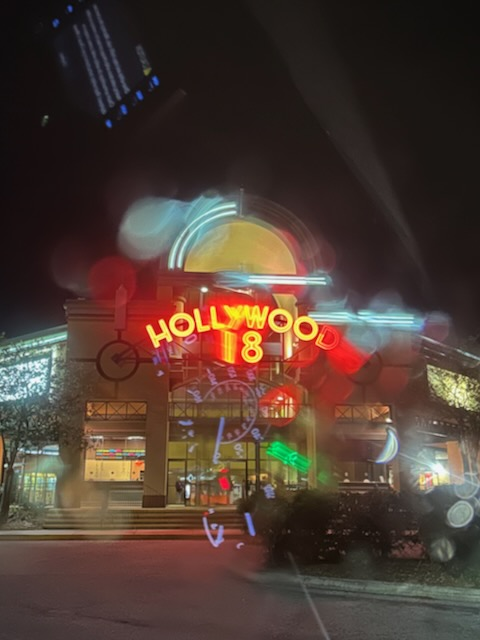

# TBD

## My Day

### 11:45am

This morning has been one of *those* mornings...LOL This week as been one of *those* weeks, actually. I almost made a social media post...hehehe I decided not to. I wanted to express how I didn't like *it*...meaning, I didn't like how this week has been and how this morning had been going. I'll probably write more about this later today. We'll see.

Part of the morning I really didn't like is that I didn't have my breakfast and coffee at my usual time. That coupled with new meetings popping up today, I won't be able to take an actually lunch break. I may try to make a *normal* lunch to eat during one of the meetings. With my current diet, timing is important. But today is a lesson in being better prepared for when I have one of *these* days...LOL

I was able to get out for a short walk today, though. I only got in 1 lap...LOL A third of a mile is better than no walk at all. I saw something beautiful; besides the sunrise...hehehe After I took my sunrise photo, a saw an osprey take off from one of the trees and circle the pond. He perched back up on top of one of the trees. Shortly after, I saw him dive down from the tree straight into the pond. With a great splash, he had secured his breakfast. I then saw him launch out of the water like a fountain of hope with what he had secured. A fish was held tightly in his talons as he soared off into the distance. I imagine he found a nearby parking lot light to sit on and have his breakfast. Good job little buddy! Enjoy your food. God does provide!

Although I don't always like what is happening and how it makes me feel, I'll not allow things to *ruin* my hope. My hope is in the LORD. But I still don't like *it*...HAHAHA

### 12:45pm

We've booked our tickets to see *The King of Kings* tomorrow. For me, it's around 2pm. For her, it's around 11am. I'm excited for this film. I think I mentioned this yesterday...but I like how this one is being told.

This is getting me thinking about going to another movie tonight too. I've been wanting to see *Captain America: Brave New World* in the cinema. It has been out for a while now. I don't know how much longer it will be. I wanted to go these past few weekends. But it hasn't worked out. Tonight would be a good time to go if I decide to. Two movies in a row?

I took another 1 lap walk around the pond a little bit ago. Even though I haven't been able to do my usual walking today, I'm grateful I have been able to walk at all. This is part of things I don't like today...hehehe I want to walk, walk, walk...LOL I'll take what I can get. God is good <3

### 03:25pm

I decided to go to the movies tonight to see that Captain America movie. It will be fun...hehehe I think I've seen all of those Marvel Cinematic Universe films in the the theatre. I've seen almost all of the TV shows too. I think the only show I have yet to catch up on is *Daredevil: Reborn*. All of these things tie in together. I haven't caught up with *What If?* either. But I don't think those directly connect. I'm sure there is a way to watch each movie and show individually without needing to watch it all. But I'm one who picks up on the connections. So, I prefer to keep up with it. Star Wars has become this sort of thing too. I think at some point, I'm going to lose this connection or the desire to keep up. But for now, I haven't. I enjoy it and it makes me happy. So, I'm glad to be seeing this new film in the theatre after all.

I'm not really complaining about what it is I don't like right now. I'm just acknowledging that I don't like some things. I often wonder if I come across as a overly positive guy. But I am still well connected with reality and you can see that in my journal. That's why I pondered if I would do a social media post. I may still do one. I think it's okay to not be *okay* with everything in life. It's okay to be wrong. It's okay to need help. It's okay to not like when a routine is interrupted. Good or bad, it's okay to acknowledge it all. Writing about these things this week has been a huge help. And I'll be glad to read about these things in the future. I like to see what I was thinking a year ago when I last went through this particular season. I wish I had been journaling two years ago...LOL Two years ago I was really struggling. Last year wasn't so bad. And this year, well, I'm doing great with it all, actually. So, no, I'm not complaining. I'm seeing...

### 05:15pm

I'm all finished with work for the week. I took 4 one lap walks today. It was nice to be more leisurely than normal with the walks. I took something I didn't like (not being able to do my normal walks) and found some happiness (being able to enjoy what I was able to do). I just finished that last walk...hehehe I could have done a full mile on this walk. But I realized the joy of slowing down. When I do 3 laps at a time, I go faster due to time. Doing just 1 lap allows me to slow down a little for that single lap. That's where I found the happiness in it.

I'm going to have fried rice again. It will be a nice dinner before my movie tonight. I'll probably get popcorn and a soda. I'm not sure if I'll do that tomorrow or not. Two days in a row is a bit much for that. But I don't do this often. So, it'll be okay if I do it again tomorrow. Just thinking out loud here...hehehe

I had a dream last night that trigger anxiety in the middle of the night. I was praying in front of a group of people. My dad called me out for having too long a prayer. He was rebuking me based on what Jesus said about *the hypocrites*. Check out Matthew 6:5 for reference. I felt horrible in the dream and then I woke up feeling the same way. I used to want to make my dad proud. To see his look of shame and rebuke crushed my spirit. I was even crushed for a moment when I awoke. I'm not sure if there is any meaning to this dream or what was going on that made me feel the way I did. But I'm glad it was just a dream. When I do pray long prayers with others, I don't mean to. I just love talking to God. And I love talking to Him with others too. I sometimes stumble through prayers as I get all tripped up on words. I struggle with words sometimes. And I struggle when reading aloud. I work through that, though. I desire to grow. I sometimes apologize. But I don't want to give up. I want to keep going. 

### 09:30pm

I really liked the movie. It was definitely interconnected with the other films and one of the TV shows. The cherry blossoms in Washington DC played a role...hehehe I really want to go see those someday. There was also a scene in Tokyo with their cherry blossoms. That's another place I'd love to go someday. When I watch movies, I love to find the extra characters that help with the story. Like the cherry blossoms did for this movie...hehehe The theatre experience was just as good this time as it was on my birthday <3

It was raining just as I got to my car. We need rain. So it was nice. I'm glad the theatre isn't far from home, though. I don't like driving in the rain...LOL The smell was nice, though. And I was able to get a nice photo of the front of the theatre through the rain drenched window of my car...hehehe I don't think that will be today's photo. But I liked how the neon looked through the rain drops. And you can see part of the car's dashboard lighting reflecting on the window. Well, actually, here it is for you to see...hehehe

I just heard a clap of thunder. It wasn't a violent one. It was just one of those sweet and friendly *hello, here I am* sort of thunder claps...hehehe

This has been a lovely end to a not so lovely week. I'm glad it is ending this way. I'm looking forward to the weekend. Although I find all days to have something good in them, I still think weekends can be special. Not just because I'm not working...LOL But I do special things on weekends. I don't always go anywhere. I just find something special to do. I get that same special feeling on weekdays like Meatless Monday and Taco Tuesday. Wednesday is becoming Humpty Dumpty Day. Although, I'd like to find something different for that day if I can. Thursdays still need something. Fridays are sort of FriYAYs...hehehe

I did end up going with a soda pop and popcorn. So no evening coffee and snack tonight. I like the theatre experience with the soda pop and popcorn. It connects me with my son. He insists on it each time because of the experience. Before him, I rarely got those...hehehe He's a good *kid* and helps make life special. Things like soda pop and popcorn at the movies is like having him with me even when he isn't <3

### 10:15pm

I chose today's photo. You'll see it below. It was a nice moment when I took that photo. That's why I chose it. I may not remember what this moment meant a year from now...LOL But that's okay.

I'm watching tonight's Dodgers game. I haven't seen a game in a week. I listened to Saturday's game. But I haven't watched the others the rest of the week. I'll try to stay up to see the whole game. I'll be able to see tomorrow's too. I really love watching baseball...hehehe I may have to start watching other teams too...LOL

This series is against the Cubs. That's another team I follow for scores. They were my favorite back in the day. They are also the team we played in Tokyo last month <3

I had forgotten this game was on tonight when I decided not to have coffee...LOL I may need to have that coffee and snack after all...LOL Or I may just decide to go to bed when I get tired. That's probably what is best ;)

## Today's photo 📸

<!--@include: @/photos/photo-a-day/2025/04/11.md{3,}-->

You can find [this photo](/photos/photo-a-day/2025/04/11) in the [photo](/photos/) section too.

## Bible

📖 [Today's Bible in a Year reading](/bible/plans/bible-in-a-year/04/10) in the [Bible](/bible/) section.