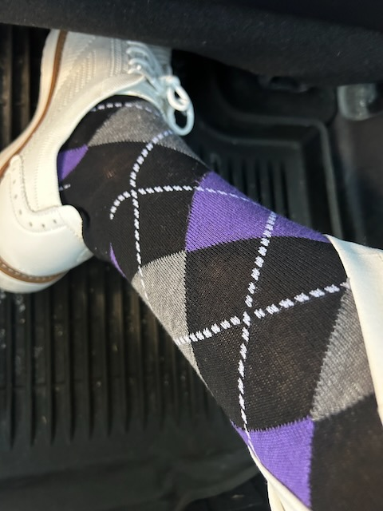

# Staycation in Review

## 07:50am

It has been a while! My last journal entry was on Easter...hehehe I had quite a week since then. I wasn't able to write. And I've missed this!

I had a staycation last week where my parents came down for a visit. I mostly stuck around the area. That's why I'm calling it a staycation. I took time off. But I mostly stayed at home each night. The only exception was 1 night at Disney's Pop Century hotel. That night, we all had dinner at The Cake Bake for mom's birthday celebration and then we did EPCOT the next day so I could participate in Dapper Day.

I'll probably write a little bit about all of it later today. It was a good week and I'm grateful for their visit. I'm grateful for my parents and I see the Blessing of still having them in my life <3

Today, I'm back to my routine; which includes going back to work...hehehe My boss contacted me about an issue on Wednesday. I felt that was odd because I've never been contacted on my days off. I didn't stress about it, though. I simply answered his questions when I could. It was mom's actual birthday that day and I didn't want to interrupt *her* day. My parents actually do not know work was involved in the day...LOL I didn't say anything about it to them...hehehe

## 09:35am

A major system I'm responsible for is having trouble this morning. It's at the old company. I don't have the access to things I need to actually fix anything...LOL Plus I needed to update some things on my local machine to even look at the code behind things because I no longer do development work for the old company...LOL It has been a bit of a mess. But I'm working through it. I'm taking this quick break because I'm waiting for things to install...LOL

It sounds like it might actually be an easy fix. Some data was purged yesterday as part of the new data retention policy. But it sounds like the indexes weren't updated after the purge. That would definitely explain why the queries are failing with timeouts. Without indexes, queries have to search through all of the data one record at a time like an elderly librarian trying to find a book without a card catalogue to point to which section and shelf the book is on...LOL I think the data guy is rebuilding the indexes now. Perhaps the issue will resolve itself before I even get to look at the code...LOL

At the new company, we are making sure I have the access I need to support these applications. At the old company, I began inheriting it all as we were transitioning over. So, my name is on things, but I don't have access to much...LOL It can be frustrating at times. But I kind of shrug it off in my mind because I can only do what I am able and allowed to do. If my hands are tied, I can't fret over what I can't do to help. I simply help where I can and try to get others involved who do have access and knowledge where I lack.

## 11:15am

It appears the issue was the database indexing. Once that was fixed, everything seems to be working as expected. Yay!!! Hopefully this is the last hiccup with that system that I'll have to deal with. In just 3 weeks, that system will be out of scope for me...hehehe At least on the old company's side. I'll still have it at the new one. But at the new one, I have full access to support it...LOL

My favorite moment last Tuesday was when I saw my parents for the first time. Their favorite was seeing us too; my sister, her husband, and me. They arrived in the evening and I met up with everyone at Rusty Bellies in Tarpon Springs. And my favorite moment from that experience was when one of the specials was crab balls. They said that crab cakes would normally have been the special. But the machine they make those in was down. So they converted them into balls...hehehe My mom lllooovvveeesss crab cakes. You know, the real ones. Those are great down here where I live. So, I was happy she was able to get a new twist on those that night. She lit up like a Christmas tree on that first bite...LOL She shared one of them with me...hehehe That was a great way to begin the staycation with my parents <3

## 02:00pm

Today is an anniversary of sorts. 25 years ago this evening, I met Stephanie. She eventually became my wife and bore our son, Malachi. I still remember the day quite well and always think about it on this day. I tend to remember dates. At least those that are significant to me and my journey. Although our marriage ended, this day remains important because it is part of my son's journey <3

Another recent significant date was last Wednesday. It was mom's birthday...hehehe She turned 70 this year. She's only a few months older than Disneyland...LOL The three of us went to St Pete Pier that day. At the pier, we had lunch, went to the history museum there, and enjoyed some time outside. My parent's favorite moment was looking at the baseballs in the museum...hehehe Especially finding Ozzie Smith's signed baseball so they could show my brother.

There were a lot of wonderful moments on that day. But my favorite was when we went to Kohl's...hehehe I wanted to buy some white shorts and a white short sleeve shirt. Mom wanted to get some white capris since she forgot to pack some. When we got there, she and dad went one way and I went another. Divide and conquer...LOL After I was done, I went looking for them. I did a loop around the whole store and didn't see them...hehehe At the beginning of my second pass, I spotted them, though. That was my favorite moment. At a far distance, I saw them together just enjoying being alive and together in a random store in Florida <3

When we got back to my sister's house, we played a card game called Five Crowns. It's fun and simple. It was my first time ever playing it. It was just the 3 of us since my sister and her husband were working that day. I ended up winning the game. Beginner's luck...LOL I hated beating my mom on her birthday...LOL But she loved just playing with her favorite child and that guy she lives with...HAHAHA j/k Seriously, though, it was a fun time. The entire day was Blessed.

## 03:45pm

Once I helped resolve the earlier issue and confirmed with end users it was resolved, I tackled another one from the same application. Once again, I don't have access to investigate myself...LOL I've reached out to someone to log into the server and share their screen so I can take a look. They haven't gotten back with me yet. It's a smaller issue. I suspect it is something simple like the server's hard drive is filled up or something. It has a smaller impact than the other issue...hehehe

On Thursday last week, we didn't really do much away from my sister's place. Mom and dad and I went to the Tarpon Turtle for lunch and we had ice cream in downtown Dunedin near where my sister lives. But later that night, my brother-in-law's mom came over and we all had a cookout. It was a lovely time. I'd say that was my favorite moment of the day. I think it was for my parents as well.

After his mom left for the evening, we all played that Five Crowns card game. It was the first time for my sister and her husband. We had a great time doing it as a group of 5 instead of 3 from the night before. But it took longer to play...LOL Mom ended up winning this time...LOL I think this was the second favorite moment of the day.

It was a fun day with family and mostly relaxing. Sometimes, the best thing to do is just be. No plans. Nothing fancy. Just be present and enjoy the company of loved ones <3

## 08:10pm

That second issue at work hasn't been resolved yet. I couldn't get ahold of the server guy. Hopefully I can catch him first thing in the morning. I don't like to be blocked like this. But like I said before, I can't fret over things I cannot do. I do what I can, when I can, however I can...hehehe I feel bad for the end users, though.

On Friday, we started off the day with a big breakfast at my sister's house. She and her husband made a wonderful home cooked breakfast. They put spinach in their scrambled eggs. I have never thought to do that. They were amazing! After that, we all loaded up in mom's amazing vehicle and headed off to Disney World.

We arrived at Disney's Pop Century hotel around 2:30 or 3. Our rooms were ready as soon as we got there. So, we unloaded and relaxed in the café area. We browsed the menu for our dinner and a few of the others snacked. Dinner was still hours away. I didn't snack, though. I was doing well after that big breakfast...LOL After relaxing for a bit, we all dressed up for dinner.

Mom and dad's favorite moment of the day was dinner. We ate at The Cake Bake. The original locations are up in the Indianapolis area where we are from. Mom and my sister have eaten at the very first location in Broadripple. The owner later expanded to Carmel. Oprah listed The Cake Bake as one of her favorite things. So the business boomed. That led to Disney asking her to make a location at Disney World from what I understand. It took a few yEARS to build. It hasn't been open very long...a few months, I think. Mom couldn't wait to go. We made this her birthday celebration dinner...hehehe

My favorite moment happened after dinner. We all took a stroll on Disney's Boardwalk. We enjoyed some live entertainment, did some shopping, and enjoyed the sunset. It was an amazing evening between The Cake Bake and the Boardwalk.

By the way, The Cake Bake does have cakes...but it is also a really fancy restaurant...hehehe We did enjoy a few slices of cake. They are way too big for one person. So, we split 2 pieces amongst the 5 of us...hehehe The restaurant is amazing. If you like to get all dolled up, it's a wonderful place to dine. Most of the guests were dressed very nicely. I only saw a few people in t-shirts. My family was all dressed very nicely. I was retro with my famous Mickey ears adorning my hat...hehehe

## 09:50pm

I had myself a Meatless Monday...hehehe I've enjoyed doing that. Although, I didn't do it last week...LOL Last Monday, I had ham for one meal and tuna for the other. The ham was left over from Easter dinner the day before. The tuna was an experiment with a new (to me) teriyaki marinade I wanted to try. It's from the same folks who make the coco aminos I get. This week, I used another new (to me) one from that company that's a ponzu. Both were amazing. I love the sauces they make. I'm up to 5 different ones now...LOL

On Saturday, we did Dapper Day at EPCOT. At first, I was expecting to be the only one to dress up. But my sister and her husband surprised me and dressed up too. I ended up doing my Disney Dapper Bounding of Joffrey's coffee...LOL It garnered a lot of attention. My parents had a good time with it all as well. They didn't dress up; which was perfectly fine. They loved seeing everyone else dressed up...hehehe

I don't recall what they're favorite moment was on Saturday. I just think they enjoyed spending time with us...hehehe My favorite moment was when my mom almost backed into me with her scooter...HAHAHA I was taking a video of a bird in the tree above me. I didn't realize how close she was to me even though I heard the backing up beep the scooter was making...LOL My dad stopped her just in time. The running joke the rest of the day was about how I almost had tire marks up and down and all over my white clothes...HAHAHA

## 10:30pm

Earlier tonight, I watched this week's episode (S4E3) of *The Chosen* and read through lesson 3 of book 4. Timely once more and I feel this will be an amazing experience this week. The episode is full of surprises. It's almost like a season finale...LOL But it's only the 3rd of 8 for the season! That says a lot about the season. And the study book has been the best yet. I'm really grateful for these devotionals and studies.

We've been doing these for just over a year now. Season 5's devotional comes out in July and the new study book is in August. The episodes are supposed to drop in June. I may watch season 5 ahead of the devotional and study, though. After all, I had already seen all 4 of the first seasons before we began the devotionals and Bible study a year ago...LOL Our current study will conclude in June. It's too bad the devotional and study books aren't coming out when the episodes are first available...hehehe

Before my parents left on Sunday, we met up for breakfast at Cracker Barrel. This was the first time where I asked them my *what was your favorite moment* question. I went through each day one at a time with them. It was amazing talking about their visit. I even got to hear about things that happened when I wasn't around. It was the perfect way to say goodbye <3

They made it home safely this evening. They always drive on these visits. So dad shares his location with me so I can track their progress. I do the same when I drive up there and back down. I'll be doing that on my next visit to Indiana; which is next month. I haven't driven up there in a while because I usually fly. I enjoy that drive and I'm looking forward to it. And I can't wait to see my son and family. I'll be up long enough to probably visit with some friends as well.

## 11:00pm

I really enjoyed my staycation. Especially the time with my family. Like usual, there were a few moments that weren't my favorites...HAHAHA But I tried to highlight the top ones today. Of course, there were plenty more amazing moments I didn't write about. It was one of those weeks where it would have been nice to journal every day. I just didn't make the time for that. I prioritized time with family <3

I also really enjoyed dressing up each day...especially Friday night and Saturday. It was great that my parents were able to see me do that in person this time. They had only really ever seen photos before. The one exception was for my sister's wedding last year. I did dress up for that. But this time, I dressed retro and dapper everyday for their visit. Except Sunday when they left. But unplanned, my parents and I matched at breakfast that day...LOL

My full dapper will probably have to wait again until the Fall. I may try to find some ways to do that in the summer. I have the retro that should work for most of the summer. But otherwise, dapper season is over for now. Dapper makes me happier...hehehe

Look! I'm a Joffrey's coffee...HAHAHA

Argyle makes me happy 💜

