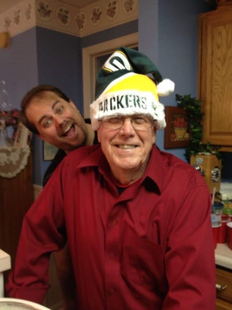
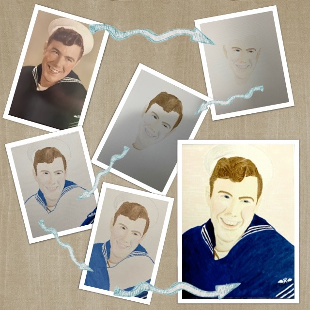
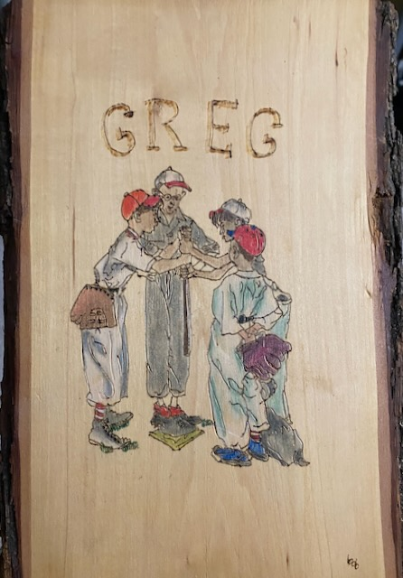
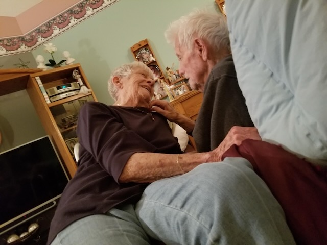

# Joy Comes in the Mourning Coffee

*Weeping may stay the night, but joy comes in the [mourning]...You turned my mourning into [coffee];* ~ Psalm 30:5b,11a (paraphrased by *meeeeeee*)

Today is my annual celebration of life for my late paternal grandfather. He left this age and entered into the next on this day in 2019. Due to an unfortunate circumstance, I wasn't able to mourn his death from 2019 through 2021 on this day. But since 2022, I've been able to mourn in the ways that work best for me for my relationship with him.

I'm grateful for the life that was grandpa. He is an amazing man. I find joy in how I've mourned him these last few years. And God has turned my mourning into coffee...LOL After all, remembering grandpa was why I started drinking coffee in the first place...LOL Today's dose is just extra special...hehehe

Grandpa Bob was a good man. He cared very much for family. From my perspective, I don't think he ever thought about himself. He had his hobbies and had a study. But those were just things he did and a place to go when he needed that sort of thing. Most of the time, he was doing *something* for someone else.

He served in the US Navy for about 4 years, I believe. With our last name being *Marine*, I'm sure that was *fun* being in the *Navy*...HAHAHA He was stationed in southern California near where I like to visit. I think the base is in LA County, actually...possibly Orange County. But he and grandma lived in Orange County. A stones throw from where Disneyland was building built. My dad and first uncle were born there. My second uncle was born in Indiana after they returned home.

Grandpa and grandma didn't want to raise children in the faster paced culture of California. So, that's why they returned to Indiana to spend the rest of their lives. They traveled along historic Route 66...hehehe This was back before the interstate system was put into place. I've been on parts of Route 66 in Illinois myself and I've been to Santa Monica Pier. I love the connection I've felt between those experiences and my grandparents.

When I went to the pier last year, I sent photos to grandma. She told me of how her and grandpa danced to the live music of Lawrence Welk on the Santa Monica Pier. To be standing in the very place they danced 70+ years prior brought me so much joy. I hadn't ever heard that story before that day. I'm grateful God brought me to that place in the moment and inspired grandma to share the story.

One of grandpa's hobbies was woodworking. He made all sorts of things for us. He would also do art with it. He'd burn outlines of images on the wood and then paint them. I don't have many of those things any longer. But I do have a few that I cherish. When I was young, I didn't have the same appreciation I have now. But I'm glad I didn't loose everything from my youth and can still hold on to memories today; whether only memories or some physical items too. I'm that scrappy little boy waiting for the others to decide who's team I'll be on...LOL

Grandpa also loved fishing. He and grandma lived on a lake for a while. I remember several times going fishing with grandpa. Sometimes we didn't catch anything. But just being with him was what mattered. And the stories he would tell would keep my interest even when the fish found not interest in our bait...LOL

The lake's name was Heritage. It was a fitting name for what memories I have with my grandpa there. He passed onto me a lasting heritage of God's Love. There's a community near where I live today that is also called Heritage Lake. I smile every single time I drive by; which is weekly. It's between my home and my grocery...hehehe

Grandpa bought one of those huge VHS camcorders that you had to lug on your shoulder while you recorded. We'd see him capture all of the *best* family moments. All of our holiday gatherings were at their house. So, most of the footage was captured there. And most of those years were while they lived at Heritage Lake. One of my fondest, and most traumatizing (j/k), memories was when I was *attacked* by a huge white goose...LOL I was wearing a bright red jacket and that goose tore it clean off my body. We still have proof of that somewhere because grandpa recorded the whole thing...LOL Instead of *saving* me from the goose, he must have thought it was something everyone should always remember in full color...HAHAHA

Obviously in the moment, I wasn't all that happy that no one came to my rescue. But looking back, I fondly remember how funny the ordeal actually was. I wasn't harmed in any way. The goose was clearly after my jacket and not me personally. Sure, child Greg was *traumatized*...hehehe But I'm so grateful for memories like that. I love how grandpa loved his family so much that he wanted to re-watch our gatherings over and over again. I do the same thing with my iPhone today. I record little clips and take photos all of the time. And yes, I do go back and watch the videos and look at the photos often. Somewhere, there is a DVD with most of those old home movies, as they used to be called. My cousin had the VHS tapes transferred to DVD discs before grandpa passed. We all got together and watched them a year or two before he was gone.

As far back as I can remember, grandpa had a study. All around his desk and shelves were various references that helped him study the Bible. With the exception of those final years, he didn't have a computer. He studied the Bible the classic way. It was a central part of who I remember grandpa to be. His spirit and actions showed the fruit of God's Holy Spirit. And his study showed why. He read a lot of other stuff too. But what sticks out are the commentaries, study guides, and his very large Bible; which was always open to something he was in the middle of studying.

I never actually saw him study any of it. That was always in his quiet, private time with God. And rightfully so. My memories of him are always related to the time he spent with *me*. How selfish of me, right?!? HAHAHA j/k But I always knew about his personal relationship with God. It's something that remains very much a part of the inspiration for my own personal relationship. His little study was where all of that took place. And I'm so glad he had that place to do it. It was a little different in each of the homes they lived at in my lifetime. But the purpose remained the same.

I think it was sometime in the 70's when grandma and grandpa bought a dry cleaning business in my hometown. He ran it for decades before he sold it to my uncles. It was fun to go visit him at work when I was a kid. We'd also all meet up there on Independence Day to watch the town fireworks show as we could see it from his parking lot. I briefly worked for him by mowing the business property and the yard for my great grand mother; his mother. My sister also worked there. But she worked for the dry cleaning business directly...hehehe I don't think my brother ever worked for him.

I know grandpa had other jobs before that. But I don't know much about any of that because it was all before I was born. And I don't have a great memory for things I wasn't a witness to in our family...LOL Like I said earlier, I didn't have the same appreciation for such things when I was young that I have today.

One of my earliest memories was a Christmas gift he and grandma gave to my brother and I wwwaaayyy back...hehehe It was a pair of very loud fireman's helmets that had a bright spinning light on top and an annoying siren sound. My grandparents were known for getting us boys the most obnoxious toys to annoy my parents...HAHAHA We were the only two grandsons they had...LOL My parents never appreciated that annoyance...LOL But it's a great memory. By the way, my parents always hid those toys when we got home. To this day, I have no idea what ever happened to those fireman's helmets...HAHAHA

I'm now about the age grandpa was when I was born. It's surreal to think about his life. I'm grateful for the 41 years I had with grandpa. His presence was very impactful. Not just for me, but also for the entire family. And the communities he always lived in for the 87 years of his life were equally Blessed by his life.

Below is the last photo I took of grandpa. He was being sweet with grandma and I was able to sneak this. I was sitting on the couch right next to them. This was also the last night I saw grandpa before he passed. It was a Friday evening. A lot of family were there that night. He was surrounded by the love he and grandma created in the 1950s and beyond. He breathed his last 4 days later.

To bookend this day of remembrance, I thought I'd mention that grandpa always drank that cheap Foldgers instant coffee. I don't care much for it, myself. I still endure it when I visit with grandma since she still drinks it...LOL I imagine they drank it because of the low cost. They lived through some tough times. And even when times weren't tough, they liked what they liked...hehehe I'm more of high quality coffee person, myself. I mostly drink Joffrey's. But the connection to grandpa isn't in the brand or quality. It's in the warmth I feel as I sip that bitter black nectar and the love it reminds me of. I mourn grandpa. I miss grandpa. I love grandpa. And joy comes in the mourning coffee.