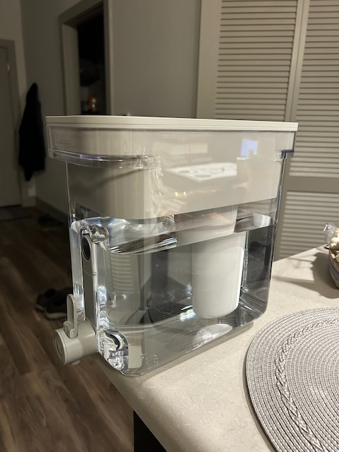
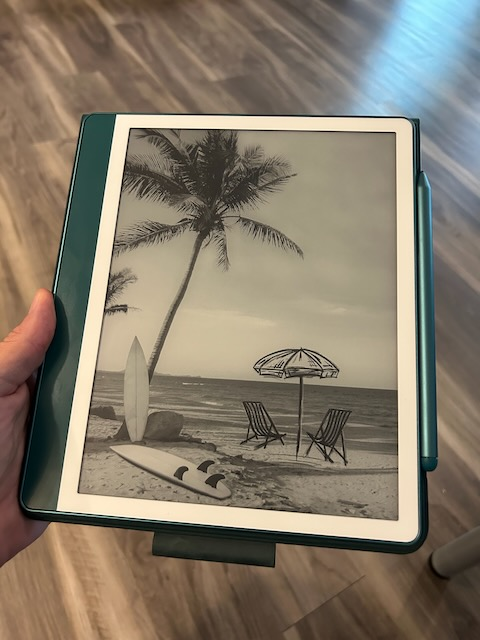
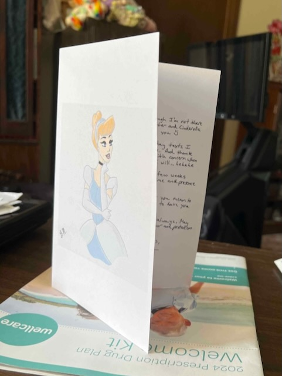

# TBD

You may have noticed I haven't been including the featured photo and Bible in a Year reading in my posts lately. Well, I stopped adding them to my website for now...LOL I still take the photos and I'm on track with my daily readings. I just haven't felt like adding them as content for my website lately. It takes some time to do that. It was adding unnecessary stress to the little time I have to write. What I may start doing is batching that up for the week on weekends when I have more time. For now, I'm not going to be consistent with that on my website. I'll get around to it if it is important enough to me...hehehe

I made a few purchases this week...hehehe One is my new Culligan water filtration tank. I like the water. It's noticeably improved over the Brita. The Brita is like drinking water from McDonald's...LOL j/k The Culligan seems more like bottled water. I'm really happy with this so far!

The other big purchase was a new Kindle Scribe. I'm not sure I've written about looking into Kindles 🤔 I've been considering a Scribe for quite a while. I heard about them well over a year or so ago. I wanted a device to use as a notebook that could help me better organize handwritten notes. There have been products like this out for quite a while. None of them really appealed to me. They all felt too *computery*...LOL And my iPad never fit the bill either.

Then along came the Kindle Scribe. What appealed to me on this one was the built in Kindle support...because, well, it's a Kindle...LOL I used to own a Kindle Fire. I never liked it. It wasn't an eReader. It was a tablet with the Kindle app on it like any other Android. But I've never owned the Kindle eReader before. The Scribe looked like the best of all worlds. It took me a long time to pull the trigger on it.

One of the catalysts for this recently was the Bible study. After the first book, and part way through the second, I decided to switch to the Kindle version. I used my MacBook for that. I liked having the digital version. This was inspired by Cherie, who was doing the same. She later bought a Kindle device. And that got me thinking about the Scribe again.

My friend, Mike, released a new book last weekend. He was giving the book away for free for 2 days only through the Kindle store. I jumped on that deal. On Monday, I read the entire book. It's a great book using AI as a personal assistant. More on that next. One of the things I wanted to do was write a review. I wanted to keep my notes attached the book. Well, it was a Kindle book. So, on Wednesday, I finally pulled the trigger and bought a Kindle Scribe. Taking notes in Mike's book was a breeze! The Scribe was prefect for what I wanted to do!

I actually used what I learned from Mike's book to use AI to help me research and decide on the which Kindle to buy. The Kindle Paperwhite, one that I was considering, allows for taking notes. It's text only. The Scribe allows handwritten notes. With my AI assistant's help, I was able to figure out which would work best for *me*. I chatted with it like talking to a person. And it prompted me with questions that I hadn't considered. After a lengthy dialog with the AI, the conclusion was that the Scribe would work for me. So, here it is!

With it, I was able to make all of my notes by simply writing by hand. I could highlight things, and had the option of adding notes to those highlights. I could also do *page level* notes without highlighting certain things. After going through Mike's entire book a second time, I had a list of notes by which I could work on my review. I also made notes for feedback I may talk to Mike about. He always appreciates my feedback...hehehe

Although I kept all of the notes in my handwriting, I typed out my notes into my AI assistant and asked it to help me write a review based on my thoughts. That's actually one of the chapters of Mike's book...LOL He talks about how you can use it for such a task. Using the framework I learned from Mike, I was able to come up with a good review that I could post on Amazon. Although I used AI to help, in the end, it was I who wrote the review. It's all in my writer's voice and completely based on my notes. I had it generate an initial review, and then I took it from there. The result was a concise, Amazon-appropriate review that captures everything I wanted to say about the book. And it was a fun exercise!

There's also a brief chapter about using AI to help write books. He used AI to help with his writing. You can feed the AI your content and it can help organize things and check for issues. Mike also includes a link to another book from a different author about how to use AI to help write non-fiction books. I grabbed a copy...hehehe It was free with the link he provided...LOL I'll read it soon and see how I might make use of AI to help with my own creative writing.

Of course, Mike does a good job of explaining how the use AI to augment your own human intelligence. AI isn't supposed to replace what you already know and what you can do. It's to be used as an assistant. He does talk about the ethics of all of this. Although AI can technically write an entire creative work, it can't actually be creative. It can't do what I do. It can only help me do what I do. There may come a day when it can go beyond and actually be creative. But that's when AI will go from being artificial to having *actual* intelligence. For now, I could only use AI to augment my workflow. And that's all I would ever want from it.

After the few successes this week with AI, I decided I'd use it to help me write a letter for my mom for Mother's Day. Again, as an assistant. It did not write my letter for me...LOL I basically chatted with it like talking with a friend. *We* bounced ideas off each other. This time, though, I took my notes on my Kindle Scribe...LOL Once I had all of the ideas of what I wanted to include in the letter, based on my *conversation* with AI, I then reorganized the notes using the Scribes copy and paste feature. I copied the key things to the bottom of a new *page* and then began handwriting my letter from the top. As I finished with each key item, I crossed it out below. Once it was all captured, I then erased the notes from the bottom of the page so I could have room to conclude the letter. I only did a single page because it was a part of a larger project that included my brother and sister. I didn't want to take up too much. Plus, I included my Cinderella (mom's favorite Disney princess) drawing from last year that I still hadn't given her...hehehe

I sent the image of my handwritten letter, along with the Cinderella drawing, to my dad. He printed them out in as a card to be inserted into the card he made. He's including what my brother and sister sent too. It will be a nice little Mother's Day gift for her. Happy Mother's Day (tomorrow), Mom <3

I'll not delve into how AI can have it's caveats. Mike does a great job with the *gotchas* in his book. I made notes about things from his book that I call a *framework*. It is an excellent guide in how to use AI to augment my own abilities when using it as an assistant. I'm pretty excited about the possibilities. But it will still require a great deal of my human intelligence to make the best use of it. For example, I still need to check it's sources to ensure what it is telling me is, in fact, accurate...LOL And for things like my writing, it is more of an editor helping me check my work.