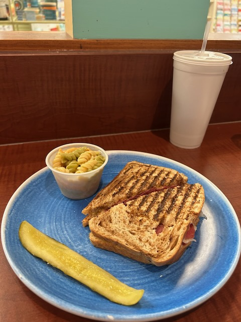
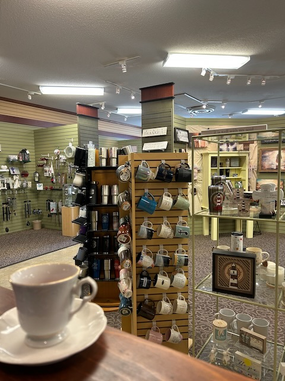

# Malachi's Birthday, Food, and Book Progress

## Morning

Today is Malachi's big day...hehehe Today, he turns 20. I still vividly remember the moment I first saw him. I was present in the delivery room as I coached his mother through labor. And I was blessed to give him his first diaper. His poor mother was exhausted from a very long day of labor. And I imagine his poor little body was in shock at the day he had too...hehehe I was tired. But I didn't go through any of what those two went through that day. I did what I could to help them both get through their experience. I feel blessed to have been a witness.

Life can be very complicated. But that first breath isn't so complicated. It's a deep breath, followed by the first cry...hehehe It's like, *what did I just go through?!?* Everything that happens after the first breath is a series of moments that make up what we call life. The complexities come as we go through all of the other experiences that follow that first breath. He has now had 20 years of experiences. Some have been amazing. Some have been a struggle. I'm so glad to be his father. I'm equally glad to see life through his eyes as he shares his hopes, struggles, and overall thoughts.

I flew up from Florida to Indiana last evening. The flight was okay. I don't like the planes of the airline I went with for this trip...LOL But it was a *safe* flight. I emphasis safe only because such an experience is completely out of my hands. I'm a passenger along with nearly 200 other people...hehehe We are at the mercy of the airline, it's equipment, and it's crew. The crew was great. The planes are a bit rough around the edges. But you get what you pay for on a discount airline. It's definitely safe enough for such a trip. My concerns are only about how uncomfortable it is...hehehe Long gone are the days of leg room, proper padding in the seat, and fancy meals...LOL I say that like I've been on a flight with a meal...LOL No, I have not. But I missed the romance of that and wish I had experienced it...hehehe Perhaps they have them on an international flight? I'll find out if I ever have one.

I believe this is the first time I've read on a plane. I read 2 chapters of 2 separate books. The first was a non-fiction book. I was surprised to get through 2 chapters of that book. They are lengthy chapters. But after that, I decided to hop over to a fiction book for entertainment. Those 2 chapters were shorter but very engaging. All in all, this made for a very quick flight experience. I used to watch movies or TV on flights. Those flights seemed to drag on...LOL And all of my flights last year, and the few previous ones this year, I prayed the entire time. Those didn't feel very long either because I was talking with God in spirit.

I haven't talked much about my Kindles yet. I'll get to it. It's on my backlog of topics to dig into...hehehe But for today, I'd love to just say that I'm so grateful those devices are in my routine now. The Kindle I read from is so much easier on my eyes than the phone app. I stopped reading from the app on my phone awhile ago because of the eye strain. And on the computer, I only use the app for Bible study books. Now that I have a Kindle eReader, I'm reading quite a bit more. It's almost been daily lately. A life changing addition to my routine, I'd say. I'm saving my in depth thoughts for later because I feel like I have a lot to say. But I'm not ready to dedicate time to writing it all down just yet...hehehe

Although this particular digital device has been helpful, not all digital-age advancements have been so good for me...hehehe I posted something the other day on Threads about how I miss the dedicated headphone jack for wired headphones. The Bluetooth options have been very buggy for me. As has the wired headphones that use the Lightning port on my phone. Stand alone music players seem like the best option for me right now. I wish I hadn't lost track of my old iPod Touch. I miss it. I pretty much stopped listening to music regularly a few years ago because of my woes with Bluetooth. I still listen over my speakers at home and in the car. But it isn't often anymore. I used to listen through headphones *back in the day*. I *window shopped* for a refurbished iPod. They're expensive...LOL I have a feeling I'm just going to need to adapt so I can get back to listening...LOL

Technical issues no longer frustrate me like they used to. I still have my moments. But overall, I feel like I'm learning to accept that technology isn't going to be perfect and that how things *used to be* can no longer *be*. I'm not so set in *my ways* that I'm incapable of change or adaptation. I'm learning that sometimes things aren't going to work the way I think or hope they should. And I'm learning to be okay with that and not allow it to disrupt my inner peace. I've grown in these last few years when it comes to things like this. What once used to bother me *yesterday* is nothing more than a minor inconvenience *today*. If it isn't working *now*, I can move on to something else and hope that it will work *later* or that I'll figure out some new way to get what I want out of these technological *advancements*...hehehe

Something that has been working really well for me lately is separating all of these things into dedicated devices; which is actually what got me thinking about my headphone woes. Having everything on one device, namely the phone, seemed like a very convenient thing as that began to happen. Now, I feel like that was a mistake. For me, at least. So, I've begun separating everything into it's own device. I now have my MacBook for projects that need a full computer. I use my phone for communication and very basic and quick research. My dedicated research is through my MacBook now. I use a Kindle Colorsoft for reading. I have a Kindle Scribe for writing handwritten notes and journals. I listen to music on my TV. I also watch TV with my TV...hehehe And my iPad is now just for my artwork. Sure, with more devices, it means I have more things that could possible break or go wrong. But I'm finding the experiences to actually be calmer. And so far, everything *just works*. I'm far less distracted and more focused on the task at hand. As this evolves for me, I imagine I'll find a good balance this way. I'm open to these changes for now...hehehe

Well, I still have a little bit left in my morning. But I'll soon be on my way to see Malachi. I love him so much.

## Afternoon

I'm sitting at a little cafe called Gingersnaps. It's in the back of a Christian bookstore in Malachi's city of Terre Haute. Right now, he's with his grandma. So, I'm here to have some lunch and journal a little bit. It's a bit loud. But I still love it here. I've never eaten here before. It was really good for a bookstore cafe...hehehe

I've been to the bookstore a few times over the years. I was here a few months ago and bought one of my new mugs. It's my Jesus+coffee mug. I'm staring at their mugs right now...LOL The seat I'm in is facing the coffee mugs the bookstore sells...LOL As tempting as it is to buy another one, I may not do that this time...hehehe

I'll be checking into my hotel soon. I'll be staying the night in Terre Haute tonight. It has been a very long time since I've stayed in a hotel here. I would normally just stay at my parents the entire visit. But I would need to drive back and forth between their place and Terre Haute several times in a few days if I were to go back to my parents tonight. So, it made the most sense to at least remain here tonight. I thought about staying for Friday night too. But Saturday's events aren't in Terre Haute. I decided to just drive back to my parents Friday night instead.

After I check into the hotel, and while Malachi remains with his grandmother, I'll likely do some work on one of my books. Now that I've finally found a workflow that works well for me, my mind is working hard in bringing some of that work to fruition. It's a little surreal, actually. I've written about my books a few times. And I've been talking about them for years. But now, it seems that things are really starting to click. I feel highly motived.

I plan to write more about this soon. It's on my backlog of topics too...LOL But one of the writing tasks I've already made progress on is working with Kindle Direct Publishing. I've created a few books already and went through the whole publishing process. It is pretty simple and easy to do. I've since *unpublished* those books. They weren't ready for publication. I just wanted to understand the process for KDP by actually doing it...hehehe That's one step of this process I'm no longer ignorant of or even anxious about anymore. That's pretty exciting!

## Evening

It sounds like Malachi had a great birthday <3 I met up with him, his mother, and her fiancé for dinner. Malachi picked out Tokyo; a hibachi grill he loves in Terre Haute. My hotel happens to be across the street from it...hehehe Earlier in the day, I setup a reservation for us and walked over about 10 minutes before time. When they got there, they stayed in the parking to wait for me to arrive. They were looking for the truck I'm driving...LOL I called them to see if they were getting close and they said they were in the parking lot waiting for me...hehehe That's when I told them I was already inside and had just walked over from my hotel...LOL

There were a lot of people celebrating birthdays tonight! I heard at least one while I was waiting for the others to arrive. But while we were eating, several other celebrations were going on. At our hibachi grill table, there was another person celebrating. So we sang to two people at our table...hehehe We had such a wonderful time tonight.

After dinner, we parted ways. I took my left overs to my hotel room and then checked my bank app for a nearby ATM to get cash for my hotel housekeeping tip. There was one just down the street. After my Santa Ana trip in November, I realized how nice it is to walk places. Especially nearby. It only took a few minutes to walk to the ATM. It was a nice evening to be out between my hotel, Tokyo, and the CVS ATM down the street...hehehe I did all of this well before sunset, of course. I don't like to be out walking in the dark even in the *safest* of places. And Terre Haute is far from safe to be out walking at night...LOL It's like any other city in that regard.

I finished another chapter of my book today. After doing so, I created a test file to send to my Kindle to see how it reads. I really like it so far. I found some typos that I needed to correct. And I had to add something I forget in the second chapter. But it's coming along nicely. I'll have some time in the morning to get started on chapter 3 if I feel inspired to do so. Since the source material is from my journal entries last year, the inspiration is mostly about being motivated to grab the next topic and see what I need to work on to make it work in the book format...hehehe

Once my morning comes to an end, I'll be getting with Malachi. I'll help him get connected with the virtual dress rehearsal for his graduation. It's a Microsoft Teams meeting he needs to attend. After that, we'll have something for lunch here in Terre Haute. And then we'll be off to Mooresville to visit with my parents.

Tomorrow night, we'll have dinner with them and my grandma. We're having another of Malachi's favorites, Bing's. Bing is an old friend of mine. She owns a Chinese restaurant in my hometown. Her parents owned the original. I think her mom still works in the kitchen at Bing's. They are an amazing family and I feel blessed to call them friends. I think I've gone there on every visit I've made back since my move to Florida 3 years ago...LOL

I'm looking forward to seeing Malachi again tomorrow. I'll have more time with him than I had today. I'm glad he got to do what he did today. He had such a great day. God provided everything Malachi needed to have the best birthday he could have this year. I'm so grateful to have been a part of it. God is so good <3