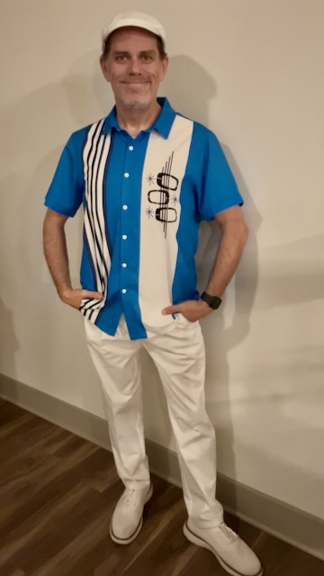

# My Soul is Satisfied

I went to the movies tonight to see *Thunderbolts*. It's the latest Marvel Cinematic Universe (MCU) film. It's different than the others. It is part of the overall story they are telling with the films. But it also somewhat stands alone. I'll not delve to deep into it. But I will say that it hit home. The main *theme* I got from it is the darkness of the void. It touched on mental illness, trauma, abuse, and being an outcast. Although parts of society are beginning to accept that these things exist, there still remains a bit of an ignorance to it all. Along with the stigma ignorance can manifest. I'm glad things are turning around for those of us who are suffering, or have suffered, such things. We've come a long way as a society even if we aren't quite there yet...hehehe

Seeing this movie was like watching my *dark years* literally on the screen. In those years, I had such brain fog that it was like watching my life as a movie as it was happening back then. Well, I got the Marvel adaptation of that movie tonight...LOL j/k Thanks to a gracious God, I am doing okay with it tonight. I have some things to pray about it. But I feel good.

I failed to mention this yesterday...hehehe I bought a French press to make my coffee. I've had French press coffee a few times at Disney. And I had it the other day after Malachi's graduation at the restaurant we ate at. I enjoyed it so much on Saturday that I decided to finally buy one for home...LOL I tried it for the first time today. Wow! It really makes a great cup, or 3, of coffee...LOL It's amazing how different techniques can make a difference with the same coffee beans.

I'm now on my third style of coffee at home. For quite awhile, I made it the *normal* way using a coffee machine. Keeping that thing clean with all of its inner workings was difficult. Sure, it was nice to set it up and let it do all the work. But the results varied and it was never quite right. Plus cleaning the inner tubing wasn't working well. About 14 months ago, I switched to doing pour over coffee. It has been fantastic and a very stable way to make it. And cleanup is supper easy. No inner, hidden parts to keep clean! It's also fun! Well, this French press style is just as fun and just as easy to clean. But it is produces a much bolder and pleasant flavor than even the pour over. As I continue doing this, I hope it is as stable a flavor profile as is the pour over technique.

This coffee journey, much like my life’s, has shown me the importance of being involved in the process, remaining patience, and the value of slowing down. I've spent most of my life chasing after *whatever*. In recent years, I've stopped chasing and started finding contentment in the moments as they happen. This has given me an appreciation for all of the things I have. I no longer have a fear of missing out. I'm becoming fine with missing out on things that aren't meant for me and waiting for all that is meant for me. What God wants for me will arrive at the perfect moment it’s supposed to in His timing. I’ll wait on and hope in Him while being content with my circumstances.

For my movie outing, I dressed up in one of my retro outfits. I had been wearing the shirt all day. I love the shirt and just wanted to wear it...hehehe But when I decided to take in a movie, I decided I wanted to complete the ensemble. I used the hat I bought for my Joffrey's and Olaf dapper bounds, along with the same pants and shoes, and I put on some of my new retro socks. I wore it for dinner too. I decided to eat out as well. But the point was the movie outing...hehehe I really enjoy doing this. I'm really glad I went out tonight and dressed for the occasion. It made my heart happy <3

This has been an interesting week so far. Not remaining set to a specific routine has been a nice change of pace. I thought I'd go back to it this week after my travel last week and all of the work that went into the Big Bang weekend; before, during, and after. As I mentioned yesterday, I decided not to go back to my routine and have been logging my days on a ledger in my Kindle Scribe. I've been pleasantly surprised at all I've been able to do without a specific balance to my schedule. It has been a long time since I've been intentionally unintentional with my time...LOL This is aside from my work hours, of course. I have little control over that...hehehe

I'm not sure how long I'll *experiment* with this. There really isn't a point to it other than to try something different. I look forward to where this leads. I think it is helping me with my journey to maintain a state of contentment. I'm embracing a mindfulness in a way that I've not really even tried before. So far, I really like it <3

For now, I'm content. I still have all of the other emotions. But my soul is satisfied with how things are.