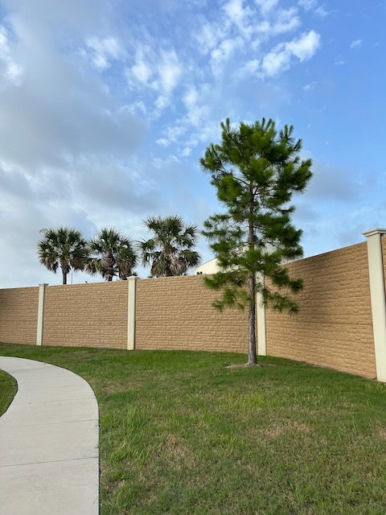

# TBD

I was living out the same life and patterns over and over again until 2020. By 2021, I was ready to break out of the circular, and oftentimes downward spiral, that was my life. When I finally broke the cycle, I became self-aware for pretty much the first time in my life...hehehe The journey since has been more of a straighter path than it was that old *going in circles* pattern I was living. This new path has been a bit rocky at times. And it was tempting more than once to go back to familiar habits and patterns from my past. But God has been my guide and has helped me keep moving forward toward the life He created for me.

I've been in a meditative reflection for most of this year so far. The current Bible study book we're doing has come at just the right time; which keeps happening...LOL It has been a pleasant reminder of just how temporal this life can be. In a way, this latest book has giving me a chuckle at how I used to deal with my life...HAHAHA What used to bring me comfort and happiness in the moment was actually causing more harm than good. Looking to worldly solutions to solve life's problems seems to have just make more problems in my life. I'm grateful God never gave up on me...LOL

Part of what inspired me to reflect on such things this year is what happened nearly 20 years ago. This October, I'll be celebrating 20 years since my suicide attempt. The last 20 years have been far from rainbows and puppies. But there have been some wonderful things that happened among all the bad. I keep thanking God for saving me because of all of the good things and amazing people I have in my life today despite what I tried to do that day.

I have a lot to celebrate today. I have a son that I'm very proud of. My parents are doing well. One of my grandmothers is still alive. My brother and sister, and their families, are doing really well. I have a few friends I text daily. It's nice to have people to think about and who are thinking about me. I have a good job that provides for some amazing things. I'm involved in this Blessed fellowship that keeps inspiring awesome insight into who God is. And I'm currently working on Budford's next *Greatest Hit*...LOL Not to mention the random adventures of Trex and the weekly Humpty fun...LOL

Although these things make my heart happy, that's not really what is making me feel so good about being alive today. It's really my relationship with God that is bringing me contentment and joy. Everything else is in addition to that. This journey I'm on comes with wins, both big and small. It comes with failures and setback. It has moments that are good and some that are bad. But through it all, God is with me.

Celebrating the small wins doesn’t take away from the big wins. It adds to them and helps me appreciate both. And what feels like failure or setback is actually the next step on my journey. Taking one step at a time is part of the process. Since God's process is more important than my progress, I focus on Him. My journey isn’t about the wins and losses. It’s more about all of the moments God has created or allowed. The path I'm taking isn’t as important as being present and intentionally being involved in my journey through prayer. Whether walking around the pond near my apartment or hiking on a mountain side in LA County, embracing my life has lead to contentment. My meaningful existence begins from within through the presence of God's Holy Spirit. And I have Him no matter where I am or what circumstances I'm facing.

I took a rather long prayer walk this evening. As you can tell, I have a lot on my heart and mind. I walked a little over 3 miles around the pond. Today's featured photo came from a moment when my heart felt very heavy and I stopped walking. I even bent down low to the ground for a bit. I think it was near the end of first mile when this happened. That moment inspired me to keep walking and praying.

