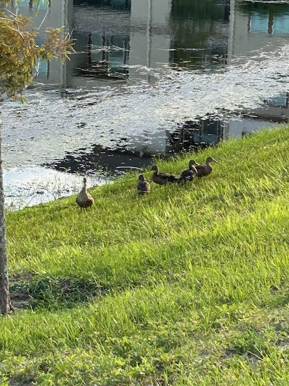

# Social Unkindness and the Lone Duckling

I *joined* the Reddit *community* yesterday. I've had *dummy* accounts in the past so I could look things up there. But I finally created my *bygregmarine* account. Supernote relies heavily on their subreddit for discussions and it sounds like support is quicker there as well. That's why I finally took the plunge into that world. I immediately noticed how unkind people can be there. It reminds me of how Twitter has become...LOL All social media is that way now, it seems. Perhaps it as always been? But I'm noticed it more last year. This inspired me to write a Threads post about how I started to pull back last year. It makes me sad at the lack of empathy in the world. I try to stay positive about it. But it doesn't take long to see how unkind people can be. Especially in the comments of an original post where someone has a genuine concern about something. I almost didn't post on threads about this out of concern it might get toxic attention. But I genuinely want to talk about it. Hearing other points of view helps me grow. I can handle any unkindness I experience *now*. But it heavily weighs in on my decisions of what to post and when to hold back. Not everything needs said. I'm not looking for validation. I just want to have a healthy discussion 🙂

Today's photo and *Vitamin G* were inspired by the mother duck in the photo below. She also inspired the song choice on Instagram (*Mother Knows Best* from Tangled). I had admired the ducks on each of my laps around the pond. On the lap when I took the photo, I decided to stop and observe the ducklings for a bit. I've been watching them grow since they hatched a few months ago. This is the first set of ducklings I've seen since moving here. They are getting so big now. As I was watching, I suddenly spotted a creature coming up out of the water through the seaweed where the ducks were. The mother had seen it too and sprang into action. She started flapping her wings, hovered over the creature, kicked her webbed feet, and quacked louder than I had ever heard a duck quack; save Donald Duck...LOL Actually, she did sound exactly like Donald Duck...LOL Perhaps that sort of thing was Disney's inspiration? The creature dove back under the water and the ducklings scattered. One of them went left while three went right. The creature then reemerged as the mother continued her attack. It didn't take long for either of us, me and the mother, to realize the creature was no danger at all. It turned out to be none other than an anhinga; aka water turkey...LOL It was only hunting its dinner of a tiny fish. I later saw the water turkey swallow a cute little fish...hehehe Nemo's dad, Marlin, perhaps?..LOL The mother duck flew over to the three that went to the right, leaving the one that went left all by itself. After the mother and the three got up on the bank, the lone duckling started to cry. The poor thing couldn't see where the mother and siblings made it off to. The mother quacked a few times and the lone duckling began to walk in her direction. But the poor thing still couldn't see mother. It cried all the more. Mother then quacked one more time and the lone duckling could finally see mother as it made it to the crest of the hill separating them. It ran like the wind to join mother and the three siblings. Now that the lone duckling was reunited, I snapped today's featured photo <3

